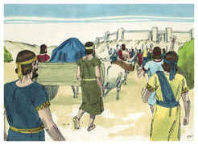
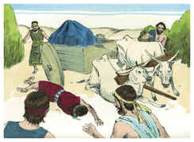
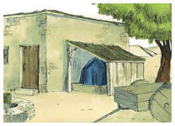

# 1 Crônicas Capítulo 13

## 1
E DAVI tomou conselho com os capitães dos milhares, e das centenas, e com todos os líderes.

## 2
E disse Davi a toda a congregação de Israel: Se bem vos parece, e se isto vem do Senhor nosso Deus, enviemos depressa mensageiros a todos os nossos outros irmãos em todas as terras de Israel, e aos sacerdotes, e aos levitas nas suas cidades e nos seus arrabaldes, para que se reúnam conosco;

## 3
E tornemos a trazer para nós a arca do nosso Deus; porque não a buscamos nos dias de Saul.

## 4
Então disse toda a congregação que se fizesse assim; porque este negócio pareceu reto aos olhos de todo o povo.

## 5
Convocou, pois, Davi a todo o Israel desde Sior do Egito até chegar a Hamate; para trazer a arca de Deus de Quiriate-Jearim.

## 6
E então Davi com todo o Israel subiu a Baalá de Quiriate-Jearim, que está em Judá, para fazer subir dali a arca de Deus, o Senhor que habita entre os querubins, sobre a qual é invocado o seu nome.

## 7
E levaram a arca de Deus, da casa de Abinadabe, sobre um carro novo; e Uzá e Aiô guiavam o carro.

## 8
E Davi e todo o Israel, alegraram-se perante Deus com todas as suas forças; com cânticos, e com harpas, e com saltérios, e com tamborins, e com címbalos, e com trombetas.

## 9
E, chegando à eira de Quidom, estendeu Uzá a sua mão, para segurar a arca, porque os bois tropeçavam.

## 10
Então se acendeu a ira do Senhor contra Uzá, e o feriu, por ter estendido a sua mão à arca; e morreu ali perante Deus.

## 11
E Davi se encheu de tristeza porque o Senhor havia aberto brecha em Uzá; por isso chamou aquele lugar Perez-Uzá, até ao dia de hoje.

## 12
E aquele dia temeu Davi a Deus, dizendo: Como trarei a mim a arca de Deus?

## 13
Por isso Davi não trouxe a arca a si, à cidade de Davi; porém a fez levar à casa de Obede-Edom, o giteu.

## 14
Assim ficou a arca de Deus com a família de Obede-Edom, três meses em sua casa; e o Senhor abençoou a casa de Obede-Edom, e tudo quanto tinha.

