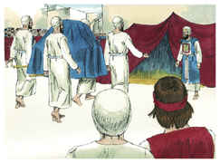
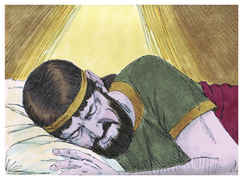

# 1 Crônicas Capítulo 15

## 1
DAVI também fez casa para si na cidade de Davi; e preparou um lugar para a arca de Deus, e armou-lhe uma tenda.

## 2
Então disse Davi: Ninguém pode levar a arca de Deus, senão os levitas; porque o Senhor os escolheu, para levar a arca de Deus, e para o servirem eternamente.

## 3
E Davi convocou a todo o Israel em Jerusalém, para fazer subir a arca do Senhor ao seu lugar, que lhe tinha preparado.

## 4
E Davi reuniu os filhos de Arão e os levitas:

## 5
Dos filhos de Coate: Uriel, o chefe, e de seus irmãos cento e vinte.

## 6
Dos filhos de Merari: Asaías, o chefe, e de seus irmãos duzentos e vinte.

## 7
Dos filhos de Gérson: Joel, o chefe, e de seus irmãos cento e trinta.

## 8
Dos filhos de Elizafã: Semaías, o chefe, e de seus irmãos duzentos.

## 9
Dos filhos de Hebrom: Eliel, o chefe, e de seus irmãos oitenta.

## 10
Dos filhos de Uziel: Aminadabe, o chefe, e de seus irmãos cento e doze.

## 11
E chamou Davi os sacerdotes Zadoque e Abiatar, e os levitas, Uriel, Asaías, Joel, Semaías, Eliel, e Aminadabe.

## 12
E disse-lhes: Vós sois os chefes dos pais entre os levitas; santificai-vos, vós e vossos irmãos, para que façais subir a arca do Senhor Deus de Israel, ao lugar que lhe tenho preparado.

## 13
Porquanto vós não a levastes na primeira vez, o Senhor nosso Deus fez rotura em nós, porque não o buscamos segundo a ordenança.

## 14
Santificaram-se, pois, os sacerdotes e os levitas, para fazerem subir a arca do Senhor Deus de Israel.

## 15
E os filhos dos levitas trouxeram a arca de Deus sobre os seus ombros, pelas varas que nela havia, como Moisés tinha ordenado conforme a palavra do Senhor.

## 16
E disse Davi aos chefes dos levitas que constituíssem, de seus irmãos, cantores, para que com instrumentos musicais, com alaúdes, harpas e címbalos, se fizessem ouvir, levantando a voz com alegria.

## 17
Designaram, pois, os levitas a Hemã, filho de Joel; e dos seus irmãos, Asafe, filho de Berequias; e dos filhos de Merari, seus irmãos, Etã, filho de Cusaías.

## 18
E com eles a seus irmãos da segunda ordem: a Zacarias, Bene, Jaaziel, Semiramote, Jeiel, Uni, Eliabe, Benaia, Maaséias, Matitias, Elifeleu, Micnéias, Obede-Edom, e Jeiel, os porteiros.

## 19
E os cantores, Hemã, Asafe e Etã, se faziam ouvir com címbalos de metal;

## 20
E Zacarias, Aziel, Semiramote, Jeiel, Uni, Eliabe, Maaséias, e Benaia, com alaúdes, sobre Alamote:

## 21
E Matitias, Elifeleu, Micnéias, Obede-Edom, Jeiel, e Azazias, com harpas, sobre Seminite, para sobressaírem.

## 22
E Quenanias, chefe dos levitas, tinha o encargo de dirigir o canto; ensinava-os a entoá-lo, porque era entendido.

## 23
E Berequias e Elcana eram porteiros da arca.

## 24
E Sebanias, Jeosafá, Netanel, Amasai, Zacarias, Benaia, e Eliezer, os sacerdotes, tocavam as trombetas perante a arca de Deus; e Obede-Edom e Jeías eram porteiros da arca.

## 25
Sucedeu, pois, que Davi e os anciãos de Israel, e os capitães dos milhares, foram, com alegria, para fazer subir a arca da aliança do Senhor, da casa de Obede-Edom.

## 26
E sucedeu que, ajudando Deus os levitas que levavam a arca da aliança do Senhor, sacrificaram sete novilhos e sete carneiros.

## 27
E Davi ia vestido de um manto de linho fino, como também todos os levitas que levavam a arca, e os cantores, e Quenanias, mestre dos cantores; também Davi levava sobre si um éfode de linho,

## 28
E todo o Israel fez subir a arca da aliança do Senhor, com júbilo, e ao som de buzinas, e de trombetas, e de címbalos, fazendo ressoar alaúdes e harpas.

## 29
E sucedeu que, chegando a arca da aliança do Senhor à cidade de Davi, Mical, a filha de Saul, olhou de uma janela, e, vendo a Davi dançar e tocar, o desprezou no seu coração.

