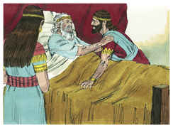

# 1 Crônicas Capítulo 22

## 1
E DISSE Davi: Esta será a casa do Senhor Deus, e este será o altar do holocausto para Israel.

## 2
E deu ordem Davi que se ajuntassem os estrangeiros que estavam na terra de Israel; e ordenou cortadores de pedras, para que lavrassem pedras de cantaria, para edificar a casa de Deus.

## 3
E aparelhou Davi ferro em abundância, para os pregos das portas das entradas, e para as junturas; como também cobre em abundância, que não foi pesado;

## 4
E madeira de cedro sem conta; porque os sidônios e tírios traziam a Davi madeira de cedro em abundância.

## 5
Porque dizia Davi: Salomão, meu filho, ainda é moço e tenro, e a casa que se há de edificar para o Senhor deve ser magnífica em excelência, para nome e glória em todas as terras; eu, pois, agora lhe prepararei materiais. Assim preparou Davi materiais em abundância, antes da sua morte.

## 6
Então chamou a Salomão seu filho, e lhe ordenou que edificasse uma casa ao Senhor Deus de Israel.

## 7
E disse Davi a Salomão: Filho meu, quanto a mim, tive em meu coração o propósito de edificar uma casa ao nome do Senhor meu Deus.

## 8
Porém, veio a mim a palavra do Senhor, dizendo: Tu derramaste sangue em abundância, e fizeste grandes guerras; não edificarás casa ao meu nome; porquanto muito sangue tens derramado na terra, perante mim.

## 9
Eis que o filho que te nascer será homem de repouso; porque repouso lhe hei de dar de todos os seus inimigos ao redor; portanto, Salomão será o seu nome, e paz e descanso darei a Israel nos seus dias.

## 10
Ele edificará uma casa ao meu nome, e me será por filho, e eu lhe serei por pai, e confirmarei o trono de seu reino sobre Israel, para sempre.

## 11
Agora, pois, meu filho, o Senhor seja contigo; e prospera, e edifica a casa do Senhor teu Deus, como ele disse de ti.

## 12
O Senhor te dê tão-somente prudência e entendimento, e te instrua acerca de Israel; e isso para guardar a lei do Senhor teu Deus.

## 13
Então prosperarás, se tiveres cuidado de cumprir os estatutos e os juízos, que o Senhor mandou a Moisés acerca de Israel; esforça-te, e tem bom ânimo; não temas, nem tenhas pavor.

## 14
Eis que na minha aflição preparei para a casa do Senhor cem mil talentos de ouro, e um milhão de talentos de prata, e de cobre e de ferro que não se pesou, porque era em abundância; também madeira e pedras preparei, e tu suprirás o que faltar.

## 15
Também tens contigo obreiros em grande número, cortadores e artífices em obra de pedra e madeira; e toda a sorte de peritos em toda a espécie de obra.

## 16
Do ouro, da prata, e do cobre, e do ferro não há conta. Levanta-te, pois, e faze a obra, e o Senhor seja contigo.

## 17
E Davi deu ordem a todos os príncipes de Israel que ajudassem a Salomão, seu filho, dizendo:

## 18
Porventura não está convosco o Senhor vosso Deus, e não vos deu repouso ao redor? Porque entregou na minha mão os moradores da terra; e a terra foi sujeita perante o Senhor e perante o seu povo.

## 19
Disponde, pois, agora o vosso coração e a vossa alma para buscardes ao Senhor vosso Deus; e levantai-vos, e edificai o santuário do Senhor Deus, para que a arca da aliança do Senhor, e os vasos sagrados de Deus se tragam a esta casa, que se há de edificar ao nome do Senhor.

