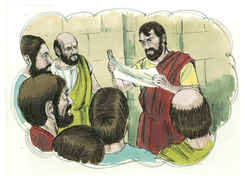

# 1 João Capítulo 4

## 1
AMADOS, não creiais a todo o espírito, mas provai se os espíritos são de Deus, porque já muitos falsos profetas se têm levantado no mundo.

## 2
Nisto conhecereis o Espírito de Deus: Todo o espírito que confessa que Jesus Cristo veio em carne é de Deus;

## 3
E todo o espírito que não confessa que Jesus Cristo veio em carne não é de Deus; mas este é o espírito do anticristo, do qual já ouvistes que há de vir, e eis que já agora está no mundo.

## 4
Filhinhos, sois de Deus, e já os tendes vencido; porque maior é o que está em vós do que o que está no mundo.

## 5
Do mundo são, por isso falam do mundo, e o mundo os ouve.

## 6
Nós somos de Deus; aquele que conhece a Deus ouve-nos; aquele que não é de Deus não nos ouve. Nisto conhecemos nós o espírito da verdade e o espírito do erro.

## 7
Amados, amemo-nos uns aos outros; porque o amor é de Deus; e qualquer que ama é nascido de Deus e conhece a Deus.

## 8
Aquele que não ama não conhece a Deus; porque Deus é amor.

## 9
Nisto se manifestou o amor de Deus para conosco: que Deus enviou seu Filho unigênito ao mundo, para que por ele vivamos.

## 10
Nisto está o amor, não em que nós tenhamos amado a Deus, mas em que ele nos amou a nós, e enviou seu Filho para propiciação pelos nossos pecados.

## 11
Amados, se Deus assim nos amou, também nós devemos amar uns aos outros.

## 12
Ninguém jamais viu a Deus; se nos amamos uns aos outros, Deus está em nós, e em nós é perfeito o seu amor.

## 13
Nisto conhecemos que estamos nele, e ele em nós, pois que nos deu do seu Espírito.

## 14
E vimos, e testificamos que o Pai enviou seu Filho para Salvador do mundo.

## 15
Qualquer que confessar que Jesus é o Filho de Deus, Deus está nele, e ele em Deus.

## 16
E nós conhecemos, e cremos no amor que Deus nos tem. Deus é amor; e quem está em amor está em Deus, e Deus nele.

## 17
Nisto é perfeito o amor para conosco, para que no dia do juízo tenhamos confiança; porque, qual ele é, somos nós também neste mundo.

## 18
No amor não há temor, antes o perfeito amor lança fora o temor; porque o temor tem consigo a pena, e o que teme não é perfeito em amor.

## 19
Nós o amamos porque ele nos amou primeiro.

## 20
Se alguém diz: Eu amo a Deus, e odeia a seu irmão, é mentiroso. Pois quem não ama a seu irmão, ao qual viu, como pode amar a Deus, a quem não viu?

## 21
E dele temos este mandamento: que quem ama a Deus, ame também a seu irmão.

