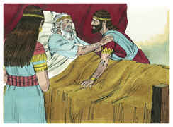

# 1 Reis Capítulo 2

## 1
E APROXIMARAM-SE os dias da morte de Davi; e deu ele ordem a Salomão, seu filho, dizendo:

## 2
Eu vou pelo caminho de toda a terra; esforça-te, pois, e sê homem.

## 3
E guarda a ordenança do Senhor teu Deus, para andares nos seus caminhos, e para guardares os seus estatutos, e os seus mandamentos, e os seus juízos, e os seus testemunhos, como está escrito na lei de Moisés; para que prosperes em tudo quanto fizeres, e para onde quer que fores.

## 4
Para que o Senhor confirme a palavra, que falou de mim, dizendo: Se teus filhos guardarem o seu caminho, para andarem perante a minha face fielmente, com todo o seu coração e com toda a sua alma, nunca, disse, te faltará sucessor ao trono de Israel.

## 5
E também tu sabes o que me fez Joabe, filho de Zeruia, e o que fez aos dois capitães do exército de Israel, a Abner filho de Ner, e a Amasa, filho de Jeter, os quais matou, e em paz derramou o sangue de guerra, e pôs o sangue de guerra no cinto que tinha nos lombos, e nos sapatos que trazia nos pés.

## 6
Faze, pois, segundo a tua sabedoria, e não permitas que suas cãs desçam à sepultura em paz.

## 7
Porém com os filhos de Barzilai, o gileadita, usarás de beneficência, e estarão entre os que comem à tua mesa, porque assim se chegaram eles a mim, quando eu fugia por causa de teu irmão Absalão.

## 8
E eis que também contigo está Simei, filho de Gera, filho de Benjamim, de Baurim, que me maldisse com maldição atroz, no dia em que ia a Maanaim; porém ele saiu a encontrar-se comigo junto ao Jordão, e eu pelo Senhor lhe jurei, dizendo que o não mataria à espada.

## 9
Mas agora não o tenhas por inculpável, pois és homem sábio, e bem saberás o que lhe hás de fazer para que faças com que as suas cãs desçam à sepultura com sangue.

## 10
E Davi dormiu com seus pais, e foi sepultado na cidade de Davi.

## 11
E foram os dias que Davi reinou sobre Israel quarenta anos: sete anos reinou em Hebrom, e em Jerusalém reinou trinta e três anos.

## 12
E Salomão se assentou no trono de Davi, seu pai, e o seu reino se fortificou sobremaneira.

## 13
Então veio Adonias, filho de Hagite, a Bate-Seba, mãe de Salomão; e disse ela: De paz é a tua vinda? E ele disse: É de paz.

## 14
Então disse ele: Uma palavra tenho que dizer-te. E ela disse: Fala.

## 15
Disse, pois, ele: Bem sabes que o reino era meu, e todo o Israel tinha posto a vista em mim para que eu viesse a reinar, contudo o reino foi transferido e veio a ser de meu irmão, porque foi feito seu pelo Senhor.

## 16
Assim que agora uma só petição te faço; não ma rejeites. E ela lhe disse: Fala.

## 17
E ele disse: Peço-te que fales ao rei Salomão (porque ele não te rejeitará) que me dê por mulher a Abisague, a sunamita.

## 18
E disse Bate-Seba: Bem, eu falarei por ti ao rei.

## 19
Assim foi Bate-Seba ao rei Salomão, a falar-lhe por Adonias; e o rei se levantou a encontrar-se com ela, e se inclinou diante dela; então se assentou no seu trono, e fez pôr uma cadeira para a sua mãe, e ela se assentou à sua direita.

## 20
Então disse ela: Só uma pequena petição te faço; não ma rejeites. E o rei lhe disse: Pede, minha mãe, porque não ta negarei.

## 21
E ela disse: Dê-se Abisague, a sunamita, a Adonias, teu irmão, por mulher.

## 22
Então respondeu o rei Salomão, e disse a sua mãe: E por que pedes a Abisague, a sunamita, para Adonias? Pede também para ele o reino (porque é meu irmão maior), para ele, digo, e também para Abiatar, sacerdote, e para Joabe, filho de Zeruia.

## 23
E jurou o rei Salomão pelo Senhor, dizendo: Assim Deus me faça, e outro tanto, se não falou Adonias esta palavra contra a sua vida.

## 24
Agora, pois, vive o Senhor, que me confirmou, e me fez assentar no trono de Davi, meu pai, e que me tem feito casa, como tinha falado, que hoje morrerá Adonias.

## 25
E enviou o rei Salomão pela mão de Benaia, filho de Joiada, o qual arremeteu contra ele de modo que morreu.

## 26
E a Abiatar, o sacerdote, disse o rei: Vai para Anatote, para os teus campos, porque és homem digno de morte; porém hoje não te matarei, porquanto levaste a arca do Senhor Deus diante de Davi, meu pai, e porquanto foste aflito em tudo quanto meu pai foi aflito.

## 27
Lançou, pois, Salomão fora a Abiatar, para que não fosse sacerdote do Senhor, para cumprir a palavra do Senhor, que tinha falado sobre a casa de Eli em Siló.

## 28
E chegou a notícia até Joabe (porque Joabe tinha se desviado seguindo a Adonias, ainda que não tinha se desviado seguindo a Absalão), e Joabe fugiu para o tabernáculo do Senhor, e apegou-se às pontas do altar.

## 29
E disseram ao rei Salomão que Joabe tinha fugido para o tabernáculo do Senhor; e eis que está junto ao altar; então Salomão enviou Benaia, filho de Joiada, dizendo: Vai, arremete sobre ele.

## 30
E foi Benaia ao tabernáculo do Senhor, e lhe disse: Assim diz o rei: Sai daí. E disse ele: Não, porém aqui morrerei. E Benaia tornou com a resposta ao rei, dizendo: Assim falou Joabe, e assim me respondeu.

## 31
E disse-lhe o rei: Faze como ele disse, e arremete contra ele, e sepulta-o, para que tires de mim e da casa de meu pai o sangue que Joabe sem causa derramou.

## 32
Assim o Senhor fará recair o sangue dele sobre a sua cabeça, porque deu sobre dois homens mais justos e melhores do que ele, e os matou à espada, sem que meu pai Davi o soubesse, a saber: a Abner, filho de Ner, capitão do exército de Israel, e a Amasa, filho de Jeter, capitão do exército de Judá.

## 33
Assim recairá o sangue destes sobre a cabeça de Joabe e sobre a cabeça da sua descendência para sempre; mas a Davi, e à sua descendência, e à sua casa, e ao seu trono, dará o Senhor paz para todo o sempre.

## 34
E subiu Benaia, filho de Joiada, e arremeteu contra ele, e o matou; e foi sepultado em sua casa, no deserto.

## 35
E o rei pôs a Benaia, filho de Joiada, em seu lugar sobre o exército, e a Zadoque, o sacerdote, pôs o rei em lugar de Abiatar.

## 36
Depois mandou o rei, e chamou a Simei, e disse-lhe: Edifica-te uma casa em Jerusalém, e habita aí, e daí não saias, nem para uma nem para outra parte.

## 37
Porque há de ser que no dia em que saíres e passares o ribeiro de Cedrom, de certo que sem dúvida morrerás; o teu sangue será sobre a tua cabeça.

## 38
E Simei disse ao rei: Boa é essa palavra; como tem falado o rei meu senhor, assim fará o teu servo. E Simei habitou em Jerusalém muitos dias.

## 39
Sucedeu, porém, que, ao cabo de três anos, dois servos de Simei fugiram para Aquis, filho de Maaca, rei de Gate; e deram parte a Simei, dizendo: Eis que teus servos estão em Gate.

## 40
Então Simei se levantou, e albardou o seu jumento, e foi a Gate, ter com Aquis, em busca de seus servos; assim foi Simei, e trouxe os seus servos de Gate.

## 41
E disseram a Salomão como Simei fora de Jerusalém a Gate, e já tinha voltado.

## 42
Então o rei mandou chamar a Simei, e disse-lhe: Não te conjurei eu pelo Senhor, e protestei contra ti, dizendo: No dia em que saíres para uma ou outra parte, sabe de certo que, sem dúvida, morrerás? E tu me disseste: Boa é essa palavra que ouvi.

## 43
Por que, pois, não guardaste o juramento do Senhor, nem a ordem que te dei?

## 44
Disse mais o rei a Simei: Bem sabes tu toda a maldade que o teu coração reconhece, que fizeste a Davi, meu pai; pelo que o Senhor fez recair a tua maldade sobre a tua cabeça.

## 45
Mas o rei Salomão será abençoado, e o trono de Davi será confirmado perante o Senhor para sempre.

## 46
E o rei mandou a Benaia, filho de Joiada, o qual saiu, e arremeteu contra ele, de modo que morreu; assim foi confirmado o reino na mão de Salomão.

