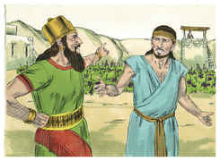
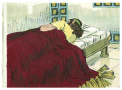
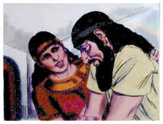
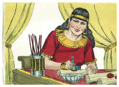
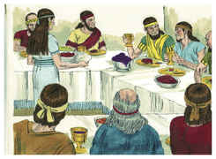
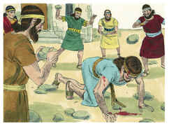
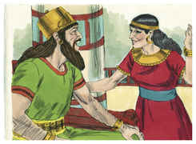
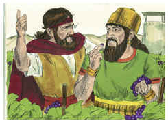
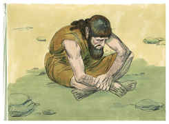

# 1 Reis Capítulo 21

## 1
E SUCEDEU depois destas coisas que, Nabote, o jizreelita, tinha uma vinha em Jizreel junto ao palácio de Acabe, rei de Samaria.

## 2
Então Acabe falou a Nabote, dizendo: Dá-me a tua vinha, para que me sirva de horta, pois está vizinha ao lado da minha casa; e te darei por ela outra vinha melhor: ou, se for do teu agrado, dar-te-ei o seu valor em dinheiro.

## 3
Porém Nabote disse a Acabe: Guarde-me o Senhor de que eu te dê a herança de meus pais.

## 4
Então Acabe veio desgostoso e indignado à sua casa, por causa da palavra que Nabote, o jizreelita, lhe falara, quando disse: Não te darei a herança de meus pais. E deitou-se na sua cama, e voltou o rosto, e não comeu pão.

## 5
Porém, vindo a ele Jezabel, sua mulher, lhe disse: Que há, que está tão desgostoso o teu espírito, e não comes pão?

## 6
E ele lhe disse: Porque falei a Nabote, o jizreelita, e lhe disse: Dá-me a tua vinha por dinheiro; ou, se te apraz, te darei outra vinha em seu lugar. Porém ele disse: Não te darei a minha vinha.

## 7
Então Jezabel, sua mulher lhe disse: Governas tu agora no reino de Israel? Levanta-te, come pão, e alegre-se o teu coração; eu te darei a vinha de Nabote, o jizreelita.

## 8
Então escreveu cartas em nome de Acabe, e as selou com o seu sinete; e mandou as cartas aos anciãos e aos nobres que havia na sua cidade e habitavam com Nabote.

## 9
E escreveu nas cartas, dizendo: Apregoai um jejum, e ponde Nabote diante do povo.

## 10
E ponde defronte dele dois filhos de Belial, que testemunhem contra ele, dizendo: Blasfemaste contra Deus e contra o rei; e trazei-o fora, e apedrejai-o para que morra.

## 11
E os homens da sua cidade, os anciãos e os nobres que habitavam na sua cidade, fizeram como Jezabel lhes ordenara, conforme estava escrito nas cartas que lhes mandara.

## 12
Apregoaram um jejum, e puseram a Nabote diante do povo.

## 13
Então vieram dois homens, filhos de Belial, e puseram-se defronte dele; e os homens, filhos de Belial, testemunharam contra ele, contra Nabote, perante o povo, dizendo: Nabote blasfemou contra Deus e contra o rei. E o levaram para fora da cidade, e o apedrejaram, e morreu.

## 14
Então mandaram dizer a Jezabel: Nabote foi apedrejado, e morreu.

## 15
E sucedeu que, ouvindo Jezabel que já fora apedrejado Nabote, e morrera, disse a Acabe: Levanta-te, e possui a vinha de Nabote, o jizreelita, a qual te recusou dar por dinheiro; porque Nabote não vive, mas é morto.

## 16
E sucedeu que, ouvindo Acabe, que Nabote já era morto, levantou-se para descer para a vinha de Nabote, o jizreelita, para tomar posse dela.

## 17
Então veio a palavra do Senhor a Elias, o tisbita, dizendo:

## 18
Levanta-te, desce para encontrar-te com Acabe, rei de Israel, que está em Samaria; eis que está na vinha de Nabote, aonde tem descido para possuí-la.

## 19
E falar-lhe-ás, dizendo: Assim diz o Senhor: Porventura não mataste e tomaste a herança? Falar-lhe-ás mais, dizendo: Assim diz o Senhor: No lugar em que os cães lamberam o sangue de Nabote lamberão também o teu próprio sangue.

## 20
E disse Acabe a Elias: Já me achaste, inimigo meu? E ele disse: Achei-te; porquanto já te vendeste para fazeres o que é mau aos olhos do Senhor.

## 21
Eis que trarei mal sobre ti, e arrancarei a tua posteridade, e arrancarei de Acabe a todo o homem, tanto o escravo como o livre em Israel;

## 22
E farei a tua casa como a casa de Jeroboão, filho de Nebate, e como a casa de Baasa, filho de Aías; por causa da provocação, com que me provocaste e fizeste pecar a Israel.

## 23
E também acerca de Jezabel falou o Senhor, dizendo: Os cães comerão a Jezabel junto ao antemuro de Jizreel.

## 24
Aquele que morrer dos de Acabe, na cidade, os cães o comerão; e o que morrer no campo as aves do céu o comerão.

## 25
Porém ninguém fora como Acabe, que se vendera para fazer o que era mau aos olhos do Senhor; porque Jezabel, sua mulher, o incitava.

## 26
E fez grandes abominações, seguindo os ídolos, conforme a tudo o que fizeram os amorreus, os quais o Senhor lançou fora da sua possessão, de diante dos filhos de Israel.

## 27
Sucedeu, pois, que Acabe, ouvindo estas palavras, rasgou as suas vestes, e cobriu a sua carne de saco, e jejuou; e jazia em saco, e andava mansamente.

## 28
Então veio a palavra do Senhor a Elias tisbita, dizendo:

## 29
Não viste que Acabe se humilha perante mim? Por isso, porquanto se humilha perante mim, não trarei este mal nos seus dias, mas nos dias de seu filho o trarei sobre a sua casa.

