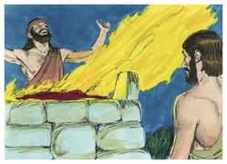

# 1 Reis Capítulo 3

## 1
E SALOMÃO se aparentou com Faraó, rei do Egito; e tomou a filha de Faraó, e a trouxe à cidade de Davi, até que acabasse de edificar a sua casa, e a casa do Senhor, e a muralha de Jerusalém em redor.

## 2
Entretanto, o povo sacrificava sobre os altos; porque até àqueles dias ainda não se havia edificado casa ao nome do Senhor.

## 3
E Salomão amava ao Senhor, andando nos estatutos de Davi seu pai; somente que nos altos sacrificava, e queimava incenso.

## 4
E foi o rei a Gibeom para lá sacrificar, porque aquele era o alto maior; mil holocaustos sacrificou Salomão naquele altar.

## 5
E em Gibeom apareceu o Senhor a Salomão de noite em sonhos; e disse-lhe Deus: Pede o que queres que eu te dê.

## 6
E disse Salomão: De grande beneficência usaste tu com teu servo Davi, meu pai, como também ele andou contigo em verdade, e em justiça, e em retidão de coração, perante a tua face; e guardaste-lhe esta grande beneficência, e lhe deste um filho que se assentasse no seu trono, como se vê neste dia.

## 7
Agora, pois, ó Senhor meu Deus, tu fizeste reinar a teu servo em lugar de Davi meu pai; e sou apenas um menino pequeno; não sei como sair, nem como entrar.

## 8
E teu servo está no meio do teu povo que elegeste; povo grande, que nem se pode contar, nem numerar, pela sua multidão.

## 9
A teu servo, pois, dá um coração entendido para julgar a teu povo, para que prudentemente discirna entre o bem e o mal; porque quem poderia julgar a este teu tão grande povo?

## 10
E esta palavra pareceu boa aos olhos do Senhor, de que Salomão pedisse isso.

## 11
E disse-lhe Deus: Porquanto pediste isso, e não pediste para ti muitos dias, nem pediste para ti riquezas, nem pediste a vida de teus inimigos; mas pediste para ti entendimento, para discernires o que é justo;

## 12
Eis que fiz segundo as tuas palavras; eis que te dei um coração tão sábio e entendido, que antes de ti igual não houve, e depois de ti igual não se levantará.

## 13
E também até o que não pediste te dei, assim riquezas como glória; de modo que não haverá um igual entre os reis, por todos os teus dias.

## 14
E, se andares nos meus caminhos, guardando os meus estatutos, e os meus mandamentos, como andou Davi teu pai, também prolongarei os teus dias.

## 15
E acordou Salomão, e eis que era sonho. E indo a Jerusalém, pôs-se perante a arca da aliança do Senhor, e sacrificou holocausto, e preparou sacrifícios pacíficos, e fez um banquete a todos os seus servos.

## 16
Então vieram duas mulheres prostitutas ao rei, e se puseram perante ele.

## 17
E disse-lhe uma das mulheres: Ah! senhor meu, eu e esta mulher moramos numa casa; e tive um filho, estando com ela naquela casa.

## 18
E sucedeu que, ao terceiro dia, depois do meu parto, teve um filho também esta mulher; estávamos juntas; nenhum estranho estava conosco na casa; somente nós duas naquela casa.

## 19
E de noite morreu o filho desta mulher, porquanto se deitara sobre ele.

## 20
E levantou-se à meia-noite, e tirou o meu filho do meu lado, enquanto dormia a tua serva, e o deitou no seu seio; e a seu filho morto deitou no meu seio.

## 21
E, levantando-me eu pela manhã, para dar de mamar a meu filho, eis que estava morto; mas, atentando pela manhã para ele, eis que não era meu filho, que eu havia tido.

## 22
Então disse a outra mulher: Não, mas o vivo é meu filho, e teu filho o morto. Porém esta disse: Não, por certo, o morto é teu filho, e meu filho o vivo. Assim falaram perante o rei.

## 23
Então disse o rei: Esta diz: Este que vive é meu filho, e teu filho o morto; e esta outra diz: Não, por certo, o morto é teu filho e meu filho o vivo.

## 24
Disse mais o rei: Trazei-me uma espada. E trouxeram uma espada diante do rei.

## 25
E disse o rei: Dividi em duas partes o menino vivo; e dai metade a uma, e metade a outra.

## 26
Mas a mulher, cujo filho era o vivo, falou ao rei (porque as suas entranhas se lhe enterneceram por seu filho), e disse: Ah! senhor meu, dai-lhe o menino vivo, e de modo nenhum o mateis. Porém a outra dizia: Nem teu nem meu seja; dividi-o.

## 27
Então respondeu o rei, e disse: Dai a esta o menino vivo, e de maneira nenhuma o mateis, porque esta é sua mãe.

## 28
E todo o Israel ouviu o juízo que havia dado o rei, e temeu ao rei; porque viram que havia nele a sabedoria de Deus, para fazer justiça.

