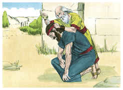
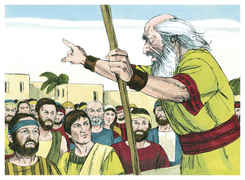
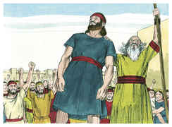

# 1Samuel Capítulo 10

## 1
ENTÃO tomou Samuel um vaso de azeite, e lho derramou sobre a cabeça, e beijou-o, e disse: Porventura não te ungiu o Senhor por capitão sobre a sua herança?

## 2
Apartando-te hoje de mim, acharás dois homens junto ao sepulcro de Raquel, no termo de Benjamim, em Zelza, os quais te dirão: Acharam-se as jumentas que foste buscar, e eis que já o teu pai deixou o negócio das jumentas, e anda aflito por causa de vós, dizendo: Que farei eu por meu filho?

## 3
E quando dali passares mais adiante, e chegares ao carvalho de Tabor, ali te encontrarão três homens, que vão subindo a Deus a Betel; um levando três cabritos, o outro três bolos de pão e o outro um odre de vinho.

## 4
E te perguntarão como estás, e te darão dois pães, que tomarás das suas mãos.

## 5
Então chegarás ao outeiro de Deus, onde está a guarnição dos filisteus; e há de ser que, entrando ali na cidade, encontrarás um grupo de profetas que descem do alto, e trazem diante de si saltérios, e tambores, e flautas, e harpas; e eles estarão profetizando.

## 6
E o Espírito do Senhor se apoderará de ti, e profetizarás com eles, e tornar-te-ás um outro homem.

## 7
E há de ser que, quando estes sinais te vierem, faze o que achar a tua mão, porque Deus é contigo.

## 8
Tu, porém, descerás antes de mim a Gilgal, e eis que eu descerei a ti, para sacrificar holocaustos, e para oferecer ofertas pacíficas; ali sete dias esperarás, até que eu venha a ti, e te declare o que hás de fazer.

## 9
Sucedeu, pois, que, virando ele as costas para partir de Samuel, Deus lhe mudou o coração em outro; e todos aqueles sinais aconteceram naquele mesmo dia.

## 10
E, chegando eles ao outeiro, eis que um grupo de profetas lhes saiu ao encontro; e o Espírito de Deus se apoderou dele, e profetizou no meio deles.

## 11
E aconteceu que, como todos os que antes o conheciam viram que ele profetizava com os profetas, então disse o povo, cada um ao seu companheiro: Que é o que sucedeu ao filho de Quis? Está também Saul entre os profetas?

## 12
Então um homem dali respondeu, e disse: Pois quem é o pai deles? Pelo que se tornou em provérbio: Está Saul também entre os profetas?

## 13
E, acabando de profetizar, foi ao alto.

## 14
E disse-lhe o tio de Saul, a ele e ao seu moço: Aonde fostes? E disse ele: A buscar as jumentas, e, vendo que não apareciam, fomos a Samuel.

## 15
Então disse o tio de Saul: Declara-me, peço-te, o que vos disse Samuel?

## 16
E disse Saul a seu tio: Declarou-nos, na verdade, que as jumentas foram encontradas. Porém o negócio do reino, de que Samuel falara, não lhe declarou.

## 17
Convocou, pois, Samuel o povo ao Senhor, em Mizpá.

## 18
E disse aos filhos de Israel: Assim disse o Senhor Deus de Israel: Eu fiz subir a Israel do Egito, e livrei-vos da mão dos egípcios e da mão de todos os reinos que vos oprimiam.

## 19
Mas vós tendes rejeitado hoje a vosso Deus, que vos livrou de todos os vossos males e trabalhos, e lhe tendes falado: Põe um rei sobre nós. Agora, pois, ponde-vos perante o Senhor, pelas vossas tribos e segundo os vossos milhares.

## 20
Tendo, pois, Samuel feito chegar todas as tribos, tomou-se a tribo de Benjamim.

## 21
E, fazendo chegar a tribo de Benjamim pelas suas famílias, tomou-se a família de Matri; e dela se tomou Saul, filho de Quis; e o buscaram, porém não se achou.

## 22
Então tornaram a perguntar ao Senhor se aquele homem ainda viria ali. E disse o Senhor: Eis que se escondeu entre a bagagem.

## 23
E correram, e o tomaram dali, e pôs-se no meio do povo; e era mais alto do que todo o povo desde o ombro para cima.

## 24
Então disse Samuel a todo o povo: Vedes já a quem o Senhor escolheu? Pois em todo o povo não há nenhum semelhante a ele. Então jubilou todo o povo, e disse: Viva o rei!

## 25
E declarou Samuel ao povo o direito do reino, e escreveu-o num livro, e pô-lo perante o Senhor; então despediu Samuel a todo o povo, cada um para sua casa.

## 26
E foi também Saul à sua casa, em Gibeá; e foram com ele do exército aqueles cujos corações Deus tocara.

## 27
Mas os filhos de Belial disseram: É este o que nos há de livrar? E o desprezaram, e não lhe trouxeram presentes; porém ele se fez como surdo.

