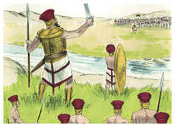
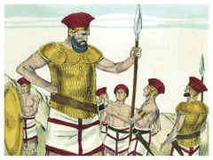
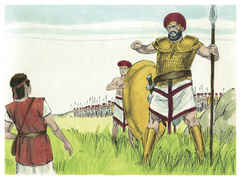
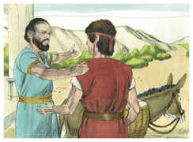
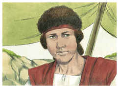
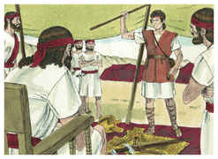
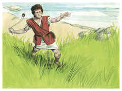
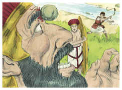
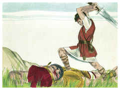
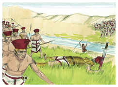

# 1Samuel Capítulo 17

## 1
E OS filisteus ajuntaram as suas forças para a guerra e congregaram-se em Socó, que está em Judá, e acamparam-se entre Socó e Azeca, no termo de Damim.

## 2
Porém Saul e os homens de Israel se ajuntaram e acamparam no vale do carvalho, e ordenaram a batalha contra os filisteus.

## 3
E os filisteus estavam num monte de um lado, e os israelitas estavam num monte do outro lado; e o vale estava entre eles.

## 4
Então saiu do arraial dos filisteus um homem guerreiro, cujo nome era Golias, de Gate, que tinha de altura seis côvados e um palmo.

## 5
Trazia na cabeça um capacete de bronze, e vestia uma couraça de escamas; e era o peso da couraça de cinco mil siclos de bronze.

## 6
E trazia grevas de bronze por cima de seus pés, e um escudo de bronze entre os seus ombros.

## 7
E a haste da sua lança era como o eixo do tecelão, e a ponta da sua lança de seiscentos siclos de ferro, e diante dele ia o escudeiro.

## 8
E parou, e clamou às companhias de Israel, e disse-lhes: Para que saireis a ordenar a batalha? Não sou eu filisteu e vós servos de Saul? Escolhei dentre vós um homem que desça a mim.

## 9
Se ele puder pelejar comigo, e me ferir, a vós seremos por servos; porém, se eu o vencer, e o ferir, então a nós sereis por servos, e nos servireis.

## 10
Disse mais o filisteu: Hoje desafio as companhias de Israel, dizendo: Dai-me um homem, para que ambos pelejemos.

## 11
Ouvindo então Saul e todo o Israel estas palavras do filisteu, espantaram-se, e temeram muito.

## 12
E Davi era filho de um homem efrateu, de Belém de Judá, cujo nome era Jessé, que tinha oito filhos; e nos dias de Saul era este homem já velho e adiantado em idade entre os homens.

## 13
Foram-se os três filhos mais velhos de Jessé, e seguiram a Saul à guerra; e eram os nomes de seus três filhos, que se foram à guerra, Eliabe, o primogênito, e o segundo Abinadabe, e o terceiro Sama.

## 14
E Davi era o menor; e os três maiores seguiram a Saul.

## 15
Davi, porém, ia e voltava de Saul, para apascentar as ovelhas de seu pai em Belém.

## 16
Chegava-se, pois, o filisteu pela manhã e à tarde; e apresentou-se por quarenta dias.

## 17
E disse Jessé a Davi, seu filho: Toma, peço-te, para teus irmãos um efa deste grão tostado e estes dez pães, e corre a levá-los ao arraial, a teus irmãos.

## 18
Porém estes dez queijos de leite leva ao capitão de mil; e visitarás a teus irmãos, a ver se vão bem; e tomarás o seu penhor.

## 19
E estavam Saul, e eles, e todos os homens de Israel no vale do carvalho, pelejando com os filisteus.

## 20
Davi então se levantou de madrugada, pela manhã, e deixou as ovelhas com um guarda, e carregou-se, e partiu, como Jessé lhe ordenara; e chegou ao lugar dos carros, quando já o exército saía em ordem de batalha, e a gritos chamavam à peleja.

## 21
E os israelitas e filisteus se puseram em ordem, fileira contra fileira.

## 22
E Davi deixou a carga que trouxera na mão do guarda da bagagem, e correu à batalha; e, chegando, perguntou a seus irmãos se estavam bem.

## 23
E, estando ele ainda falando com eles, eis que vinha subindo do exército dos filisteus o homem guerreiro, cujo nome era Golias, o filisteu de Gate; e falou conforme àquelas palavras, e Davi as ouviu.

## 24
Porém todos os homens em Israel, vendo aquele homem, fugiram de diante dele, e temiam grandemente.

## 25
E diziam os homens de Israel: Vistes aquele homem que subiu? Pois subiu para afrontar a Israel; há de ser, pois, que, o homem que o ferir, o rei o enriquecerá de grandes riquezas, e lhe dará a sua filha, e fará livre a casa de seu pai em Israel.

## 26
Então falou Davi aos homens que estavam com ele, dizendo: Que farão àquele homem, que ferir a este filisteu, e tirar a afronta de sobre Israel? Quem é, pois, este incircunciso filisteu, para afrontar os exércitos do Deus vivo?

## 27
E o povo lhe tornou a falar conforme àquela palavra dizendo: Assim farão ao homem que o ferir.

## 28
E, ouvindo Eliabe, seu irmão mais velho, falar àqueles homens, acendeu-se a ira de Eliabe contra Davi, e disse: Por que desceste aqui? Com quem deixaste aquelas poucas ovelhas no deserto? Bem conheço a tua presunção, e a maldade do teu coração, que desceste para ver a peleja.

## 29
Então disse Davi: Que fiz eu agora? Porventura não há razão para isso?

## 30
E desviou-se dele para outro, e falou conforme àquela palavra; e o povo lhe tornou a responder conforme às primeiras palavras.

## 31
E, ouvidas as palavras que Davi havia falado, as anunciaram a Saul, que mandou chamá-lo.

## 32
E Davi disse a Saul: Não desfaleça o coração de ninguém por causa dele; teu servo irá, e pelejará contra este filisteu.

## 33
Porém Saul disse a Davi: Contra este filisteu não poderás ir para pelejar com ele; pois tu ainda és moço, e ele homem de guerra desde a sua mocidade.

## 34
Então disse Davi a Saul: Teu servo apascentava as ovelhas de seu pai; e quando vinha um leão e um urso, e tomava uma ovelha do rebanho,

## 35
Eu saía após ele e o feria, e livrava-a da sua boca; e, quando ele se levantava contra mim, lançava-lhe mão da barba, e o feria e o matava.

## 36
Assim feria o teu servo o leão, como o urso; assim será este incircunciso filisteu como um deles; porquanto afrontou os exércitos do Deus vivo.

## 37
Disse mais Davi: O Senhor me livrou das garras do leão, e das do urso; ele me livrará da mão deste filisteu. Então disse Saul a Davi: Vai, e o Senhor seja contigo.

## 38
E Saul vestiu a Davi de suas vestes, e pôs-lhe sobre a cabeça um capacete de bronze; e o vestiu de uma couraça.

## 39
E Davi cingiu a espada sobre as suas vestes, e começou a andar; porém nunca o havia experimentado; então disse Davi a Saul: Não posso andar com isto, pois nunca o experimentei. E Davi tirou aquilo de sobre si.

## 40
E tomou o seu cajado na mão, e escolheu para si cinco seixos do ribeiro, e pô-los no alforje de pastor, que trazia, a saber, no surrão, e lançou mão da sua funda; e foi aproximando-se do filisteu.

## 41
O filisteu também vinha se aproximando de Davi; e o que lhe levava o escudo ia adiante dele.

## 42
E, olhando o filisteu, e vendo a Davi, o desprezou, porquanto era moço, ruivo, e de gentil aspecto.

## 43
Disse, pois, o filisteu a Davi: Sou eu algum cão, para tu vires a mim com paus? E o filisteu pelos seus deuses amaldiçoou a Davi.

## 44
Disse mais o filisteu a Davi: Vem a mim, e darei a tua carne às aves do céu e às bestas do campo.

## 45
Davi, porém, disse ao filisteu: Tu vens a mim com espada, e com lança, e com escudo; porém eu venho a ti em nome do Senhor dos Exércitos, o Deus dos exércitos de Israel, a quem tens afrontado.

## 46
Hoje mesmo o Senhor te entregará na minha mão, e ferir-te-ei, e tirar-te-ei a cabeça, e os corpos do arraial dos filisteus darei hoje mesmo às aves do céu e às feras da terra; e toda a terra saberá que há Deus em Israel;

## 47
E saberá toda esta congregação que o Senhor salva, não com espada, nem com lança; porque do Senhor é a guerra, e ele vos entregará na nossa mão.

## 48
E sucedeu que, levantando-se o filisteu, e indo encontrar-se com Davi, apressou-se Davi, e correu ao combate, a encontrar-se com o filisteu.

## 49
E Davi pôs a mão no alforje, e tomou dali uma pedra e com a funda lha atirou, e feriu o filisteu na testa, e a pedra se lhe encravou na testa, e caiu sobre o seu rosto em terra.

## 50
Assim Davi prevaleceu contra o filisteu, com uma funda e com uma pedra, e feriu o filisteu, e o matou; sem que Davi tivesse uma espada na mão.

## 51
Por isso correu Davi, e pôs-se em pé sobre o filisteu, e tomou a sua espada, e tirou-a da bainha, e o matou, e lhe cortou com ela a cabeça; vendo então os filisteus, que o seu herói era morto, fugiram.

## 52
Então os homens de Israel e Judá se levantaram, e jubilaram, e seguiram os filisteus, até chegar ao vale, e até às portas de Ecrom; e caíram os feridos dos filisteus pelo caminho de Saaraim até Gate e até Ecrom.

## 53
Então voltaram os filhos de Israel de perseguirem os filisteus, e despojaram os seus arraiais.

## 54
E Davi tomou a cabeça do filisteu, e a trouxe a Jerusalém; porém pôs as armas dele na sua tenda.

## 55
Vendo, porém, Saul, sair Davi a encontrar-se com o filisteu, disse a Abner, o capitão do exército: De quem é filho este moço, Abner? E disse Abner: Vive a tua alma, ó rei, que o não sei.

## 56
Disse então o rei: Pergunta, pois, de quem é filho este moço.

## 57
Voltando, pois, Davi de ferir o filisteu, Abner o tomou consigo, e o trouxe à presença de Saul, trazendo ele na mão a cabeça do filisteu.

## 58
E disse-lhe Saul: De quem és filho, jovem? E disse Davi: Filho de teu servo Jessé, belemita.

