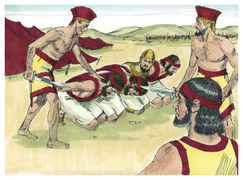
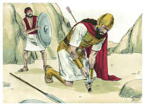
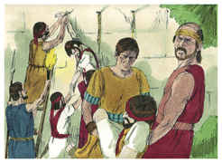

# 1Samuel Capítulo 31

## 1
OS filisteus, pois, pelejaram contra Israel; e os homens de Israel fugiram de diante dos filisteus, e caíram mortos na montanha de Gilboa.

## 2
E os filisteus perseguiram a Saul e a seus filhos; e mataram a Jônatas, e a Abinadabe, e a Malquisua, filhos de Saul.

## 3
E a peleja se agravou contra Saul, e os flecheiros o alcançaram; e muito temeu por causa dos flecheiros.

## 4
Então disse Saul ao seu pajem de armas: Arranca a tua espada, e atravessa-me com ela, para que porventura não venham estes incircuncisos, e me atravessem e escarneçam de mim. Porém o seu pajem de armas não quis, porque temia muito; então Saul tomou a espada, e se lançou sobre ela.

## 5
Vendo, pois, o seu pajem de armas que Saul já era morto, também ele se lançou sobre a sua espada, e morreu com ele.

## 6
Assim faleceu Saul, e seus três filhos, e o seu pajem de armas, e também todos os seus homens morreram juntamente naquele dia.

## 7
E, vendo os homens de Israel, que estavam deste lado do vale e deste lado do Jordão, que os homens de Israel fugiram, e que Saul e seus filhos estavam mortos, abandonaram as cidades, e fugiram; e vieram os filisteus, e habitaram nelas.

## 8
Sucedeu, pois, que, vindo os filisteus no outro dia para despojar os mortos, acharam a Saul e a seus três filhos estirados na montanha de Gilboa.

## 9
E cortaram-lhe a cabeça, e o despojaram das suas armas, e enviaram pela terra dos filisteus, em redor, a anunciá-lo no templo dos seus ídolos e entre o povo.

## 10
E puseram as suas armas no templo de Astarote, e o seu corpo o afixaram no muro de Bete-Sã.

## 11
Ouvindo então os moradores de Jabes-Gileade, o que os filisteus fizeram a Saul,

## 12
Todo o homem valoroso se levantou, e caminharam toda a noite, e tiraram o corpo de Saul e os corpos de seus filhos do muro, de Bete-Sã, e, vindo a Jabes, os queimaram.

## 13
E tomaram os seus ossos, e os sepultaram debaixo de um arvoredo, em Jabes, e jejuaram sete dias.

