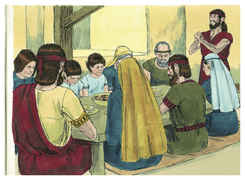

# 2 Crônicas Capítulo 35

## 1
ENTÃO Josias celebrou a páscoa ao Senhor em Jerusalém; e mataram o cordeiro da páscoa no décimo quarto dia do primeiro mês.

## 2
E estabeleceu os sacerdotes nos seus cargos, e os animou ao ministério da casa do Senhor.

## 3
E disse aos levitas que ensinavam a todo o Israel e estavam consagrados ao Senhor: Ponde a arca sagrada na casa que edificou Salomão, filho de Davi, rei de Israel; não tereis mais esta carga aos ombros; agora servi ao Senhor vosso Deus, e ao seu povo Israel.

## 4
E preparai-vos segundo as vossas casas paternas e segundo as vossas turmas, conforme à prescrição de Davi, rei de Israel, e a de Salomão, seu filho.

## 5
E estai no santuário segundo as divisões das casas paternas de vossos irmãos, os filhos do povo; e haja para cada divisão uma parte de uma família de levitas.

## 6
E imolai a páscoa, e santificai-vos, e preparai-a para vossos irmãos, fazendo conforme a palavra do Senhor, dada pela mão de Moisés.

## 7
E ofereceu Josias, aos filhos do povo, cordeiros e cabritos do rebanho, todos para os sacrifícios da páscoa, em número de trinta mil, por todos os que ali se achavam, e de bois três mil; isto era da fazenda do rei.

## 8
Também apresentaram os seus príncipes ofertas voluntárias ao povo, aos sacerdotes e aos levitas: Hilquias, e Zacarias, e Jeiel, líderes da casa de Deus, deram aos sacerdotes para os sacrifícios da páscoa duas mil e seiscentas reses de gado miúdo, e trezentos bois.

## 9
E Conanias, e Semaías, e Natanael, seus irmãos, como também Hasabias, e Jeiel, e Jozabade, chefe dos levitas, apresentaram aos levitas, para os sacrifícios da páscoa, cinco mil reses de gado miúdo, e quinhentos bois.

## 10
Assim se preparou o serviço, e puseram-se os sacerdotes nos seus postos, e os levitas nas suas turmas, conforme a ordem do rei,

## 11
Então imolaram a páscoa; e os sacerdotes espargiram o sangue recebido das mãos dos levitas que esfolavam as reses.

## 12
E puseram de parte os holocaustos para os darem aos filhos do povo, segundo as divisões das casas paternas, para o oferecerem ao Senhor, como está escrito no livro de Moisés; e assim fizeram com os bois.

## 13
E assaram a páscoa no fogo, segundo o rito; e as ofertas sagradas cozeram em panelas, e em caldeirões e em sertãs; e prontamente as repartiram entre todo o povo.

## 14
Depois prepararam para si e para os sacerdotes; porque os sacerdotes, filhos de Arão, se ocuparam até à noite com o sacrifício dos holocaustos e da gordura; por isso os levitas prepararam para si e para os sacerdotes, filhos de Arão.

## 15
E os cantores, filhos de Asafe, estavam no seu posto, segundo o mandado de Davi, e de Asafe, e de Hemã, e de Jedutum, vidente do rei, como também os porteiros a cada porta; não necessitaram de se desviarem do seu ministério; porquanto seus irmãos, os levitas, preparavam o necessário para eles.

## 16
Assim se estabeleceu todo o serviço do Senhor naquele dia, para celebrar a páscoa, e oferecer holocaustos sobre o altar do Senhor, segundo a ordem do rei Josias.

## 17
E os filhos de Israel que ali se acharam celebraram a páscoa naquele tempo, e a festa dos pães ázimos, durante sete dias.

## 18
Nunca, pois, se celebrou tal páscoa em Israel, desde os dias do profeta Samuel; nem nenhum rei de Israel celebrou tal páscoa como a que celebrou Josias com os sacerdotes, e levitas, e todo o Judá e Israel, que ali se acharam, e os habitantes de Jerusalém.

## 19
No décimo oitavo ano do reinado de Josias se celebrou esta páscoa.

## 20
Depois de tudo isto, havendo Josias já preparado o templo, subiu Neco, rei do Egito, para guerrear contra Carquemis, junto ao Eufrates; e Josias lhe saiu ao encontro.

## 21
Então ele lhe mandou mensageiros, dizendo: Que tenho eu contigo, rei de Judá? Não é contra ti que venho hoje, mas contra a casa que me faz guerra; e disse Deus que me apressasse; guarda-te de te opores a Deus, que é comigo, para que ele não te destrua.

## 22
Porém Josias não virou dele o seu rosto, antes se disfarçou, para pelejar contra ele; e não deu ouvidos às palavras de Neco, que saíram da boca de Deus; antes veio pelejar no vale de Megido.

## 23
E os flecheiros atiraram contra o rei Josias. Então o rei disse a seus servos: Tirai-me daqui, porque estou gravemente ferido.

## 24
E seus servos o tiraram do carro, e o levaram no segundo carro que tinha, e o trouxeram a Jerusalém; e morreu, e o sepultaram nos sepulcros de seus pais; e todo o Judá e Jerusalém prantearam a Josias.

## 25
E Jeremias fez uma lamentação sobre Josias; e todos os cantores e cantoras, nas suas lamentações, têm falado de Josias, até ao dia de hoje; porque as estabeleceram por estatuto em Israel; e eis que estão escritas nas lamentações.

## 26
Quanto ao mais dos atos de Josias, e as suas boas obras, conforme o que está escrito na lei do Senhor,

## 27
E os seus atos, tanto os primeiros como os últimos, eis que estão escritos no livro dos reis de Israel e de Judá.

