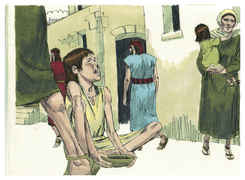
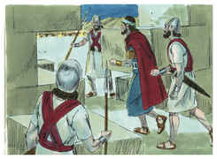
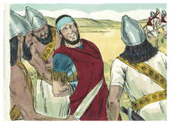
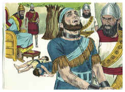
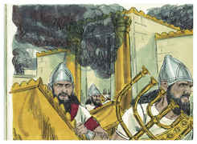
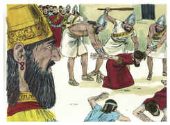
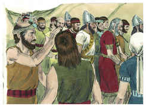
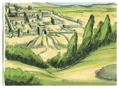

# 2 Reis Capítulo 25

## 1
E SUCEDEU que, no nono ano do seu reinado, no mês décimo, aos dez do mês, Nabucodonosor, rei de Babilônia, veio contra Jerusalém, ele e todo o seu exército, e se acampou contra ela, e levantaram contra ela trincheiras em redor.

## 2
E a cidade foi sitiada até ao undécimo ano do rei Zedequias.

## 3
Aos nove do mês quarto, quando a cidade se via apertada pela fome, nem havia pão para o povo da terra,

## 4
Então a cidade foi invadida, e todos os homens de guerra fugiram de noite pelo caminho da porta, entre os dois muros que estavam junto ao jardim do rei (porque os caldeus estavam contra a cidade em redor), e o rei se foi pelo caminho da campina.

## 5
Porém o exército dos caldeus perseguiu o rei, e o alcançou nas campinas de Jericó; e todo o seu exército se dispersou.

## 6
E tomaram o rei, e o fizeram subir ao rei de Babilônia, a Ribla; e foi-lhe pronunciada a sentença.

## 7
E aos filhos de Zedequias mataram diante dos seus olhos; e vazaram os olhos de Zedequias, e o ataram com duas cadeias de bronze, e o levaram a Babilônia.

## 8
E no quinto mês, no sétimo dia do mês (este era o ano décimo nono de Nabucodonosor, rei de Babilônia), veio Nebuzaradã, capitão da guarda, servo do rei de Babilônia, a Jerusalém.

## 9
E queimou a casa do Senhor e a casa do rei, como também todas as casas de Jerusalém, e todas as casas dos grandes queimou.

## 10
E todo o exército dos caldeus, que estava com o capitão da guarda, derrubou os muros em redor de Jerusalém.

## 11
E o mais do povo que deixaram ficar na cidade, os rebeldes que se renderam ao rei de Babilônia e o mais da multidão, Nebuzaradã, o capitão da guarda, levou presos.

## 12
Porém dos mais pobres da terra deixou o capitão da guarda ficar alguns para vinheiros e para lavradores.

## 13
Quebraram mais, os caldeus, as colunas de cobre que estavam na casa do Senhor, como também as bases e o mar de cobre que estavam na casa do Senhor; e levaram o seu bronze para Babilônia.

## 14
Também tomaram as caldeiras, as pás, os apagadores, as colheres e todos os vasos de cobre, com que se ministrava.

## 15
Também o capitão-da-guarda tomou os braseiros, e as bacias, o que era de ouro puro, em ouro e o que era de prata, em prata.

## 16
As duas colunas, um mar, e as bases, que Salomão fizera para a casa do Senhor; o cobre de todos estes vasos não tinha peso.

## 17
A altura de uma coluna era de dezoito côvados, e sobre ela havia um capitel de cobre, e de altura tinha o capitel três côvados; e a rede e as romãs em redor do capitel, tudo era de cobre; e semelhante a esta era a outra coluna com a rede.

## 18
Também o capitão-da-guarda tomou a Seraías, primeiro sacerdote, e a Sofonias, segundo sacerdote, e aos três guardas do umbral da porta.

## 19
E da cidade tomou a um oficial, que tinha cargo dos homens de guerra, e a cinco homens dos que estavam na presença do rei, e se achavam na cidade, como também ao escrivão-mor do exército, que registrava o povo da terra para a guerra, e a sessenta homens do povo da terra, que se achavam na cidade.

## 20
E tomando-os Nebuzaradã, o capitão da guarda, os levou ao rei de Babilônia, a Ribla.

## 21
E o rei de Babilônia os feriu e os matou em Ribla, na terra de Hamate; e Judá foi levado preso para fora da sua terra.

## 22
Porém, quanto ao povo que ficara na terra de Judá, que Nabucodonosor, rei de Babilônia, deixou ficar, pôs sobre ele, por governador a Gedalias, filho de Aicão, filho de Safã.

## 23
Ouvindo, pois, os capitães dos exércitos, eles e os seus homens, que o rei de Babilônia pusera a Gedalias por governador, vieram a Gedalias, a Mizpá, a saber: Ismael, filho de Netanias, e Joanã, filho de Careá, e Seraías, filho de Tanumete, o netofatita, e Jazanias, filho do maacatita, eles e os seus homens.

## 24
E Gedalias jurou a eles e aos seus homens, e lhes disse: Não temais ser servos dos caldeus; ficai na terra, servi ao rei de Babilônia, e bem vos irá.

## 25
Sucedeu, porém, que, no sétimo mês, veio Ismael, filho de Netanias, o filho de Elisama, da descendência real, e dez homens com ele, e feriram a Gedalias, e ele morreu, como também aos judeus, e aos caldeus que estavam com ele em Mizpá.

## 26
Então todo o povo se levantou, desde o menor até ao maior, como também os capitães dos exércitos, e foram ao Egito, porque temiam os caldeus.

## 27
Depois disto sucedeu que, no ano trinta e sete do cativeiro de Joaquim, rei de Judá, no mês duodécimo, aos vinte e sete do mês, Evil-Merodaque, rei de Babilônia, no ano em que reinou, levantou a cabeça de Joaquim, rei de Judá, tirando-o da casa da prisão.

## 28
E lhe falou benignamente; e pôs o seu trono acima do trono dos reis que estavam com ele em Babilônia.

## 29
E lhe mudou as roupas de prisão, e de contínuo comeu pão na sua presença todos os dias da sua vida.

## 30
E, quanto à sua subsistência, pelo rei lhe foi dada subsistência contínua, a porção de cada dia no seu dia, todos os dias da sua vida.

