# 2 Reis Capítulo 4

## 1
E UMA mulher, das mulheres dos filhos dos profetas, clamou a Eliseu, dizendo: Meu marido, teu servo, morreu; e tu sabes que o teu servo temia ao Senhor; e veio o credor, para levar os meus dois filhos para serem servos.

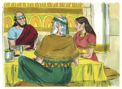

## 2
E Eliseu lhe disse: Que te hei de fazer? Dize-me que é o que tens em casa. E ela disse: Tua serva não tem nada em casa, senão uma botija de azeite.

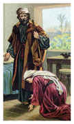

## 3
Então disse ele: Vai, pede emprestadas, de todos os teus vizinhos, vasilhas vazias, não poucas.

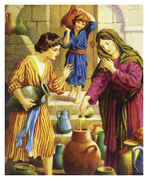

## 4
Então entra, e fecha a porta sobre ti, e sobre teus filhos, e deita o azeite em todas aquelas vasilhas, e põe à parte a que estiver cheia.

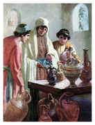

## 5
Partiu, pois, dele, e fechou a porta sobre si e sobre seus filhos; e eles lhe traziam as vasilhas, e ela as enchia.

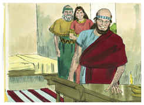

## 6
E sucedeu que, cheias que foram as vasilhas, disse a seu filho: Traze-me ainda uma vasilha. Porém ele lhe disse: Não há mais vasilha alguma. Então o azeite parou.

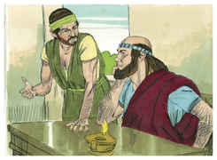

## 7
Então veio ela, e o fez saber ao homem de Deus; e disse ele: Vai, vende o azeite, e paga a tua dívida; e tu e teus filhos vivei do resto.

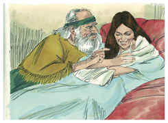

## 8
Sucedeu também um dia que, indo Eliseu a Suném, havia ali uma mulher importante, a qual o reteve para comer pão; e sucedeu que todas as vezes que passava por ali entrava para comer pão.

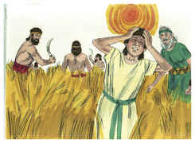

## 9
E ela disse a seu marido: Eis que tenho observado que este que sempre passa por nós é um santo homem de Deus.

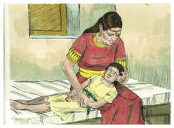

## 10
Façamos-lhe, pois, um pequeno quarto junto ao muro, e ali lhe ponhamos uma cama, uma mesa, uma cadeira e um candeeiro; e há de ser que, vindo ele a nós, para ali se recolherá.

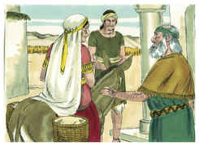

## 11
E sucedeu que um dia ele chegou ali, e recolheu-se àquele quarto, e se deitou.

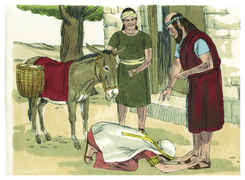

## 12
Então disse ao seu servo Geazi: Chama esta sunamita. E chamando-a ele, ela se pôs diante dele.

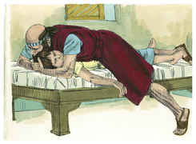

## 13
Porque ele tinha falado a Geazi: Dize-lhe: Eis que tu nos tens tratado com todo o desvelo; que se há de fazer por ti? Haverá alguma coisa de que se fale por ti ao rei, ou ao capitão do exército? E disse ela: Eu habito no meio do meu povo.

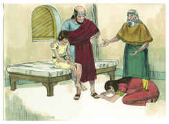

## 14
Então disse ele: Que se há de fazer por ela? E Geazi disse: Ora ela não tem filho, e seu marido é velho.

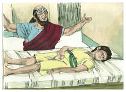

## 15
Por isso disse ele: Chama-a. E, chamando-a ele, ela se pôs à porta.

## 16
E ele disse: A este tempo determinado, segundo o tempo da vida, abraçarás um filho. E disse ela: Não, meu senhor, homem de Deus, não mintas à tua serva.

## 17
E concebeu a mulher, e deu à luz um filho, no tempo determinado, no ano seguinte, segundo Eliseu lhe dissera.

## 18
E, crescendo o filho, sucedeu que um dia saiu para ter com seu pai, que estava com os segadores,

## 19
E disse a seu pai: Ai, a minha cabeça! Ai, a minha cabeça! Então disse a um moço: Leva-o à sua mãe.

## 20
E ele o tomou, e o levou à sua mãe; e esteve sobre os seus joelhos até ao meio-dia, e morreu.

## 21
E subiu ela, e o deitou sobre a cama do homem de Deus; e fechou a porta, e saiu.

## 22
E chamou a seu marido, e disse: Manda-me já um dos moços, e uma das jumentas, para que eu corra ao homem de Deus, e volte.

## 23
E disse ele: Por que vais a ele hoje? Não é lua nova nem sábado. E ela disse: Tudo vai bem.

## 24
Então albardou a jumenta, e disse ao seu servo: Guia e anda, e não te detenhas no caminhar, senão quando eu to disser.

## 25
Partiu ela, pois, e foi ao homem de Deus, ao monte Carmelo; e sucedeu que, vendo-a o homem de Deus de longe, disse a Geazi, seu servo: Eis aí a sunamita.

## 26
Agora, pois, corre-lhe ao encontro e dize-lhe: Vai bem contigo? Vai bem com teu marido? Vai bem com teu filho? E ela disse: Vai bem.

## 27
Chegando ela, pois, ao homem de Deus, ao monte, pegou nos seus pés; mas chegou Geazi para retirá-la; disse porém o homem de Deus: Deixa-a, porque a sua alma está triste de amargura, e o Senhor me encobriu, e não me manifestou.

## 28
E disse ela: Pedi eu a meu senhor algum filho? Não disse eu: Não me enganes?

## 29
E ele disse a Geazi: Cinge os teus lombos, toma o meu bordão na tua mão, e vai; se encontrares alguém não o saúdes, e se alguém te saudar, não lhe respondas; e põe o meu bordão sobre o rosto do menino.

## 30
Porém disse a mãe do menino: Vive o Senhor, e vive a tua alma, que não te hei de deixar. Então ele se levantou, e a seguiu.

## 31
E Geazi passou adiante deles, e pôs o bordão sobre o rosto do menino; porém não havia nele voz nem sentido; e voltou a encontrar-se com ele, e lhe trouxe aviso, dizendo: O menino não despertou.

## 32
E, chegando Eliseu àquela casa, eis que o menino jazia morto sobre a sua cama.

## 33
Então entrou ele, e fechou a porta sobre eles ambos, e orou ao Senhor.

## 34
E subiu à cama e deitou-se sobre o menino, e, pondo a sua boca sobre a boca dele, e os seus olhos sobre os olhos dele, e as suas mãos sobre as mãos dele, se estendeu sobre ele; e a carne do menino aqueceu.

## 35
Depois desceu, e andou naquela casa de uma parte para a outra, e tornou a subir, e se estendeu sobre ele, então o menino espirrou sete vezes, e abriu os olhos.

## 36
Então chamou a Geazi, e disse: Chama esta sunamita. E chamou-a, e veio a ele. E disse ele: Toma o teu filho.

## 37
E entrou ela, e se prostrou a seus pés, e se inclinou à terra; e tomou o seu filho e saiu.

## 38
E, voltando Eliseu a Gilgal, havia fome naquela terra, e os filhos dos profetas estavam assentados na sua presença; e disse ao seu servo: Põe a panela grande ao lume, e faze um caldo de ervas para os filhos dos profetas.

## 39
Então um deles saiu ao campo a apanhar ervas, e achou uma parra brava, e colheu dela enchendo a sua capa de colocíntidas; e veio, e as cortou na panela do caldo; porque não as conheciam.

## 40
Assim deram de comer para os homens. E sucedeu que, comendo eles daquele caldo, clamaram e disseram: Homem de Deus, há morte na panela. Não puderam comer.

## 41
Porém ele disse: Trazei farinha. E deitou-a na panela, e disse: Dai de comer ao povo. E já não havia mal nenhum na panela.

## 42
E um homem veio de Baal-Salisa, e trouxe ao homem de Deus pães das primícias, vinte pães de cevada, e espigas verdes na sua palha, e disse: Dá ao povo, para que coma.

## 43
Porém seu servo disse: Como hei de pôr isto diante de cem homens? E disse ele: Dá ao povo, para que coma; porque assim diz o Senhor: Comerão, e sobejará.

## 44
Então lhos pôs diante, e comeram e ainda sobrou, conforme a palavra do Senhor.

