# 2 Reis Capítulo 5

## 1
E NAAMÃ, capitão do exército do rei da Síria, era um grande homem diante do seu senhor, e de muito respeito; porque por ele o Senhor dera livramento aos sírios; e era este homem herói valoroso, porém leproso.

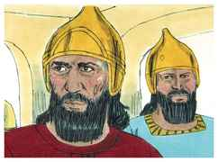

## 2
E saíram tropas da Síria, da terra de Israel, e levaram presa uma menina que ficou ao serviço da mulher de Naamã.

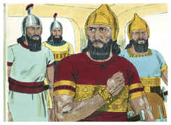

## 3
E disse esta à sua senhora: Antes o meu senhor estivesse diante do profeta que está em Samaria; ele o restauraria da sua lepra.

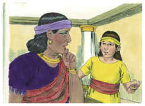

## 4
Então foi Naamã e notificou ao seu senhor, dizendo: Assim e assim falou a menina que é da terra de Israel.

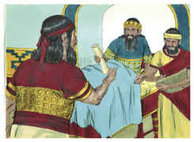

## 5
Então disse o rei da Síria: Vai, anda, e enviarei uma carta ao rei de Israel. E foi, e tomou na sua mão dez talentos de prata, seis mil siclos de ouro e dez mudas de roupas.

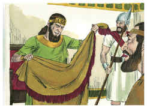

## 6
E levou a carta ao rei de Israel, dizendo: Logo, em chegando a ti esta carta, saibas que eu te enviei Naamã, meu servo, para que o cures da sua lepra.

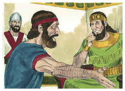

## 7
E sucedeu que, lendo o rei de Israel a carta, rasgou as suas vestes, e disse: Sou eu Deus, para matar e para vivificar, para que este envie a mim um homem, para que eu o cure da sua lepra? Pelo que deveras notai, peço-vos, e vede que busca ocasião contra mim.

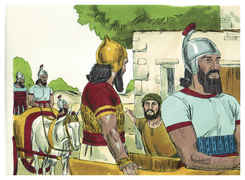

## 8
Sucedeu, porém, que, ouvindo Eliseu, homem de Deus, que o rei de Israel rasgara as suas vestes, mandou dizer ao rei: Por que rasgaste as tuas vestes? Deixa-o vir a mim, e saberá que há profeta em Israel.

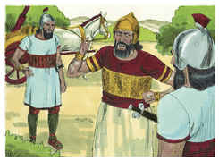

## 9
Veio, pois, Naamã com os seus cavalos, e com o seu carro, e parou à porta da casa de Eliseu.

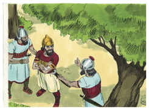

## 10
Então Eliseu lhe mandou um mensageiro, dizendo: Vai, e lava-te sete vezes no Jordão, e a tua carne será curada e ficarás purificado.

## 11
Porém, Naamã muito se indignou, e se foi, dizendo: Eis que eu dizia comigo: Certamente ele sairá, pôr-se-á em pé, invocará o nome do Senhor seu Deus, e passará a sua mão sobre o lugar, e restaurará o leproso.

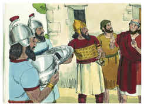

## 12
Não são porventura Abana e Farpar, rios de Damasco, melhores do que todas as águas de Israel? Não me poderia eu lavar neles, e ficar purificado? E voltou-se, e se foi com indignação.

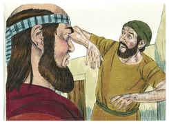

## 13
Então chegaram-se a ele os seus servos, e lhe falaram, e disseram: Meu pai, se o profeta te dissesse alguma grande coisa, porventura não a farias? Quanto mais, dizendo-te ele: Lava-te, e ficarás purificado.

## 14
Então desceu, e mergulhou no Jordão sete vezes, conforme a palavra do homem de Deus; e a sua carne tornou-se como a carne de um menino, e ficou purificado.

## 15
Então voltou ao homem de Deus, ele e toda a sua comitiva, e chegando, pôs-se diante dele, e disse: Eis que agora sei que em toda a terra não há Deus senão em Israel; agora, pois, peço-te que aceites uma bênção do teu servo.

## 16
Porém ele disse: Vive o Senhor, em cuja presença estou, que não a aceitarei. E instou com ele para que a aceitasse, mas ele recusou.

## 17
E disse Naamã: Se não queres, dê-se a este teu servo uma carga de terra que baste para carregar duas mulas; porque nunca mais oferecerá este teu servo holocausto nem sacrifício a outros deuses, senão ao Senhor.

## 18
Nisto perdoe o Senhor a teu servo; quando meu senhor entrar na casa de Rimom para ali adorar, e ele se encostar na minha mão, e eu também tenha de me encurvar na casa de Rimom; quando assim me encurvar na casa de Rimom, nisto perdoe o Senhor a teu servo.

## 19
E ele lhe disse: Vai em paz. E foi dele a uma pequena distância.

## 20
Então Geazi, servo de Eliseu, homem de Deus, disse: Eis que meu senhor poupou a este sírio Naamã, não recebendo da sua mão alguma coisa do que trazia; porém, vive o Senhor que hei de correr atrás dele, e receber dele alguma coisa.

## 21
E foi Geazi a alcançar Naamã; e Naamã, vendo que corria atrás dele, desceu do carro a encontrá-lo, e disse-lhe: Vai tudo bem?

## 22
E ele disse: Tudo vai bem; meu senhor me mandou dizer: Eis que agora mesmo vieram a mim dois jovens dos filhos dos profetas da montanha de Efraim; dá-lhes, pois, um talento de prata e duas mudas de roupas.

## 23
E disse Naamã: Sê servido tomar dois talentos. E instou com ele, e amarrou dois talentos de prata em dois sacos, com duas mudas de roupas; e pô-los sobre dois dos seus servos, os quais os levaram diante dele.

## 24
E, chegando ele a certa altura, tomou-os das suas mãos, e os depositou na casa; e despediu aqueles homens, e foram-se.

## 25
Então ele entrou, e pôs-se diante de seu senhor. E disse-lhe Eliseu: Donde vens, Geazi? E disse: Teu servo não foi nem a uma nem a outra parte.

## 26
Porém ele lhe disse: Porventura não foi contigo o meu coração, quando aquele homem voltou do seu carro a encontrar-te? Era a ocasião para receberes prata, e para tomares roupas, olivais e vinhas, ovelhas e bois, servos e servas?

## 27
Portanto a lepra de Naamã se pegará a ti e à tua descendência para sempre. Então saiu de diante dele leproso, branco como a neve.

