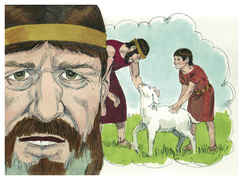
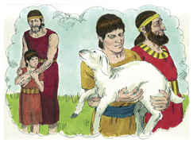
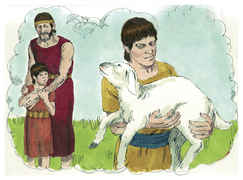
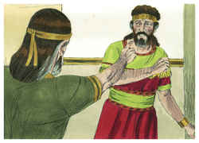
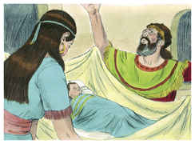
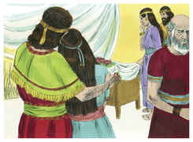
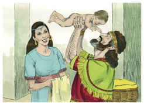

# 2 Samuel Capítulo 12

## 1
E O Senhor enviou Natã a Davi; e, apresentando-se ele a Davi, disse-lhe: Havia numa cidade dois homens, um rico e outro pobre.

## 2
O rico possuía muitíssimas ovelhas e vacas.

## 3
Mas o pobre não tinha coisa nenhuma, senão uma pequena cordeira que comprara e criara; e ela tinha crescido com ele e com seus filhos; do seu bocado comia, e do seu copo bebia, e dormia em seu regaço, e a tinha como filha.

## 4
E, vindo um viajante ao homem rico, deixou este de tomar das suas ovelhas e das suas vacas para assar para o viajante que viera a ele; e tomou a cordeira do homem pobre, e a preparou para o homem que viera a ele.

## 5
Então o furor de Davi se acendeu em grande maneira contra aquele homem, e disse a Natã: Vive o Senhor, que digno de morte é o homem que fez isso.

## 6
E pela cordeira tornará a dar o quadruplicado, porque fez tal coisa, e porque não se compadeceu.

## 7
Então disse Natã a Davi: Tu és este homem. Assim diz o Senhor Deus de Israel: Eu te ungi rei sobre Israel, e eu te livrei das mãos de Saul;

## 8
E te dei a casa de teu senhor, e as mulheres de teu senhor em teu seio, e também te dei a casa de Israel e de Judá, e, se isto é pouco, mais te acrescentaria tais e tais coisas.

## 9
Por que, pois, desprezaste a palavra do Senhor, fazendo o mal diante de seus olhos? A Urias, o heteu, feriste à espada, e a sua mulher tomaste por tua mulher; e a ele mataste com a espada dos filhos de Amom.

## 10
Agora, pois, não se apartará a espada jamais da tua casa, porquanto me desprezaste, e tomaste a mulher de Urias, o heteu, para ser tua mulher.

## 11
Assim diz o Senhor: Eis que suscitarei da tua própria casa o mal sobre ti, e tomarei tuas mulheres perante os teus olhos, e as darei a teu próximo, o qual se deitará com tuas mulheres perante este sol.

## 12
Porque tu o fizeste em oculto, mas eu farei este negócio perante todo o Israel e perante o sol.

## 13
Então disse Davi a Natã: Pequei contra o Senhor. E disse Natã a Davi: Também o Senhor perdoou o teu pecado; não morrerás.

## 14
Todavia, porquanto com este feito deste lugar sobremaneira a que os inimigos do Senhor blasfemem, também o filho que te nasceu certamente morrerá.

## 15
Então Natã foi para sua casa; e o Senhor feriu a criança que a mulher de Urias dera a Davi, e adoeceu gravemente.

## 16
E buscou Davi a Deus pela criança; e jejuou Davi, e entrou, e passou a noite prostrado sobre a terra.

## 17
Então os anciãos da sua casa se levantaram e foram a ele, para o levantar da terra; porém ele não quis, e não comeu pão com eles.

## 18
E sucedeu que ao sétimo dia morreu a criança; e temiam os servos de Davi dizer-lhe que a criança estava morta, porque diziam: Eis que, sendo a criança ainda viva, lhe falávamos, porém não dava ouvidos à nossa voz; como, pois, lhe diremos que a criança está morta? Porque mais lhe afligiria.

## 19
Viu, porém, Davi que seus servos falavam baixo, e entendeu Davi que a criança estava morta, pelo que disse Davi a seus servos: Está morta a criança? E eles disseram: Está morta.

## 20
Então Davi se levantou da terra, e se lavou, e se ungiu, e mudou de roupas, e entrou na casa do Senhor, e adorou. Então foi à sua casa, e pediu pão; e lhe puseram pão, e comeu.

## 21
E disseram-lhe seus servos: Que é isto que fizeste? Pela criança viva jejuaste e choraste; porém depois que morreu a criança te levantaste e comeste pão.

## 22
E disse ele: Vivendo ainda a criança, jejuei e chorei, porque dizia: Quem sabe se Deus se compadecerá de mim, e viverá a criança?

## 23
Porém, agora que está morta, por que jejuaria eu? Poderei eu fazê-la voltar? Eu irei a ela, porém ela não voltará para mim.

## 24
Então consolou Davi a Bate-Seba, sua mulher, e entrou a ela, e se deitou com ela, e ela deu à luz um filho, e deu-lhe o nome de Salomão; e o Senhor o amou.

## 25
E enviou pela mão do profeta Natã, dando-lhe o nome de Jedidias, por amor ao Senhor.

## 26
Ora pelejou Joabe contra Rabá, dos filhos de Amom, e tomou a cidade real.

## 27
Então mandou Joabe mensageiros a Davi, e disse: Pelejei contra Rabá, e também tomei a cidade das águas.

## 28
Ajunta, pois, agora o restante do povo, e cerca a cidade, e toma-a, para que tomando eu a cidade, não se aclame sobre ela o meu nome.

## 29
Então ajuntou Davi a todo o povo, e marchou para Rabá, e pelejou contra ela, e a tomou.

## 30
E tirou a coroa da cabeça do seu rei, cujo peso era de um talento de ouro, e havia nela pedras preciosas, e foi posta sobre a cabeça de Davi; e da cidade levou mui grande despojo.

## 31
E, trazendo o povo que havia nela, o pôs às serras, e às talhadeiras de ferro, e aos machados de ferro, e os fez passar por forno de tijolos; e assim fez a todas as cidades dos filhos de Amom; e voltou Davi e todo o povo para Jerusalém.

