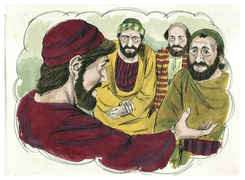

# 2 Timóteo Capítulo 2

## 1
TU, pois, meu filho, fortifica-te na graça que há em Cristo Jesus.

## 2
E o que de mim, entre muitas testemunhas, ouviste, confia-o a homens fiéis, que sejam idôneos para também ensinarem os outros.

## 3
Tu pois, sofre as aflições, como bom soldado de Jesus Cristo.

## 4
Ninguém que milita se embaraça com negócios desta vida, a fim de agradar àquele que o alistou para a guerra.

## 5
E, se alguém também milita, não é coroado se não militar legitimamente.

## 6
O lavrador que trabalha deve ser o primeiro a gozar dos frutos.

## 7
Considera o que digo, e o Senhor te dê entendimento em tudo.

## 8
Lembra-te de que Jesus Cristo, que é da descendência de Davi, ressuscitou dentre os mortos, segundo o meu evangelho;

## 9
Por isso sofro trabalhos e até prisões, como um malfeitor; mas a palavra de Deus não está presa.

## 10
Portanto, tudo sofro por amor dos escolhidos, para que também eles alcancem a salvação que está em Cristo Jesus com glória eterna.

## 11
Palavra fiel é esta: que, se morrermos com ele, também com ele viveremos;

## 12
Se sofrermos, também com ele reinaremos; se o negarmos, também ele nos negará;

## 13
Se formos infiéis, ele permanece fiel; não pode negar-se a si mesmo.

## 14
Traze estas coisas à memória, ordenando-lhes diante do Senhor que não tenham contendas de palavras, que para nada aproveitam e são para perversão dos ouvintes.

## 15
Procura apresentar-te a Deus aprovado, como obreiro que não tem de que se envergonhar, que maneja bem a palavra da verdade.

## 16
Mas evita os falatórios profanos, porque produzirão maior impiedade.

## 17
E a palavra desses roerá como gangrena; entre os quais são Himeneu e Fileto;

## 18
Os quais se desviaram da verdade, dizendo que a ressurreição era já feita, e perverteram a fé de alguns.

## 19
Todavia o fundamento de Deus fica firme, tendo este selo: O Senhor conhece os que são seus, e qualquer que profere o nome de Cristo aparte-se da iniqüidade.

## 20
Ora, numa grande casa não somente há vasos de ouro e de prata, mas também de pau e de barro; uns para honra, outros, porém, para desonra.

## 21
De sorte que, se alguém se purificar destas coisas, será vaso para honra, santificado e idôneo para uso do Senhor, e preparado para toda a boa obra.

## 22
Foge também das paixões da mocidade; e segue a justiça, a fé, o amor, e a paz com os que, com um coração puro, invocam o Senhor.

## 23
E rejeita as questões loucas, e sem instrução, sabendo que produzem contendas.

## 24
E ao servo do Senhor não convém contender, mas sim, ser manso para com todos, apto para ensinar, sofredor;

## 25
Instruindo com mansidão os que resistem, a ver se porventura Deus lhes dará arrependimento para conhecerem a verdade,

## 26
E tornarem a despertar, desprendendo-se dos laços do diabo, em que à vontade dele estão presos.

