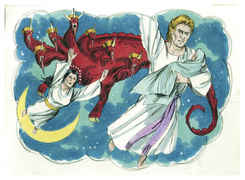
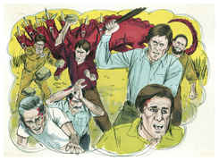

# Apocalipse Capítulo 12

## 1
E VIU-SE um grande sinal no céu: uma mulher vestida do sol, tendo a lua debaixo dos seus pés, e uma coroa de doze estrelas sobre a sua cabeça.

## 2
E estava grávida, e com dores de parto, e gritava com ânsias de dar à luz.

## 3
E viu-se outro sinal no céu; e eis que era um grande dragão vermelho, que tinha sete cabeças e dez chifres, e sobre as suas cabeças sete diademas.

## 4
E a sua cauda levou após si a terça parte das estrelas do céu, e lançou-as sobre a terra; e o dragão parou diante da mulher que havia de dar à luz, para que, dando ela à luz, lhe tragasse o filho.

## 5
E deu à luz um filho homem que há de reger todas as nações com vara de ferro; e o seu filho foi arrebatado para Deus e para o seu trono.

## 6
E a mulher fugiu para o deserto, onde já tinha lugar preparado por Deus, para que ali fosse alimentada durante mil duzentos e sessenta dias.

## 7
E houve batalha no céu; Miguel e os seus anjos batalhavam contra o dragão, e batalhavam o dragão e os seus anjos;

## 8
Mas não prevaleceram, nem mais o seu lugar se achou nos céus.

## 9
E foi precipitado o grande dragão, a antiga serpente, chamada o Diabo, e Satanás, que engana todo o mundo; ele foi precipitado na terra, e os seus anjos foram lançados com ele.

## 10
E ouvi uma grande voz no céu, que dizia: Agora é chegada a salvação, e a força, e o reino do nosso Deus, e o poder do seu Cristo; porque já o acusador de nossos irmãos é derrubado, o qual diante do nosso Deus os acusava de dia e de noite.

## 11
E eles o venceram pelo sangue do Cordeiro e pela palavra do seu testemunho; e não amaram as suas vidas até à morte.

## 12
Por isso alegrai-vos, ó céus, e vós que neles habitais. Ai dos que habitam na terra e no mar; porque o diabo desceu a vós, e tem grande ira, sabendo que já tem pouco tempo.

## 13
E, quando o dragão viu que fora lançado na terra, perseguiu a mulher que dera à luz o filho homem.

## 14
E foram dadas à mulher duas asas de grande águia, para que voasse para o deserto, ao seu lugar, onde é sustentada por um tempo, e tempos, e metade de um tempo, fora da vista da serpente.

## 15
E a serpente lançou da sua boca, atrás da mulher, água como um rio, para que pela corrente a fizesse arrebatar.

## 16
E a terra ajudou a mulher; e a terra abriu a sua boca, e tragou o rio que o dragão lançara da sua boca.

## 17
E o dragão irou-se contra a mulher, e foi fazer guerra ao remanescente da sua semente, os que guardam os mandamentos de Deus, e têm o testemunho de Jesus Cristo.

