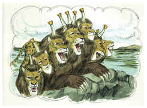

# Apocalipse Capítulo 13

## 1
E EU pus-me sobre a areia do mar, e vi subir do mar uma besta que tinha sete cabeças e dez chifres, e sobre os seus chifres dez diademas, e sobre as suas cabeças um nome de blasfêmia.

## 2
E a besta que vi era semelhante ao leopardo, e os seus pés como os de urso, e a sua boca como a de leão; e o dragão deu-lhe o seu poder, e o seu trono, e grande poderio.

## 3
E vi uma das suas cabeças como ferida de morte, e a sua chaga mortal foi curada; e toda a terra se maravilhou após a besta.

## 4
E adoraram o dragão que deu à besta o seu poder; e adoraram a besta, dizendo: Quem é semelhante à besta? Quem poderá batalhar contra ela?

## 5
E foi-lhe dada uma boca, para proferir grandes coisas e blasfêmias; e deu-se-lhe poder para agir por quarenta e dois meses.

## 6
E abriu a sua boca em blasfêmias contra Deus, para blasfemar do seu nome, e do seu tabernáculo, e dos que habitam no céu.

## 7
E foi-lhe permitido fazer guerra aos santos, e vencê-los; e deu-se-lhe poder sobre toda a tribo, e língua, e nação.

## 8
E adoraram-na todos os que habitam sobre a terra, esses cujos nomes não estão escritos no livro da vida do Cordeiro que foi morto desde a fundação do mundo.

## 9
Se alguém tem ouvidos, ouça.

## 10
Se alguém leva em cativeiro, em cativeiro irá; se alguém matar à espada, necessário é que à espada seja morto. Aqui está a paciência e a fé dos santos.

## 11
E vi subir da terra outra besta, e tinha dois chifres semelhantes aos de um cordeiro; e falava como o dragão.

## 12
E exerce todo o poder da primeira besta na sua presença, e faz que a terra e os que nela habitam adorem a primeira besta, cuja chaga mortal fora curada.

## 13
E faz grandes sinais, de maneira que até fogo faz descer do céu à terra, à vista dos homens.

## 14
E engana os que habitam na terra com sinais que lhe foi permitido que fizesse em presença da besta, dizendo aos que habitam na terra que fizessem uma imagem à besta que recebera a ferida da espada e vivia.

## 15
E foi-lhe concedido que desse espírito à imagem da besta, para que também a imagem da besta falasse, e fizesse que fossem mortos todos os que não adorassem a imagem da besta.

## 16
E faz que a todos, pequenos e grandes, ricos e pobres, livres e servos, lhes seja posto um sinal na sua mão direita, ou nas suas testas,

## 17
Para que ninguém possa comprar ou vender, senão aquele que tiver o sinal, ou o nome da besta, ou o número do seu nome.

## 18
Aqui há sabedoria. Aquele que tem entendimento, calcule o número da besta; porque é o número de um homem, e o seu número é seiscentos e sessenta e seis.

