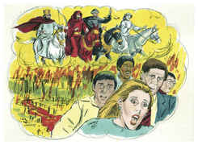

# Apocalipse Capítulo 9

## 1
E O QUINTO anjo tocou a sua trombeta, e vi uma estrela que do céu caiu na terra; e foi-lhe dada a chave do poço do abismo.

## 2
E abriu o poço do abismo, e subiu fumaça do poço, como a fumaça de uma grande fornalha, e com a fumaça do poço escureceu-se o sol e o ar.

## 3
E da fumaça vieram gafanhotos sobre a terra; e foi-lhes dado poder, como o poder que têm os escorpiões da terra.

## 4
E foi-lhes dito que não fizessem dano à erva da terra, nem a verdura alguma, nem a árvore alguma, mas somente aos homens que não têm nas suas testas o selo de Deus.

## 5
E foi-lhes permitido, não que os matassem, mas que por cinco meses os atormentassem; e o seu tormento era semelhante ao tormento do escorpião, quando fere o homem.

## 6
E naqueles dias os homens buscarão a morte, e não a acharão; e desejarão morrer, e a morte fugirá deles.

## 7
E o parecer dos gafanhotos era semelhante ao de cavalos aparelhados para a guerra; e sobre as suas cabeças havia umas como coroas semelhantes ao ouro; e os seus rostos eram como rostos de homens.

## 8
E tinham cabelos como cabelos de mulheres, e os seus dentes eram como de leões.

## 9
E tinham couraças como couraças de ferro; e o ruído das suas asas era como o ruído de carros, quando muitos cavalos correm ao combate.

## 10
E tinham caudas semelhantes às dos escorpiões, e aguilhões nas suas caudas; e o seu poder era para danificar os homens por cinco meses.

## 11
E tinham sobre si rei, o anjo do abismo; em hebreu era o seu nome Abadom, e em grego Apoliom.

## 12
Passado é já um ai; eis que depois disso vêm ainda dois ais.

## 13
E tocou o sexto anjo a sua trombeta, e ouvi uma voz que vinha das quatro pontas do altar de ouro, que estava diante de Deus,

## 14
A qual dizia ao sexto anjo, que tinha a trombeta: Solta os quatro anjos, que estão presos junto ao grande rio Eufrates.

## 15
E foram soltos os quatro anjos, que estavam preparados para a hora, e dia, e mês, e ano, a fim de matarem a terça parte dos homens.

## 16
E o número dos exércitos dos cavaleiros era de duzentos milhões; e ouvi o número deles.

## 17
E assim vi os cavalos nesta visão; e os que sobre eles cavalgavam tinham couraças de fogo, e de jacinto, e de enxofre; e as cabeças dos cavalos eram como cabeças de leões; e de suas bocas saía fogo e fumaça e enxofre.

## 18
Por estes três foi morta a terça parte dos homens, isto é pelo fogo, pela fumaça, e pelo enxofre, que saíam das suas bocas.

## 19
Porque o poder dos cavalos está na sua boca e nas suas caudas. Porquanto as suas caudas são semelhantes a serpentes, e têm cabeças, e com elas danificam.

## 20
E os outros homens, que não foram mortos por estas pragas, não se arrependeram das obras de suas mãos, para não adorarem os demônios, e os ídolos de ouro, e de prata, e de bronze, e de pedra, e de madeira, que nem podem ver, nem ouvir, nem andar.

## 21
E não se arrependeram dos seus homicídios, nem das suas feitiçarias, nem da sua fornicação, nem dos seus furtos.

