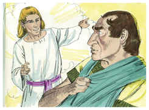
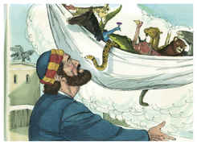
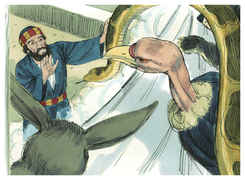
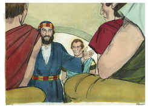
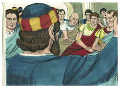
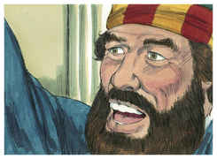
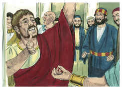
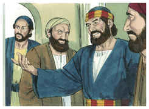

# Atos dos Apóstolos Capítulo 10

## 1
E HAVIA em Cesaréia um homem por nome Cornélio, centurião da coorte chamada italiana,

## 2
Piedoso e temente a Deus, com toda a sua casa, o qual fazia muitas esmolas ao povo, e de contínuo orava a Deus.

## 3
Este, quase à hora nona do dia, viu claramente numa visão um anjo de Deus, que se dirigia para ele e dizia: Cornélio.

## 4
O qual, fixando os olhos nele, e muito atemorizado, disse: Que é, Senhor? E disse-lhe: As tuas orações e as tuas esmolas têm subido para memória diante de Deus;

## 5
Agora, pois, envia homens a Jope, e manda chamar a Simão, que tem por sobrenome Pedro.

## 6
Este está hospedado com um certo Simão curtidor, que tem a sua casa junto do mar. Ele te dirá o que deves fazer.

## 7
E, retirando-se o anjo que lhe falava, chamou dois dos seus criados, e a um piedoso soldado dos que estavam ao seu serviço.

## 8
E, havendo-lhes contado tudo, os enviou a Jope.

## 9
E no dia seguinte, indo eles seu caminho, e estando já perto da cidade, subiu Pedro ao terraço para orar, quase à hora sexta.

## 10
E tendo fome, quis comer; e, enquanto lho preparavam, sobreveio-lhe um arrebatamento de sentidos,

## 11
E viu o céu aberto, e que descia um vaso, como se fosse um grande lençol atado pelas quatro pontas, e vindo para a terra.

## 12
No qual havia de todos os animais quadrúpedes e feras e répteis da terra, e aves do céu.

## 13
E foi-lhe dirigida uma voz: Levanta-te, Pedro, mata e come.

## 14
Mas Pedro disse: De modo nenhum, Senhor, porque nunca comi coisa alguma comum e imunda.

## 15
E segunda vez lhe disse a voz: Não faças tu comum ao que Deus purificou.

## 16
E aconteceu isto por três vezes; e o vaso tornou a recolher-se ao céu.

## 17
E estando Pedro duvidando entre si acerca do que seria aquela visão que tinha visto, eis que os homens que foram enviados por Cornélio pararam à porta, perguntando pela casa de Simão.

## 18
E, chamando, perguntaram se Simão, que tinha por sobrenome Pedro, morava ali.

## 19
E, pensando Pedro naquela visão, disse-lhe o Espírito: Eis que três homens te buscam.

## 20
Levanta-te pois, desce, e vai com eles, não duvidando; porque eu os enviei.

## 21
E, descendo Pedro para junto dos homens que lhe foram enviados por Cornélio, disse: Eis que sou eu a quem procurais; qual é a causa por que estais aqui?

## 22
E eles disseram: Cornélio, o centurião, homem justo e temente a Deus, e que tem bom testemunho de toda a nação dos judeus, foi avisado por um santo anjo para que te chamasse a sua casa, e ouvisse as tuas palavras.

## 23
Então, chamando-os para dentro, os recebeu em casa. E no dia seguinte foi Pedro com eles, e foram com ele alguns irmãos de Jope.

## 24
E no dia imediato chegaram a Cesaréia. E Cornélio os estava esperando, tendo já convidado os seus parentes e amigos mais íntimos.

## 25
E aconteceu que, entrando Pedro, saiu Cornélio a recebê-lo, e, prostrando-se a seus pés o adorou.

## 26
Mas Pedro o levantou, dizendo: Levanta-te, que eu também sou homem.

## 27
E, falando com ele, entrou, e achou muitos que ali se haviam ajuntado.

## 28
E disse-lhes: Vós bem sabeis que não é lícito a um homem judeu ajuntar-se ou chegar-se a estrangeiros; mas Deus mostrou-me que a nenhum homem chame comum ou imundo.

## 29
Por isso, sendo chamado, vim sem contradizer. Pergunto, pois, por que razão mandastes chamar-me?

## 30
E disse Cornélio: Há quatro dias estava eu em jejum até esta hora, orando em minha casa à hora nona.

## 31
E eis que diante de mim se apresentou um homem com vestes resplandecentes, e disse: Cornélio, a tua oração foi ouvida, e as tuas esmolas estão em memória diante de Deus.

## 32
Envia, pois, a Jope, e manda chamar Simão, o que tem por sobrenome Pedro; este está hospedado em casa de Simão o curtidor, junto do mar, e ele, vindo, te falará.

## 33
E logo mandei chamar-te, e bem fizeste em vir. Agora, pois, estamos todos presentes diante de Deus, para ouvir tudo quanto por Deus te é mandado.

## 34
E, abrindo Pedro a boca, disse: Reconheço por verdade que Deus não faz acepção de pessoas;

## 35
Mas que lhe é agradável aquele que, em qualquer nação, o teme e faz o que é justo.

## 36
A palavra que ele enviou aos filhos de Israel, anunciando a paz por Jesus Cristo (este é o Senhor de todos);

## 37
Esta palavra, vós bem sabeis, veio por toda a Judéia, começando pela Galiléia, depois do batismo que João pregou;

## 38
Como Deus ungiu a Jesus de Nazaré com o Espírito Santo e com virtude; o qual andou fazendo bem, e curando a todos os oprimidos do diabo, porque Deus era com ele.

## 39
E nós somos testemunhas de todas as coisas que fez, tanto na terra da Judéia como em Jerusalém; ao qual mataram, pendurando-o num madeiro.

## 40
A este ressuscitou Deus ao terceiro dia, e fez que se manifestasse,

## 41
Não a todo o povo, mas às testemunhas que Deus antes ordenara; a nós, que comemos e bebemos juntamente com ele, depois que ressuscitou dentre os mortos.

## 42
E nos mandou pregar ao povo, e testificar que ele é o que por Deus foi constituído juiz dos vivos e dos mortos.

## 43
A este dão testemunho todos os profetas, de que todos os que nele crêem receberão o perdão dos pecados pelo seu nome.

## 44
E, dizendo Pedro ainda estas palavras, caiu o Espírito Santo sobre todos os que ouviam a palavra.

## 45
E os fiéis que eram da circuncisão, todos quantos tinham vindo com Pedro, maravilharam-se de que o dom do Espírito Santo se derramasse também sobre os gentios.

## 46
Porque os ouviam falar línguas, e magnificar a Deus.

## 47
Respondeu, então, Pedro: Pode alguém porventura recusar a água, para que não sejam batizados estes, que também receberam como nós o Espírito Santo?

## 48
E mandou que fossem batizados em nome do Senhor. Então rogaram-lhe que ficasse com eles por alguns dias.

