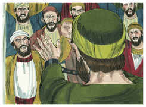
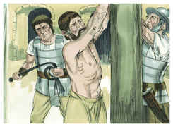
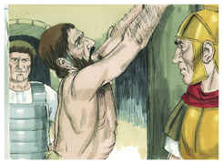
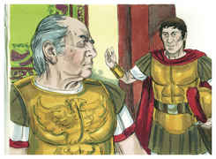
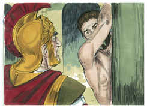

# Atos dos Apóstolos Capítulo 22

## 1
HOMENS, irmãos e pais, ouvi agora a minha defesa perante vós

## 2
(E, quando ouviram falar-lhes em língua hebraica, maior silêncio guardaram). E disse:

## 3
Quanto a mim, sou judeu, nascido em Tarso da Cilícia, e nesta cidade criado aos pés de Gamaliel, instruído conforme a verdade da lei de nossos pais, zeloso de Deus, como todos vós hoje sois.

## 4
E persegui este caminho até à morte, prendendo, e pondo em prisões, tanto homens como mulheres,

## 5
Como também o sumo sacerdote me é testemunha, e todo o conselho dos anciãos. E, recebendo destes cartas para os irmãos, fui a Damasco, para trazer maniatados para Jerusalém aqueles que ali estivessem, a fim de que fossem castigados.

## 6
Ora, aconteceu que, indo eu já de caminho, e chegando perto de Damasco, quase ao meio-dia, de repente me rodeou uma grande luz do céu.

## 7
E caí por terra, e ouvi uma voz que me dizia: Saulo, Saulo, por que me persegues?

## 8
E eu respondi: Quem és, Senhor? E disse-me: Eu sou Jesus Nazareno, a quem tu persegues.

## 9
E os que estavam comigo viram, em verdade, a luz, e se atemorizaram muito, mas não ouviram a voz daquele que falava comigo.

## 10
Então disse eu: Senhor, que farei? E o Senhor disse-me: Levanta-te, e vai a Damasco, e ali se te dirá tudo o que te é ordenado fazer.

## 11
E, como eu não via, por causa do esplendor daquela luz, fui levado pela mão dos que estavam comigo, e cheguei a Damasco.

## 12
E um certo Ananias, homem piedoso conforme a lei, que tinha bom testemunho de todos os judeus que ali moravam,

## 13
Vindo ter comigo, e apresentando-se, disse-me: Saulo, irmão, recobra a vista. E naquela mesma hora o vi.

## 14
E ele disse: O Deus de nossos pais de antemão te designou para que conheças a sua vontade, e vejas aquele Justo e ouças a voz da sua boca.

## 15
Porque hás de ser sua testemunha para com todos os homens do que tens visto e ouvido.

## 16
E agora por que te deténs? Levanta-te, e batiza-te, e lava os teus pecados, invocando o nome do Senhor.

## 17
E aconteceu que, tornando eu para Jerusalém, quando orava no templo, fui arrebatado para fora de mim.

## 18
E vi aquele que me dizia: Dá-te pressa e sai apressadamente de Jerusalém; porque não receberão o teu testemunho acerca de mim.

## 19
E eu disse: Senhor, eles bem sabem que eu lançava na prisão e açoitava nas sinagogas os que criam em ti.

## 20
E quando o sangue de Estêvão, tua testemunha, se derramava, também eu estava presente, e consentia na sua morte, e guardava as capas dos que o matavam.

## 21
E disse-me: Vai, porque hei de enviar-te aos gentios de longe.

## 22
E ouviram-no até esta palavra, e levantaram a voz, dizendo: Tira da terra um tal homem, porque não convém que viva.

## 23
E, clamando eles, e arrojando de si as vestes, e lançando pó para o ar,

## 24
O tribuno mandou que o levassem para a fortaleza, dizendo que o examinassem com açoites, para saber por que causa assim clamavam contra ele.

## 25
E, quando o estavam atando com correias, disse Paulo ao centurião que ali estava: É-vos lícito açoitar um romano, sem ser condenado?

## 26
E, ouvindo isto, o centurião foi, e anunciou ao tribuno, dizendo: Vê o que vais fazer, porque este homem é romano.

## 27
E, vindo o tribuno, disse-lhe: Dize-me, és tu romano? E ele disse: Sim.

## 28
E respondeu o tribuno: Eu com grande soma de dinheiro alcancei este direito de cidadão. Paulo disse: Mas eu o sou de nascimento.

## 29
E logo dele se apartaram os que o haviam de examinar; e até o tribuno teve temor, quando soube que era romano, visto que o tinha ligado.

## 30
E no dia seguinte, querendo saber ao certo a causa por que era acusado pelos judeus, soltou-o das prisões, e mandou vir os principais dos sacerdotes, e todo o seu conselho; e, trazendo Paulo, o apresentou diante deles.

