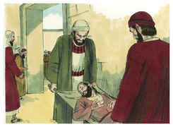
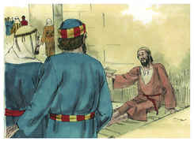
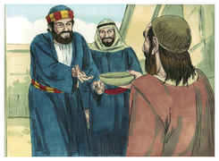
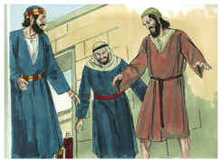
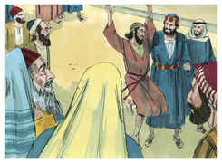
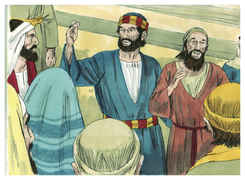
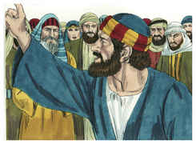
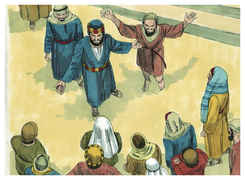
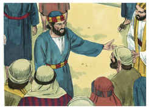
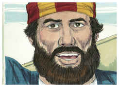

# Atos dos Apóstolos Capítulo 3

## 1
E PEDRO e João subiam juntos ao templo à hora da oração, a nona.

## 2
E era trazido um homem que desde o ventre de sua mãe era coxo, o qual todos os dias punham à porta do templo, chamada Formosa, para pedir esmola aos que entravam.

## 3
O qual, vendo a Pedro e a João que iam entrando no templo, pediu que lhe dessem uma esmola.

## 4
E Pedro, com João, fitando os olhos nele, disse: Olha para nós.

## 5
E olhou para eles, esperando receber deles alguma coisa.

## 6
E disse Pedro: Não tenho prata nem ouro; mas o que tenho isso te dou. Em nome de Jesus Cristo, o Nazareno, levanta-te e anda.

## 7
E, tomando-o pela mão direita, o levantou, e logo os seus pés e artelhos se firmaram.

## 8
E, saltando ele, pôs-se em pé, e andou, e entrou com eles no templo, andando, e saltando, e louvando a Deus.

## 9
E todo o povo o viu andar e louvar a Deus;

## 10
E conheciam-no, pois era ele o que se assentava a pedir esmola à porta Formosa do templo; e ficaram cheios de pasmo e assombro, pelo que lhe acontecera

## 11
E, apegando-se o coxo, que fora curado, a Pedro e João, todo o povo correu atônito para junto deles, ao alpendre chamado de Salomão.

## 12
E quando Pedro viu isto, disse ao povo: Homens israelitas, por que vos maravilhais disto? Ou, por que olhais tanto para nós, como se por nossa própria virtude ou santidade fizéssemos andar este homem?

## 13
O Deus de Abraão, de Isaque e de Jacó, o Deus de nossos pais, glorificou a seu filho Jesus, a quem vós entregastes e perante a face de Pilatos negastes, tendo ele determinado que fosse solto.

## 14
Mas vós negastes o Santo e o Justo, e pedistes que se vos desse um homem homicida.

## 15
E matastes o Príncipe da vida, ao qual Deus ressuscitou dentre os mortos, do que nós somos testemunhas.

## 16
E pela fé no seu nome fez o seu nome fortalecer a este que vedes e conheceis; sim, a fé que vem por ele, deu a este, na presença de todos vós, esta perfeita saúde.

## 17
E agora, irmãos, eu sei que o fizestes por ignorância, como também os vossos príncipes.

## 18
Mas Deus assim cumpriu o que já dantes pela boca de todos os seus profetas havia anunciado; que o Cristo havia de padecer.

## 19
Arrependei-vos, pois, e convertei-vos, para que sejam apagados os vossos pecados, e venham assim os tempos do refrigério pela presença do Senhor,

## 20
E envie ele a Jesus Cristo, que já dantes vos foi pregado.

## 21
O qual convém que o céu contenha até aos tempos da restauração de tudo, dos quais Deus falou pela boca de todos os seus santos profetas, desde o princípio.

## 22
Porque Moisés disse aos pais: O Senhor vosso Deus levantará de entre vossos irmãos um profeta semelhante a mim; a ele ouvireis em tudo quanto vos disser.

## 23
E acontecerá que toda a alma que não escutar esse profeta será exterminada dentre o povo.

## 24
Sim, e todos os profetas, desde Samuel, todos quantos depois falaram, também predisseram estes dias.

## 25
Vós sois os filhos dos profetas e da aliança que Deus fez com nossos pais, dizendo a Abraão: Na tua descendência serão benditas todas as famílias da terra.

## 26
Ressuscitando Deus a seu Filho Jesus, primeiro o enviou a vós, para que nisso vos abençoasse, no apartar, a cada um de vós, das vossas maldades.

