# Atos dos Apóstolos Capítulo 4

## 1
E, ESTANDO eles falando ao povo, sobrevieram os sacerdotes, e o capitão do templo, e os saduceus,

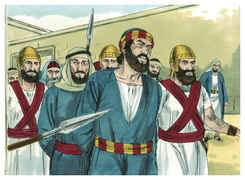

## 2
Doendo-se muito de que ensinassem o povo, e anunciassem em Jesus a ressurreição dentre os mortos.

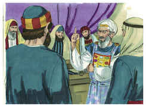

## 3
E lançaram mão deles, e os encerraram na prisão até ao dia seguinte, pois já era tarde.

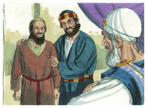

## 4
Muitos, porém, dos que ouviram a palavra creram, e chegou o número desses homens a quase cinco mil.

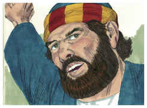

## 5
E aconteceu, no dia seguinte, reunirem-se em Jerusalém os seus principais, os anciãos, os escribas,

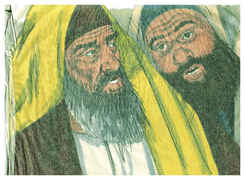

## 6
E Anás, o sumo sacerdote, e Caifás, e João, e Alexandre, e todos quantos havia da linhagem do sumo sacerdote.

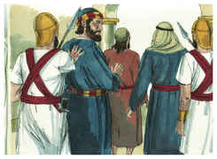

## 7
E, pondo-os no meio, perguntaram: Com que poder ou em nome de quem fizestes isto?

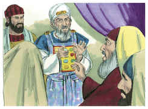

## 8
Então Pedro, cheio do Espírito Santo, lhes disse: Principais do povo, e vós, anciãos de Israel,

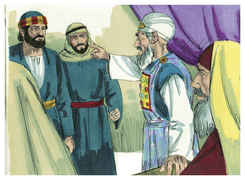

## 9
Visto que hoje somos interrogados acerca do benefício feito a um homem enfermo, e do modo como foi curado,

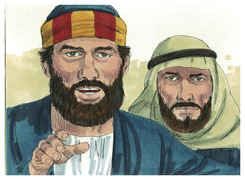

## 10
Seja conhecido de vós todos, e de todo o povo de Israel, que em nome de Jesus Cristo, o Nazareno, aquele a quem vós crucificastes e a quem Deus ressuscitou dentre os mortos, em nome desse é que este está são diante de vós.

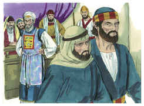

## 11
Ele é a pedra que foi rejeitada por vós, os edificadores, a qual foi posta por cabeça de esquina.

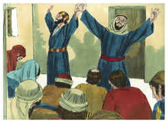

## 12
E em nenhum outro há salvação, porque também debaixo do céu nenhum outro nome há, dado entre os homens, pelo qual devamos ser salvos.

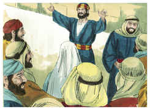

## 13
Então eles, vendo a ousadia de Pedro e João, e informados de que eram homens sem letras e indoutos, maravilharam-se e reconheceram que eles haviam estado com Jesus.

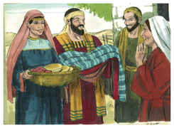

## 14
E, vendo estar com eles o homem que fora curado, nada tinham que dizer em contrário.

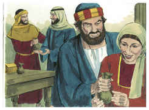

## 15
Todavia, mandando-os sair fora do conselho, conferenciaram entre si,

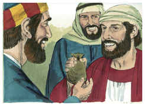

## 16
Dizendo: Que havemos de fazer a estes homens? porque a todos os que habitam em Jerusalém é manifesto que por eles foi feito um sinal notório, e não o podemos negar;

## 17
Mas, para que não se divulgue mais entre o povo, ameacemo-los para que não falem mais nesse nome a homem algum.

## 18
E, chamando-os, disseram-lhes que absolutamente não falassem, nem ensinassem, no nome de Jesus.

## 19
Respondendo, porém, Pedro e João, lhes disseram: Julgai vós se é justo, diante de Deus, ouvir-vos antes a vós do que a Deus;

## 20
Porque não podemos deixar de falar do que temos visto e ouvido.

## 21
Mas eles ainda os ameaçaram mais e, não achando motivo para os castigar, deixaram-nos ir, por causa do povo; porque todos glorificavam a Deus pelo que acontecera;

## 22
Pois tinha mais de quarenta anos o homem em quem se operara aquele milagre de saúde.

## 23
E, soltos eles, foram para os seus, e contaram tudo o que lhes disseram os principais dos sacerdotes e os anciãos.

## 24
E, ouvindo eles isto, unânimes levantaram a voz a Deus, e disseram: Senhor, tu és o Deus que fizeste o céu, e a terra, e o mar e tudo o que neles há;

## 25
Que disseste pela boca de Davi, teu servo: Por que bramaram os gentios, e os povos pensaram coisas vãs?

## 26
Levantaram-se os reis da terra, E os príncipes se ajuntaram à uma, Contra o Senhor e contra o seu Ungido.

## 27
Porque verdadeiramente contra o teu santo Filho Jesus, que tu ungiste, se ajuntaram, não só Herodes, mas Pôncio Pilatos, com os gentios e os povos de Israel;

## 28
Para fazerem tudo o que a tua mão e o teu conselho tinham anteriormente determinado que se havia de fazer.

## 29
Agora, pois, ó Senhor, olha para as suas ameaças, e concede aos teus servos que falem com toda a ousadia a tua palavra;

## 30
Enquanto estendes a tua mão para curar, e para que se façam sinais e prodígios pelo nome de teu santo Filho Jesus.

## 31
E, tendo orado, moveu-se o lugar em que estavam reunidos; e todos foram cheios do Espírito Santo, e anunciavam com ousadia a palavra de Deus.

## 32
E era um o coração e a alma da multidão dos que criam, e ninguém dizia que coisa alguma do que possuía era sua própria, mas todas as coisas lhes eram comuns.

## 33
E os apóstolos davam, com grande poder, testemunho da ressurreição do Senhor Jesus, e em todos eles havia abundante graça.

## 34
Não havia, pois, entre eles necessitado algum; porque todos os que possuíam herdades ou casas, vendendo-as, traziam o preço do que fora vendido, e o depositavam aos pés dos apóstolos.

## 35
E repartia-se a cada um, segundo a necessidade que cada um tinha.

## 36
Então José, cognominado pelos apóstolos Barnabé (que, traduzido, é filho da consolação), levita, natural de Chipre,

## 37
Possuindo uma herdade, vendeu-a, e trouxe o preço, e o depositou aos pés dos apóstolos.

