# Atos dos Apóstolos Capítulo 8

## 1
E TAMBÉM Saulo consentiu na morte dele. E fez-se naquele dia uma grande perseguição contra a igreja que estava em Jerusalém; e todos foram dispersos pelas terras da Judéia e de Samaria, exceto os apóstolos.

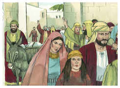

## 2
E uns homens piedosos foram enterrar Estêvão, e fizeram sobre ele grande pranto.

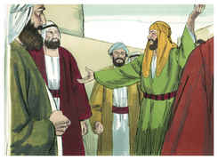

## 3
E Saulo assolava a igreja, entrando pelas casas; e, arrastando homens e mulheres, os encerrava na prisão.

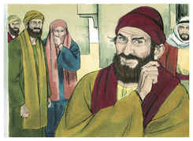

## 4
Mas os que andavam dispersos iam por toda a parte, anunciando a palavra.

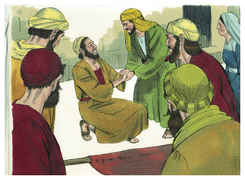

## 5
E, descendo Filipe à cidade de Samaria lhes pregava a Cristo.

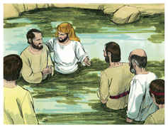

## 6
E as multidões unanimemente prestavam atenção ao que Filipe dizia, porque ouviam e viam os sinais que ele fazia;

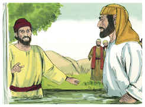

## 7
Pois que os espíritos imundos saíam de muitos que os tinham, clamando em alta voz; e muitos paralíticos e coxos eram curados.

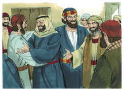

## 8
E havia grande alegria naquela cidade.

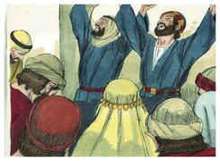

## 9
E estava ali um certo homem, chamado Simão, que anteriormente exercera naquela cidade a arte mágica, e tinha iludido o povo de Samaria, dizendo que era uma grande personagem;

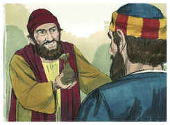

## 10
Ao qual todos atendiam, desde o menor até ao maior, dizendo: Este é a grande virtude de Deus.

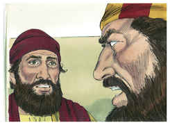

## 11
E atendiam-no, porque já desde muito tempo os havia iludido com artes mágicas.

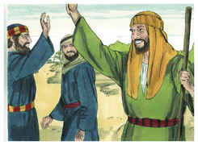

## 12
Mas, como cressem em Filipe, que lhes pregava acerca do reino de Deus, e do nome de Jesus Cristo, se batizavam, tanto homens como mulheres.

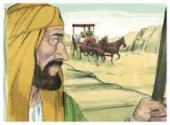

## 13
E creu até o próprio Simão; e, sendo batizado, ficou de contínuo com Filipe; e, vendo os sinais e as grandes maravilhas que se faziam, estava atônito.

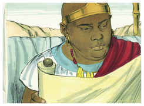

## 14
Os apóstolos, pois, que estavam em Jerusalém, ouvindo que Samaria recebera a palavra de Deus, enviaram para lá Pedro e João.

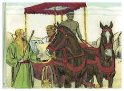

## 15
Os quais, tendo descido, oraram por eles para que recebessem o Espírito Santo

## 16
(Porque sobre nenhum deles tinha ainda descido; mas somente eram batizados em nome do Senhor Jesus).

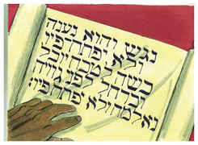

## 17
Então lhes impuseram as mãos, e receberam o Espírito Santo.

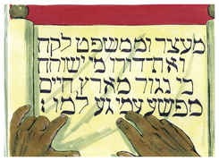

## 18
E Simão, vendo que pela imposição das mãos dos apóstolos era dado o Espírito Santo, lhes ofereceu dinheiro,

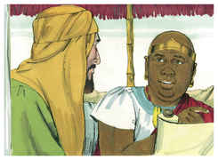

## 19
Dizendo: Dai-me também a mim esse poder, para que aquele sobre quem eu puser as mãos receba o Espírito Santo.

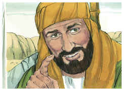

## 20
Mas disse-lhe Pedro: O teu dinheiro seja contigo para perdição, pois cuidaste que o dom de Deus se alcança por dinheiro.

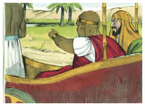

## 21
Tu não tens parte nem sorte nesta palavra, porque o teu coração não é reto diante de Deus.

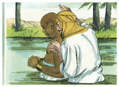

## 22
Arrepende-te, pois, dessa tua iniqüidade, e ora a Deus, para que porventura te seja perdoado o pensamento do teu coração;

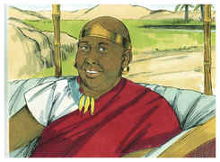

## 23
Pois vejo que estás em fel de amargura, e em laço de iniqüidade.

## 24
Respondendo, porém, Simão, disse: Orai vós por mim ao Senhor, para que nada do que dissestes venha sobre mim.

## 25
Tendo eles, pois, testificado e falado a palavra do Senhor, voltaram para Jerusalém e em muitas aldeias dos samaritanos anunciaram o evangelho.

## 26
E o anjo do Senhor falou a Filipe, dizendo: Levanta-te, e vai para o lado do sul, ao caminho que desce de Jerusalém para Gaza, que está deserta.

## 27
E levantou-se, e foi; e eis que um homem etíope, eunuco, mordomo-mor de Candace, rainha dos etíopes, o qual era superintendente de todos os seus tesouros, e tinha ido a Jerusalém para adoração,

## 28
Regressava e, assentado no seu carro, lia o profeta Isaías.

## 29
E disse o Espírito a Filipe: Chega-te, e ajunta-te a esse carro.

## 30
E, correndo Filipe, ouviu que lia o profeta Isaías, e disse: Entendes tu o que lês?

## 31
E ele disse: Como poderei entender, se alguém não me ensinar? E rogou a Filipe que subisse e com ele se assentasse.

## 32
E o lugar da Escritura que lia era este: Foi levado como a ovelha para o matadouro; e, como está mudo o cordeiro diante do que o tosquia, Assim não abriu a sua boca.

## 33
Na sua humilhação foi tirado o seu julgamento; E quem contará a sua geração? Porque a sua vida é tirada da terra.

## 34
E, respondendo o eunuco a Filipe, disse: Rogo-te, de quem diz isto o profeta? De si mesmo, ou de algum outro?

## 35
Então Filipe, abrindo a sua boca, e começando nesta Escritura, lhe anunciou a Jesus.

## 36
E, indo eles caminhando, chegaram ao pé de alguma água, e disse o eunuco: Eis aqui água; que impede que eu seja batizado?

## 37
E disse Filipe: É lícito, se crês de todo o coração. E, respondendo ele, disse: Creio que Jesus Cristo é o Filho de Deus.

## 38
E mandou parar o carro, e desceram ambos à água, tanto Filipe como o eunuco, e o batizou.

## 39
E, quando saíram da água, o Espírito do Senhor arrebatou a Filipe, e não o viu mais o eunuco; e, jubiloso, continuou o seu caminho.

## 40
E Filipe se achou em Azoto e, indo passando, anunciava o evangelho em todas as cidades, até que chegou a Cesaréia.

