# Daniel Capítulo 6

## 1
E PARECEU bem a Dario constituir sobre o reino cento e vinte príncipes, que estivessem sobre todo o reino;

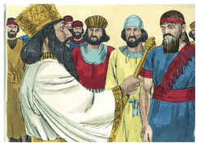

## 2
E sobre eles três presidentes, dos quais Daniel era um, aos quais estes príncipes dessem conta, para que o rei não sofresse dano.

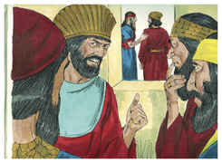

## 3
Então o mesmo Daniel sobrepujou a estes presidentes e príncipes; porque nele havia um espírito excelente; e o rei pensava constituí-lo sobre todo o reino.

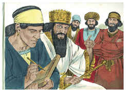

## 4
Então os presidentes e os príncipes procuravam achar ocasião contra Daniel a respeito do reino; mas não podiam achar ocasião ou culpa alguma; porque ele era fiel, e não se achava nele nenhum erro nem culpa.

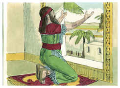

## 5
Então estes homens disseram: Nunca acharemos ocasião alguma contra este Daniel, se não a acharmos contra ele na lei do seu Deus.

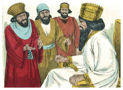

## 6
Então estes presidentes e príncipes foram juntos ao rei, e disseram-lhe assim: Ó rei Dario, vive para sempre!

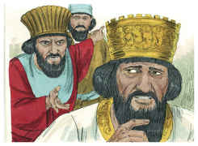

## 7
Todos os presidentes do reino, os capitães e príncipes, conselheiros e governadores, concordaram em promulgar um edito real e confirmar a proibição que qualquer que, por espaço de trinta dias, fizer uma petição a qualquer deus, ou a qualquer homem, e não a ti, ó rei, seja lançado na cova dos leões.

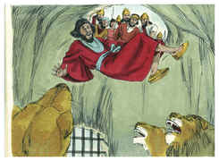

## 8
Agora, pois, ó rei, confirma a proibição, e assina o edito, para que não seja mudado, conforme a lei dos medos e dos persas, que não se pode revogar.

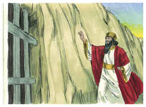

## 9
Por esta razão o rei Dario assinou o edito e a proibição.

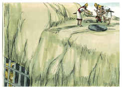

## 10
Daniel, pois, quando soube que o edito estava assinado, entrou em sua casa (ora havia no seu quarto janelas abertas do lado de Jerusalém), e três vezes no dia se punha de joelhos, e orava, e dava graças diante do seu Deus, como também antes costumava fazer.

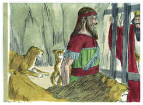

## 11
Então aqueles homens foram juntos, e acharam a Daniel orando e suplicando diante do seu Deus.

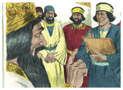

## 12
Então se apresentaram ao rei e, a respeito do edito real, disseram-lhe: Porventura não assinaste o edito, pelo qual todo o homem que fizesse uma petição a qualquer deus, ou a qualquer homem, por espaço de trinta dias, e não a ti, ó rei, fosse lançado na cova dos leões? Respondeu o rei, dizendo: Esta palavra é certa, conforme a lei dos medos e dos persas, que não se pode revogar.

## 13
Então responderam ao rei, dizendo-lhe: Daniel, que é dos filhos dos cativos de Judá, não tem feito caso de ti, ó rei, nem do edito que assinaste, antes três vezes por dia faz a sua oração.

## 14
Ouvindo então o rei essas palavras, ficou muito penalizado, e a favor de Daniel propôs dentro do seu coração livrá-lo; e até ao pôr do sol trabalhou para salvá-lo.

## 15
Então aqueles homens foram juntos ao rei, e disseram-lhe: Sabe, ó rei, que é lei dos medos e dos persas que nenhum edito ou decreto, que o rei estabeleça, se pode mudar.

## 16
Então o rei ordenou que trouxessem a Daniel, e lançaram-no na cova dos leões. E, falando o rei, disse a Daniel: O teu Deus, a quem tu continuamente serves, ele te livrará.

## 17
E foi trazida uma pedra e posta sobre a boca da cova; e o rei a selou com o seu anel e com o anel dos seus senhores, para que não se mudasse a sentença acerca de Daniel.

## 18
Então o rei se dirigiu para o seu palácio, e passou a noite em jejum, e não deixou trazer à sua presença instrumentos de música; e fugiu dele o sono.

## 19
Pela manhã, ao romper do dia, levantou-se o rei, e foi com pressa à cova dos leões.

## 20
E, chegando-se à cova, chamou por Daniel com voz triste; e disse o rei a Daniel: Daniel, servo do Deus vivo, dar-se-ia o caso que o teu Deus, a quem tu continuamente serves, tenha podido livrar-te dos leões?

## 21
Então Daniel falou ao rei: Ó rei, vive para sempre!

## 22
O meu Deus enviou o seu anjo, e fechou a boca dos leões, para que não me fizessem dano, porque foi achada em mim inocência diante dele; e também contra ti, ó rei, não tenho cometido delito algum.

## 23
Então o rei muito se alegrou em si mesmo, e mandou tirar a Daniel da cova. Assim foi tirado Daniel da cova, e nenhum dano se achou nele, porque crera no seu Deus.

## 24
E ordenou o rei, e foram trazidos aqueles homens que tinham acusado a Daniel, e foram lançados na cova dos leões, eles, seus filhos e suas mulheres; e ainda não tinham chegado ao fundo da cova quando os leões se apoderaram deles, e lhes esmigalharam todos os ossos.

## 25
Então o rei Dario escreveu a todos os povos, nações e línguas que moram em toda a terra: A paz vos seja multiplicada.

## 26
Da minha parte é feito um decreto, pelo qual em todo o domínio do meu reino os homens tremam e temam perante o Deus de Daniel; porque ele é o Deus vivo e que permanece para sempre, e o seu reino não se pode destruir, e o seu domínio durará até o fim.

## 27
Ele salva, livra, e opera sinais e maravilhas no céu e na terra; ele salvou e livrou Daniel do poder dos leões.

## 28
Este Daniel, pois, prosperou no reinado de Dario, e no reinado de Ciro, o persa.

