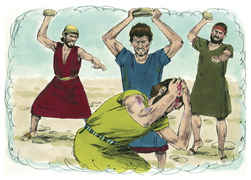
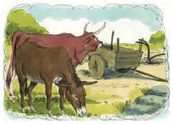

# Deuteronomio Capítulo 22

## 1
VENDO extraviado o boi ou ovelha de teu irmão, não te desviarás deles; restituí-los-ás sem falta a teu irmão.

## 2
E se teu irmão não estiver perto de ti, ou não o conheceres, recolhê-los-ás na tua casa, para que fiquem contigo, até que teu irmão os busque, e tu lhos restituirás.

## 3
Assim também farás com o seu jumento, e assim farás com as suas roupas; assim farás também com toda a coisa perdida, que se perder de teu irmão, e tu a achares; não te poderás omitir.

## 4
Se vires o jumento que é de teu irmão, ou o seu boi, caídos no caminho, não te desviarás deles; sem falta o ajudarás a levantá-los.

## 5
Não haverá traje de homem na mulher, e nem vestirá o homem roupa de mulher; porque, qualquer que faz isto, abominação é ao Senhor teu Deus.

## 6
Quando encontrares pelo caminho um ninho de ave numa árvore, ou no chão, com passarinhos, ou ovos, e a mãe posta sobre os passarinhos, ou sobre os ovos, não tomarás a mãe com os filhotes;

## 7
Deixarás ir livremente a mãe, e os filhotes tomarás para ti; para que te vá bem e para que prolongues os teus dias.

## 8
Quando edificares uma casa nova, farás um parapeito, no eirado, para que não ponhas culpa de sangue na tua casa, se alguém de algum modo cair dela.

## 9
Não semearás a tua vinha com diferentes espécies de semente, para que não se degenere o fruto da semente que semeares, e a novidade da vinha.

## 10
Com boi e com jumento não lavrarás juntamente.

## 11
Não te vestirás de diversos estofos de lã e linho juntamente.

## 12
Franjas porás nas quatro bordas da tua manta, com que te cobrires.

## 13
Quando um homem tomar mulher e, depois de coabitar com ela, a desprezar,

## 14
E lhe imputar coisas escandalosas, e contra ela divulgar má fama, dizendo: Tomei esta mulher, e me cheguei a ela, porém não a achei virgem;

## 15
Então o pai da moça e sua mãe tomarão os sinais da virgindade da moça, e levá-los-ão aos anciãos da cidade, à porta;

## 16
E o pai da moça dirá aos anciãos: Eu dei minha filha por mulher a este homem, porém ele a despreza;

## 17
E eis que lhe imputou coisas escandalosas, dizendo: Não achei virgem a tua filha; porém eis aqui os sinais da virgindade de minha filha. E estenderão a roupa diante dos anciãos da cidade.

## 18
Então os anciãos da mesma cidade tomarão aquele homem, e o castigarão.

## 19
E o multarão em cem siclos de prata, e os darão ao pai da moça; porquanto divulgou má fama sobre uma virgem de Israel. E lhe será por mulher, em todos os seus dias não a poderá despedir.

## 20
Porém se isto for verdadeiro, isto é, que a virgindade não se achou na moça,

## 21
Então levarão a moça à porta da casa de seu pai, e os homens da sua cidade a apedrejarão, até que morra; pois fez loucura em Israel, prostituindo-se na casa de seu pai; assim tirarás o mal do meio de ti.

## 22
Quando um homem for achado deitado com mulher que tenha marido, então ambos morrerão, o homem que se deitou com a mulher, e a mulher; assim tirarás o mal de Israel.

## 23
Quando houver moça virgem, desposada, e um homem a achar na cidade, e se deitar com ela,

## 24
Então trareis ambos à porta daquela cidade, e os apedrejareis, até que morram; a moça, porquanto não gritou na cidade, e o homem, porquanto humilhou a mulher do seu próximo; assim tirarás o mal do meio de ti.

## 25
E se algum homem no campo achar uma moça desposada, e o homem a forçar, e se deitar com ela, então morrerá só o homem que se deitou com ela;

## 26
Porém à moça não farás nada. A moça não tem culpa de morte; porque, como o homem que se levanta contra o seu próximo, e lhe tira a vida, assim é este caso.

## 27
Pois a achou no campo; a moça desposada gritou, e não houve quem a livrasse.

## 28
Quando um homem achar uma moça virgem, que não for desposada, e pegar nela, e se deitar com ela, e forem apanhados,

## 29
Então o homem que se deitou com ela dará ao pai da moça cinqüenta siclos de prata; e porquanto a humilhou, lhe será por mulher; não a poderá despedir em todos os seus dias.

## 30
Nenhum homem tomará a mulher de seu pai, nem descobrirá a nudez de seu pai.

