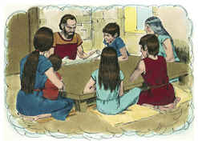

# Deuteronomio Capítulo 6

## 1
ESTES, pois, são os mandamentos, os estatutos e os juízos que mandou o Senhor vosso Deus para ensinar-vos, para que os cumprísseis na terra a que passais a possuir;

## 2
Para que temas ao Senhor teu Deus, e guardes todos os seus estatutos e mandamentos, que eu te ordeno, tu, e teu filho, e o filho de teu filho, todos os dias da tua vida, e que teus dias sejam prolongados.

## 3
Ouve, pois, ó Israel, e atenta em os guardares, para que bem te suceda, e muito te multipliques, como te disse o Senhor Deus de teus pais, na terra que mana leite e mel.

## 4
Ouve, Israel, o Senhor nosso Deus é o único Senhor.

## 5
Amarás, pois, o Senhor teu Deus de todo o teu coração, e de toda a tua alma, e de todas as tuas forças.

## 6
E estas palavras, que hoje te ordeno, estarão no teu coração;

## 7
E as ensinarás a teus filhos e delas falarás assentado em tua casa, e andando pelo caminho, e deitando-te e levantando-te.

## 8
Também as atarás por sinal na tua mão, e te serão por frontais entre os teus olhos.

## 9
E as escreverás nos umbrais de tua casa, e nas tuas portas.

## 10
Quando, pois, o Senhor teu Deus te introduzir na terra que jurou a teus pais, Abraão, Isaque e Jacó, que te daria, com grandes e boas cidades, que tu não edificaste,

## 11
E casas cheias de todo o bem, que tu não encheste, e poços cavados, que tu não cavaste, vinhas e olivais, que tu não plantaste, e comeres, e te fartares,

## 12
Guarda-te, que não te esqueças do Senhor, que te tirou da terra do Egito, da casa da servidão.

## 13
O Senhor teu Deus temerás e a ele servirás, e pelo seu nome jurarás.

## 14
Não seguireis outros deuses, os deuses dos povos que houver ao redor de vós;

## 15
Porque o Senhor teu Deus é um Deus zeloso no meio de ti, para que a ira do Senhor teu Deus se não acenda contra ti e te destrua de sobre a face da terra.

## 16
Não tentareis o Senhor vosso Deus, como o tentastes em Massá;

## 17
Diligentemente guardareis os mandamentos do Senhor vosso Deus, como também os seus testemunhos, e seus estatutos, que te tem mandado.

## 18
E farás o que é reto e bom aos olhos do Senhor, para que bem te suceda, e entres, e possuas a boa terra, a qual o Senhor jurou dar a teus pais.

## 19
Para que lance fora a todos os teus inimigos de diante de ti, como o Senhor tem falado.

## 20
Quando teu filho te perguntar no futuro, dizendo: Que significam os testemunhos, e estatutos e juízos que o Senhor nosso Deus vos ordenou?

## 21
Então dirás a teu filho: Éramos servos de Faraó no Egito; porém o Senhor, com mão forte, nos tirou do Egito;

## 22
E o Senhor, aos nossos olhos, fez sinais e maravilhas, grandes e terríveis, contra o Egito, contra Faraó e toda sua casa;

## 23
E dali nos tirou, para nos levar, e nos dar a terra que jurara a nossos pais.

## 24
E o Senhor nos ordenou que cumpríssemos todos estes estatutos, que temêssemos ao Senhor nosso Deus, para o nosso perpétuo bem, para nos guardar em vida, como no dia de hoje.

## 25
E será para nós justiça, quando tivermos cuidado de cumprir todos estes mandamentos perante o Senhor nosso Deus, como nos tem ordenado.

