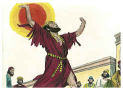
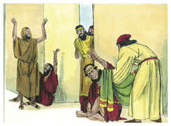
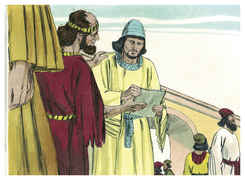
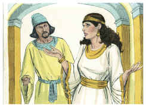
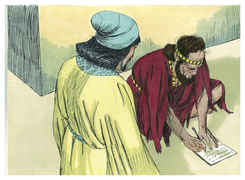
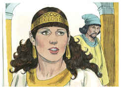

# Ester Capítulo 4

## 1
QUANDO Mardoqueu soube tudo quanto se havia passado, rasgou as suas vestes, e vestiu-se de saco e de cinza, e saiu pelo meio da cidade, e clamou com grande e amargo clamor;

## 2
E chegou até diante da porta do rei, porque ninguém vestido de saco podia entrar pelas portas do rei.

## 3
E em todas as províncias aonde a palavra do rei e a sua lei chegava, havia entre os judeus grande luto, com jejum, e choro, e lamentação; e muitos estavam deitados em saco e em cinza.

## 4
Então vieram as servas de Ester, e os seus camareiros, e fizeram-na saber, do que a rainha muito se doeu; e mandou roupas para vestir a Mardoqueu, e tirar-lhe o pano de saco; porém ele não as aceitou.

## 5
Então Ester chamou a Hatá (um dos camareiros do rei, que este tinha posto para servi-la), e deu-lhe ordem para ir a Mardoqueu, para saber que era aquilo, e porquê.

## 6
E, saindo Hatá a Mardoqueu, à praça da cidade, que estava diante da porta do rei,

## 7
Mardoqueu lhe fez saber tudo quanto lhe tinha sucedido; como também a soma exata do dinheiro, que Hamã dissera que daria para os tesouros do rei, pelos judeus, para destruí-los.

## 8
Também lhe deu a cópia da lei escrita, que se publicara em Susã, para os destruir, para que a mostrasse a Ester, e a fizesse saber; e para lhe ordenar que fosse ter com o rei, e lhe pedisse e suplicasse na sua presença pelo seu povo.

## 9
Veio, pois, Hatá, e fez saber a Ester as palavras de Mardoqueu.

## 10
Então falou Ester a Hatá, mandando-o dizer a Mardoqueu:

## 11
Todos os servos do rei, e o povo das províncias do rei, bem sabem que todo o homem ou mulher que chegar ao rei no pátio interior, sem ser chamado, não há senão uma sentença, a de morte, salvo se o rei estender para ele o cetro de ouro, para que viva; e eu nestes trinta dias não tenho sido chamada para ir ao rei.

## 12
E fizeram saber a Mardoqueu as palavras de Ester.

## 13
Então Mardoqueu mandou que respondessem a Ester: Não imagines no teu íntimo que, por estares na casa do rei, escaparás só tu entre todos os judeus.

## 14
Porque, se de todo te calares neste tempo, socorro e livramento de outra parte sairá para os judeus, mas tu e a casa de teu pai perecereis; e quem sabe se para tal tempo como este chegaste a este reino?

## 15
Então disse Ester que tornassem a dizer a Mardoqueu:

## 16
Vai, ajunta a todos os judeus que se acharem em Susã, e jejuai por mim, e não comais nem bebais por três dias, nem de dia nem de noite, e eu e as minhas servas também assim jejuaremos. E assim irei ter com o rei, ainda que não seja segundo a lei; e se perecer, pereci.

## 17
Então Mardoqueu foi, e fez conforme a tudo quanto Ester lhe ordenou.

