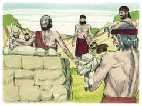
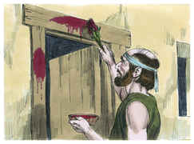
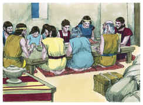
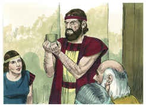
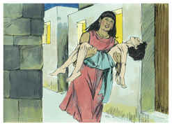
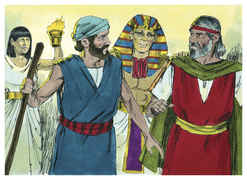
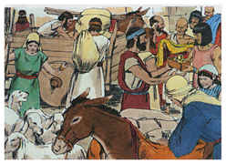
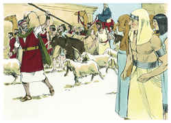
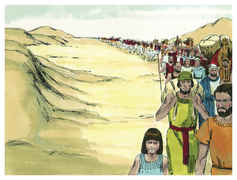

# Êxodo Capítulo 12

## 1
E FALOU o Senhor a Moisés e a Arão na terra do Egito, dizendo:

## 2
Este mesmo mês vos será o princípio dos meses; este vos será o primeiro dos meses do ano.

## 3
Falai a toda a congregação de Israel, dizendo: Aos dez deste mês tome cada um para si um cordeiro, segundo as casas dos pais, um cordeiro para cada família.

## 4
Mas se a família for pequena para um cordeiro, então tome um só com seu vizinho perto de sua casa, conforme o número das almas; cada um conforme ao seu comer, fareis a conta conforme ao cordeiro.

## 5
O cordeiro, ou cabrito, será sem mácula, um macho de um ano, o qual tomareis das ovelhas ou das cabras.

## 6
E o guardareis até ao décimo quarto dia deste mês, e todo o ajuntamento da congregação de Israel o sacrificará à tarde.

## 7
E tomarão do sangue, e pô-lo-ão em ambas as ombreiras, e na verga da porta, nas casas em que o comerem.

## 8
E naquela noite comerão a carne assada no fogo, com pães ázimos; com ervas amargosas a comerão.

## 9
Não comereis dele cru, nem cozido em água, senão assado no fogo, a sua cabeça com os seus pés e com a sua fressura.

## 10
E nada dele deixareis até amanhã; mas o que dele ficar até amanhã, queimareis no fogo.

## 11
Assim pois o comereis: Os vossos lombos cingidos, os vossos sapatos nos pés, e o vosso cajado na mão; e o comereis apressadamente; esta é a páscoa do Senhor.

## 12
E eu passarei pela terra do Egito esta noite, e ferirei todo o primogênito na terra do Egito, desde os homens até aos animais; e em todos os deuses do Egito farei juízos. Eu sou o Senhor.

## 13
E aquele sangue vos será por sinal nas casas em que estiverdes; vendo eu sangue, passarei por cima de vós, e não haverá entre vós praga de mortandade, quando eu ferir a terra do Egito.

## 14
E este dia vos será por memória, e celebrá-lo-eis por festa ao Senhor; nas vossas gerações o celebrareis por estatuto perpétuo.

## 15
Sete dias comereis pães ázimos; ao primeiro dia tirareis o fermento das vossas casas; porque qualquer que comer pão levedado, desde o primeiro até ao sétimo dia, aquela alma será cortada de Israel.

## 16
E ao primeiro dia haverá santa convocação; também ao sétimo dia tereis santa convocação; nenhuma obra se fará neles, senão o que cada alma houver de comer; isso somente aprontareis para vós.

## 17
Guardai pois a festa dos pães ázimos, porque naquele mesmo dia tirei vossos exércitos da terra do Egito; pelo que guardareis a este dia nas vossas gerações por estatuto perpétuo.

## 18
No primeiro mês, aos catorze dias do mês, à tarde, comereis pães ázimos até vinte e um do mês à tarde.

## 19
Por sete dias não se ache nenhum fermento nas vossas casas; porque qualquer que comer pão levedado, aquela alma será cortada da congregação de Israel, assim o estrangeiro como o natural da terra.

## 20
Nenhuma coisa levedada comereis; em todas as vossas habitações comereis pães ázimos.

## 21
Chamou pois Moisés a todos os anciãos de Israel, e disse-lhes: Escolhei e tomai vós cordeiros para vossas famílias, e sacrificai a páscoa.

## 22
Então tomai um molho de hissopo, e molhai-o no sangue que estiver na bacia, e passai-o na verga da porta, e em ambas as ombreiras, do sangue que estiver na bacia; porém nenhum de vós saia da porta da sua casa até à manhã.

## 23
Porque o Senhor passará para ferir aos egípcios, porém quando vir o sangue na verga da porta, e em ambas as ombreiras, o Senhor passará aquela porta, e não deixará o destruidor entrar em vossas casas, para vos ferir.

## 24
Portanto guardai isto por estatuto para vós, e para vossos filhos para sempre.

## 25
E acontecerá que, quando entrardes na terra que o Senhor vos dará, como tem dito, guardareis este culto.

## 26
E acontecerá que, quando vossos filhos vos disserem: Que culto é este?

## 27
Então direis: Este é o sacrifício da páscoa ao Senhor, que passou as casas dos filhos de Israel no Egito, quando feriu aos egípcios, e livrou as nossas casas. Então o povo inclinou-se, e adorou.

## 28
E foram os filhos de Israel, e fizeram isso como o Senhor ordenara a Moisés e a Arão, assim fizeram.

## 29
E aconteceu, à meia-noite, que o Senhor feriu a todos os primogênitos na terra do Egito, desde o primogênito de Faraó, que se sentava em seu trono, até ao primogênito do cativo que estava no cárcere, e todos os primogênitos dos animais.

## 30
E Faraó levantou-se de noite, ele e todos os seus servos, e todos os egípcios; e havia grande clamor no Egito, porque não havia casa em que não houvesse um morto.

## 31
Então chamou a Moisés e a Arão de noite, e disse: Levantai-vos, saí do meio do meu povo, tanto vós como os filhos de Israel; e ide, servi ao Senhor, como tendes dito.

## 32
Levai também convosco vossas ovelhas e vossas vacas, como tendes dito; e ide, e abençoai-me também a mim.

## 33
E os egípcios apertavam ao povo, apressando-se para lançá-los da terra; porque diziam: Todos seremos mortos.

## 34
E o povo tomou a sua massa, antes que levedasse, e as suas amassadeiras atadas em suas roupas sobre seus ombros.

## 35
Fizeram, pois, os filhos de Israel conforme à palavra de Moisés, e pediram aos egípcios jóias de prata, e jóias de ouro, e roupas.

## 36
E o Senhor deu ao povo graça aos olhos dos egípcios, e estes lhe davam o que pediam; e despojaram aos egípcios.

## 37
Assim partiram os filhos de Israel de Ramessés para Sucote, cerca de seiscentos mil a pé, somente de homens, sem contar os meninos.

## 38
E subiu também com eles muita mistura de gente, e ovelhas, e bois, uma grande quantidade de gado.

## 39
E cozeram bolos ázimos da massa que levaram do Egito, porque não se tinha levedado, porquanto foram lançados do Egito; e não se puderam deter, nem prepararam comida.

## 40
O tempo que os filhos de Israel habitaram no Egito foi de quatrocentos e trinta anos.

## 41
E aconteceu que, passados os quatrocentos e trinta anos, naquele mesmo dia, todos os exércitos do Senhor saíram da terra do Egito.

## 42
Esta noite se guardará ao Senhor, porque nela os tirou da terra do Egito; esta é a noite do Senhor, que devem guardar todos os filhos de Israel nas suas gerações.

## 43
Disse mais o Senhor a Moisés e a Arão: Esta é a ordenança da páscoa: nenhum filho do estrangeiro comerá dela.

## 44
Porém todo o servo comprado por dinheiro, depois que o houveres circuncidado, então comerá dela.

## 45
O estrangeiro e o assalariado não comerão dela.

## 46
Numa casa se comerá; não levarás daquela carne fora da casa, nem dela quebrareis osso.

## 47
Toda a congregação de Israel o fará.

## 48
Porém se algum estrangeiro se hospedar contigo e quiser celebrar a páscoa ao Senhor, seja-lhe circuncidado todo o homem, e então chegará a celebrá-la, e será como o natural da terra; mas nenhum incircunciso comerá dela.

## 49
Uma mesma lei haja para o natural e para o estrangeiro que peregrinar entre vós.

## 50
E todos os filhos de Israel o fizeram; como o Senhor ordenara a Moisés e a Arão, assim fizeram.

## 51
E aconteceu naquele mesmo dia que o Senhor tirou os filhos de Israel da terra do Egito, segundo os seus exércitos.

