# Êxodo Capítulo 19

## 1
AO terceiro mês da saída dos filhos de Israel da terra do Egito, no mesmo dia chegaram ao deserto de Sinai,

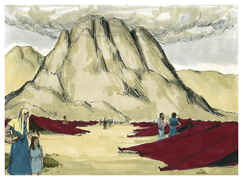

## 2
Porque partiram de Refidim e entraram no deserto de Sinai, onde se acamparam. Israel, pois, ali se acampou em frente ao monte.

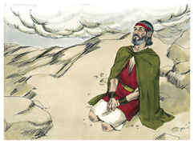

## 3
E subiu Moisés a Deus, e o Senhor o chamou do monte, dizendo: Assim falarás à casa de Jacó, e anunciarás aos filhos de Israel:

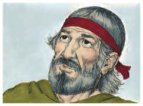

## 4
Vós tendes visto o que fiz aos egípcios, como vos levei sobre asas de águias, e vos trouxe a mim;

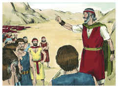

## 5
Agora, pois, se diligentemente ouvirdes a minha voz e guardardes a minha aliança, então sereis a minha propriedade peculiar dentre todos os povos, porque toda a terra é minha.

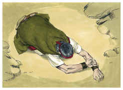

## 6
E vós me sereis um reino sacerdotal e o povo santo. Estas são as palavras que falarás aos filhos de Israel.

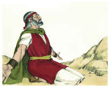

## 7
E veio Moisés, e chamou os anciãos do povo, e expôs diante deles todas estas palavras, que o Senhor lhe tinha ordenado.

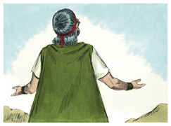

## 8
Então todo o povo respondeu a uma voz, e disse: Tudo o que o Senhor tem falado, faremos. E relatou Moisés ao Senhor as palavras do povo.

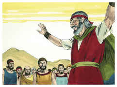

## 9
E disse o Senhor a Moisés: Eis que eu virei a ti numa nuvem espessa, para que o povo ouça, falando eu contigo, e para que também te creiam eternamente. Porque Moisés tinha anunciado as palavras do seu povo ao Senhor.

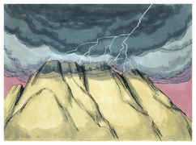

## 10
Disse também o Senhor a Moisés: Vai ao povo, e santifica-os hoje e amanhã, e lavem eles as suas roupas,

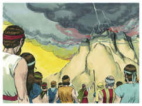

## 11
E estejam prontos para o terceiro dia; porquanto no terceiro dia o Senhor descerá diante dos olhos de todo o povo sobre o monte Sinai.

## 12
E marcarás limites ao povo em redor, dizendo: Guardai-vos, não subais ao monte, nem toqueis o seu termo; todo aquele que tocar o monte, certamente morrerá.

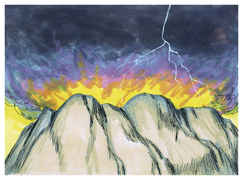

## 13
Nenhuma mão tocará nele; porque certamente será apedrejado ou asseteado; quer seja animal, quer seja homem, não viverá; soando a buzina longamente, então subirão ao monte.

## 14
Então Moisés desceu do monte ao povo, e santificou o povo; e lavaram as suas roupas.

## 15
E disse ao povo: Estai prontos ao terceiro dia; e não vos chegueis a mulher.

## 16
E aconteceu que, ao terceiro dia, ao amanhecer, houve trovões e relâmpagos sobre o monte, e uma espessa nuvem, e um sonido de buzina mui forte, de maneira que estremeceu todo o povo que estava no arraial.

## 17
E Moisés levou o povo fora do arraial ao encontro de Deus; e puseram-se ao pé do monte.

## 18
E todo o monte Sinai fumegava, porque o Senhor descera sobre ele em fogo; e a sua fumaça subiu como fumaça de uma fornalha, e todo o monte tremia grandemente.

## 19
E o sonido da buzina ia crescendo cada vez mais; Moisés falava, e Deus lhe respondia em voz alta.

## 20
E, descendo o Senhor sobre o monte Sinai, sobre o cume do monte, chamou o Senhor a Moisés ao cume do monte; e Moisés subiu.

## 21
E disse o Senhor a Moisés: Desce, adverte ao povo que não traspasse o termo para ver o Senhor, para que muitos deles não pereçam.

## 22
E também os sacerdotes, que se chegam ao Senhor, se hão de santificar, para que o Senhor não se lance sobre eles.

## 23
Então disse Moisés ao Senhor: O povo não poderá subir ao monte Sinai, porque tu nos tens advertido, dizendo: Marca termos ao redor do monte, e santifica-o.

## 24
E disse-lhe o Senhor: Vai, desce; depois subirás tu, e Arão contigo; os sacerdotes, porém, e o povo não traspassem o termo para subir ao Senhor, para que não se lance sobre eles.

## 25
Então Moisés desceu ao povo, e disse-lhe isto.

