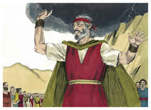
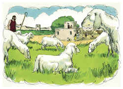

# Êxodo Capítulo 20

## 1
ENTÃO falou Deus todas estas palavras, dizendo:

## 2
Eu sou o Senhor teu Deus, que te tirei da terra do Egito, da casa da servidão.

## 3
Não terás outros deuses diante de mim.

## 4
Não farás para ti imagem de escultura, nem alguma semelhança do que há em cima nos céus, nem em baixo na terra, nem nas águas debaixo da terra.

## 5
Não te encurvarás a elas nem as servirás; porque eu, o Senhor teu Deus, sou Deus zeloso, que visito a iniqüidade dos pais nos filhos, até a terceira e quarta geração daqueles que me odeiam.

## 6
E faço misericórdia a milhares dos que me amam e aos que guardam os meus mandamentos.

## 7
Não tomarás o nome do Senhor teu Deus em vão; porque o Senhor não terá por inocente o que tomar o seu nome em vão.

## 8
Lembra-te do dia do sábado, para o santificar.

## 9
Seis dias trabalharás, e farás toda a tua obra.

## 10
Mas o sétimo dia é o sábado do Senhor teu Deus; não farás nenhuma obra, nem tu, nem teu filho, nem tua filha, nem o teu servo, nem a tua serva, nem o teu animal, nem o teu estrangeiro, que está dentro das tuas portas.

## 11
Porque em seis dias fez o Senhor os céus e a terra, o mar e tudo que neles há, e ao sétimo dia descansou; portanto abençoou o Senhor o dia do sábado, e o santificou.

## 12
Honra a teu pai e a tua mãe, para que se prolonguem os teus dias na terra que o Senhor teu Deus te dá.

## 13
Não matarás.

## 14
Não adulterarás.

## 15
Não furtarás.

## 16
Não dirás falso testemunho contra o teu próximo.

## 17
Não cobiçarás a casa do teu próximo, não cobiçarás a mulher do teu próximo, nem o seu servo, nem a sua serva, nem o seu boi, nem o seu jumento, nem coisa alguma do teu próximo.

## 18
E todo o povo viu os trovões e os relâmpagos, e o sonido da buzina, e o monte fumegando; e o povo, vendo isso retirou-se e pôs-se de longe.

## 19
E disseram a Moisés: Fala tu conosco, e ouviremos: e não fale Deus conosco, para que não morramos.

## 20
E disse Moisés ao povo: Não temais, Deus veio para vos provar, e para que o seu temor esteja diante de vós, a fim de que não pequeis.

## 21
E o povo estava em pé de longe. Moisés, porém, se chegou à escuridão, onde Deus estava.

## 22
Então disse o Senhor a Moisés: Assim dirás aos filhos de Israel: Vós tendes visto que, dos céus, eu falei convosco.

## 23
Não fareis outros deuses comigo; deuses de prata ou deuses de ouro não fareis para vós.

## 24
Um altar de terra me farás, e sobre ele sacrificarás os teus holocaustos, e as tuas ofertas pacíficas, as tuas ovelhas, e as tuas vacas; em todo o lugar, onde eu fizer celebrar a memória do meu nome, virei a ti e te abençoarei.

## 25
E se me fizeres um altar de pedras, não o farás de pedras lavradas; se sobre ele levantares o teu buril, profaná-lo-ás.

## 26
Também não subirás ao meu altar por degraus, para que a tua nudez não seja descoberta diante deles.

