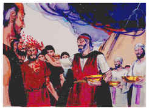

# Êxodo Capítulo 24

## 1
DEPOIS disse a Moisés: Sobe ao Senhor, tu e Arão, Nadabe e Abiú, e setenta dos anciãos de Israel; e adorai de longe.

## 2
E só Moisés se chegará ao Senhor; mas eles não se cheguem, nem o povo suba com ele.

## 3
Veio, pois, Moisés, e contou ao povo todas as palavras do Senhor, e todos os estatutos; então o povo respondeu a uma voz, e disse: Todas as palavras, que o Senhor tem falado, faremos.

## 4
Moisés escreveu todas as palavras do Senhor, e levantou-se pela manhã de madrugada, e edificou um altar ao pé do monte, e doze monumentos, segundo as doze tribos de Israel;

## 5
E enviou alguns jovens dos filhos de Israel, os quais ofereceram holocaustos e sacrificaram ao Senhor sacrifícios pacíficos de bezerros.

## 6
E Moisés tomou a metade do sangue, e a pôs em bacias; e a outra metade do sangue espargiu sobre o altar.

## 7
E tomou o livro da aliança e o leu aos ouvidos do povo, e eles disseram: Tudo o que o Senhor tem falado faremos, e obedeceremos.

## 8
Então tomou Moisés aquele sangue, e espargiu-o sobre o povo, e disse: Eis aqui o sangue da aliança que o Senhor tem feito convosco sobre todas estas palavras.

## 9
E subiram Moisés e Arão, Nadabe e Abiú, e setenta dos anciãos de Israel.

## 10
E viram o Deus de Israel, e debaixo de seus pés havia como que uma pavimentação de pedra de safira, que se parecia com o céu na sua claridade.

## 11
Porém não estendeu a sua mão sobre os escolhidos dos filhos de Israel, mas viram a Deus, e comeram e beberam.

## 12
Então disse o Senhor a Moisés: Sobe a mim ao monte, e fica lá; e dar-te-ei as tábuas de pedra e a lei, e os mandamentos que tenho escrito, para os ensinar.

## 13
E levantou-se Moisés com Josué seu servidor; e subiu Moisés ao monte de Deus.

## 14
E disse aos anciãos: Esperai-nos aqui, até que tornemos a vós; e eis que Arão e Hur ficam convosco; quem tiver algum negócio, se chegará a eles.

## 15
E, subindo Moisés ao monte, a nuvem cobriu o monte.

## 16
E a glória do Senhor repousou sobre o monte Sinai, e a nuvem o cobriu por seis dias; e ao sétimo dia chamou a Moisés do meio da nuvem.

## 17
E o parecer da glória do Senhor era como um fogo consumidor no cume do monte, aos olhos dos filhos de Israel.

## 18
E Moisés entrou no meio da nuvem, depois que subiu ao monte; e Moisés esteve no monte quarenta dias e quarenta noites.

