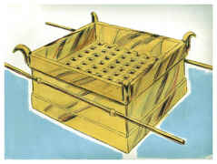
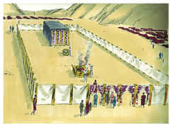

# Êxodo Capítulo 27

## 1
FARÁS também o altar de madeira de acácia; cinco côvados será o comprimento, e cinco côvados a largura (será quadrado o altar), e três côvados a sua altura.

## 2
E farás as suas pontas nos seus quatro cantos; as suas pontas serão do mesmo, e o cobrirás de cobre.

## 3
Far-lhe-ás também os seus recipientes, para recolher a sua cinza, e as suas pás, e as suas bacias, e os seus garfos e os seus braseiros; todos os seus utensílios farás de cobre.

## 4
Far-lhe-ás também um crivo de cobre em forma de rede, e farás a esta rede quatro argolas de metal nos seus quatro cantos.

## 5
E as porás dentro da borda do altar para baixo, de maneira que a rede chegue até ao meio do altar.

## 6
Farás também varais para o altar, varais de madeira de acácia, e os cobrirás de cobre.

## 7
E os varais serão postos nas argolas, de maneira que os varais estejam de ambos os lados do altar, quando for levado.

## 8
Oco e de tábuas o farás; como se te mostrou no monte, assim o farão.

## 9
Farás também o pátio do tabernáculo, ao lado meridional que dá para o sul; o pátio terá cortinas de linho fino torcido; o comprimento de cada lado será de cem côvados.

## 10
Também as suas vinte colunas e as suas vinte bases serão de cobre; os colchetes das colunas e as suas faixas serão de prata.

## 11
Assim também para o lado norte as cortinas, no comprimento, serão de cem côvados; e as suas vinte colunas e as suas vinte bases serão de cobre; os colchetes das colunas e as suas faixas serão de prata,

## 12
E na largura do pátio para o lado do ocidente haverá cortinas de cinqüenta côvados; as suas colunas dez, e as suas bases dez.

## 13
Semelhantemente a largura do pátio do lado oriental para o levante será de cinqüenta côvados.

## 14
De maneira que haja quinze côvados de cortinas de um lado; suas colunas três, e as suas bases três.

## 15
E quinze côvados das cortinas do outro lado; as suas colunas três, e as suas bases três.

## 16
E à porta do pátio haverá uma cortina de vinte côvados, de azul, e púrpura, e carmesim, e de linho fino torcido, de obra de bordador; as suas colunas quatro, e as suas bases quatro.

## 17
Todas as colunas do pátio ao redor serão cingidas de faixas de prata; os seus colchetes serão de prata, mas as suas bases de cobre.

## 18
O comprimento do pátio será de cem côvados, e a largura de cada lado de cinqüenta, e a altura de cinco côvados, as cortinas serão de linho fino torcido; mas as suas bases serão de cobre.

## 19
No tocante a todos os vasos do tabernáculo em todo o seu serviço, até todos os seus pregos, e todos os pregos do pátio, serão de cobre.

## 20
Tu pois ordenarás aos filhos de Israel que te tragam azeite puro de oliveiras, batido, para o candeeiro, para fazer arder as lâmpadas continuamente.

## 21
Na tenda da congregação, fora do véu que está diante do testemunho, Arão e seus filhos as porão em ordem, desde a tarde até a manhã, perante o Senhor; isto será um estatuto perpétuo para os filhos de Israel, pelas suas gerações.

