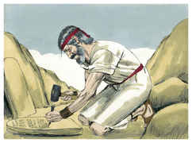

# Êxodo Capítulo 34

## 1
ENTÃO disse o Senhor a Moisés: Lavra duas tábuas de pedra, como as primeiras; e eu escreverei nas tábuas as mesmas palavras que estavam nas primeiras tábuas, que tu quebraste.

## 2
E prepara-te para amanhã, para que subas pela manhã ao monte Sinai, e ali põe-te diante de mim no cume do monte.

## 3
E ninguém suba contigo, e também ninguém apareça em todo o monte; nem ovelhas nem bois se apascentem defronte do monte.

## 4
Então Moisés lavrou duas tábuas de pedra, como as primeiras; e levantando-se pela manhã de madrugada, subiu ao monte Sinai, como o Senhor lhe tinha ordenado; e levou as duas tábuas de pedra nas suas mãos.

## 5
E o Senhor desceu numa nuvem e se pôs ali junto a ele; e ele proclamou o nome do Senhor.

## 6
Passando, pois, o Senhor perante ele, clamou: O Senhor, o Senhor Deus, misericordioso e piedoso, tardio em irar-se e grande em beneficência e verdade;

## 7
Que guarda a beneficência em milhares; que perdoa a iniqüidade, e a transgressão e o pecado; que ao culpado não tem por inocente; que visita a iniqüidade dos pais sobre os filhos e sobre os filhos dos filhos até a terceira e quarta geração.

## 8
E Moisés apressou-se, e inclinou a cabeça à terra, adorou,

## 9
E disse: Senhor, se agora tenho achado graça aos teus olhos, vá agora o Senhor no meio de nós; porque este é povo de dura cerviz; porém perdoa a nossa iniqüidade e o nosso pecado, e toma-nos por tua herança.

## 10
Então disse: Eis que eu faço uma aliança; farei diante de todo o teu povo maravilhas que nunca foram feitas em toda a terra, nem em nação alguma; de maneira que todo este povo, em cujo meio tu estás, veja a obra do Senhor; porque coisa terrível é o que faço contigo.

## 11
Guarda o que eu te ordeno hoje; eis que eu lançarei fora diante de ti os amorreus, e os cananeus, e os heteus, e os perizeus, e os heveus e os jebuseus.

## 12
Guarda-te de fazeres aliança com os moradores da terra aonde hás de entrar; para que não seja por laço no meio de ti.

## 13
Mas os seus altares derrubareis, e as suas estátuas quebrareis, e os seus bosques cortareis.

## 14
Porque não te inclinarás diante de outro deus; pois o nome do Senhor é Zeloso; é um Deus zeloso.

## 15
Para que não faças aliança com os moradores da terra, e quando eles se prostituírem após os seus deuses, ou sacrificarem aos seus deuses, tu, como convidado deles, comas também dos seus sacrifícios,

## 16
E tomes mulheres das suas filhas para os teus filhos, e suas filhas, prostituindo-se com os seus deuses, façam que também teus filhos se prostituam com os seus deuses.

## 17
Não te farás deuses de fundição.

## 18
A festa dos pães ázimos guardarás; sete dias comerás pães ázimos, como te tenho ordenado, ao tempo apontado do mês de Abibe; porque no mês de Abibe saíste do Egito.

## 19
Tudo o que abre a madre meu é, até todo o teu gado, que seja macho, e que abre a madre de vacas e de ovelhas;

## 20
O burro, porém, que abrir a madre, resgatarás com um cordeiro; mas, se o não resgatares, cortar-lhe-ás a cabeça; todo o primogênito de teus filhos resgatarás. E ninguém aparecerá vazio diante de mim.

## 21
Seis dias trabalharás, mas ao sétimo dia descansarás: na aradura e na sega descansarás.

## 22
Também guardarás a festa das semanas, que é a festa das primícias da sega do trigo, e a festa da colheita no fim do ano.

## 23
Três vezes ao ano todos os homens aparecerão perante o Senhor Deus, o Deus de Israel;

## 24
Porque eu lançarei fora as nações de diante de ti, e alargarei o teu território; ninguém cobiçará a tua terra, quando subires para aparecer três vezes no ano diante do Senhor teu Deus.

## 25
Não sacrificarás o sangue do meu sacrifício com pão levedado, nem o sacrifício da festa da páscoa ficará da noite para a manhã.

## 26
As primícias dos primeiros frutos da tua terra trarás à casa do Senhor teu Deus; não cozerás o cabrito no leite de sua mãe.

## 27
Disse mais o Senhor a Moisés: Escreve estas palavras; porque conforme ao teor destas palavras tenho feito aliança contigo e com Israel.

## 28
E esteve ali com o Senhor quarenta dias e quarenta noites; não comeu pão, nem bebeu água, e escreveu nas tábuas as palavras da aliança, os dez mandamentos.

## 29
E aconteceu que, descendo Moisés do monte Sinai trazia as duas tábuas do testemunho em suas mãos, sim, quando desceu do monte, Moisés não sabia que a pele do seu rosto resplandecia, depois que falara com ele.

## 30
Olhando, pois, Arão e todos os filhos de Israel para Moisés, eis que a pele do seu rosto resplandecia; por isso temeram chegar-se a ele.

## 31
Então Moisés os chamou, e Arão e todos os príncipes da congregação tornaram-se a ele; e Moisés lhes falou.

## 32
Depois chegaram também todos os filhos de Israel; e ele lhes ordenou tudo o que o Senhor falara com ele no monte Sinai.

## 33
Assim que Moisés acabou de falar com eles, pôs um véu sobre o seu rosto.

## 34
Porém, entrando Moisés perante o Senhor, para falar com ele, tirava o véu até sair; e, saindo, falava com os filhos de Israel o que lhe era ordenado.

## 35
Assim, pois, viam os filhos de Israel o rosto de Moisés, e que resplandecia a pele do seu rosto; e tornava Moisés a pôr o véu sobre o seu rosto, até entrar para falar com ele.

