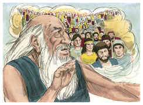

# Gênesis Capítulo 11

## 1
E ERA toda a terra de uma mesma língua e de uma mesma fala.

## 2
E aconteceu que, partindo eles do oriente, acharam um vale na terra de Sinar; e habitaram ali.

## 3
E disseram uns aos outros: Eia, façamos tijolos e queimemo-los bem. E foi-lhes o tijolo por pedra, e o betume por cal.

## 4
E disseram: Eia, edifiquemos nós uma cidade e uma torre cujo cume toque nos céus, e façamo-nos um nome, para que não sejamos espalhados sobre a face de toda a terra.

## 5
Então desceu o Senhor para ver a cidade e a torre que os filhos dos homens edificavam;

## 6
E o Senhor disse: Eis que o povo é um, e todos têm uma mesma língua; e isto é o que começam a fazer; e agora, não haverá restrição para tudo o que eles intentarem fazer.

## 7
Eia, desçamos e confundamos ali a sua língua, para que não entenda um a língua do outro.

## 8
Assim o Senhor os espalhou dali sobre a face de toda a terra; e cessaram de edificar a cidade.

## 9
Por isso se chamou o seu nome Babel, porquanto ali confundiu o Senhor a língua de toda a terra, e dali os espalhou o Senhor sobre a face de toda a terra.

## 10
Estas são as gerações de Sem: Sem era da idade de cem anos e gerou a Arfaxade, dois anos depois do dilúvio.

## 11
E viveu Sem, depois que gerou a Arfaxade, quinhentos anos, e gerou filhos e filhas.

## 12
E viveu Arfaxade trinta e cinco anos, e gerou a Selá.

## 13
E viveu Arfaxade depois que gerou a Selá, quatrocentos e três anos, e gerou filhos e filhas.

## 14
E viveu Selá trinta anos, e gerou a Éber;

## 15
E viveu Selá, depois que gerou a Éber, quatrocentos e três anos, e gerou filhos e filhas.

## 16
E viveu Éber trinta e quatro anos, e gerou a Pelegue.

## 17
E viveu Éber, depois que gerou a Pelegue, quatrocentos e trinta anos, e gerou filhos e filhas.

## 18
E viveu Pelegue trinta anos, e gerou a Reú.

## 19
E viveu Pelegue, depois que gerou a Reú, duzentos e nove anos, e gerou filhos e filhas.

## 20
E viveu Reú trinta e dois anos, e gerou a Serugue.

## 21
E viveu Reú, depois que gerou a Serugue, duzentos e sete anos, e gerou filhos e filhas.

## 22
E viveu Serugue trinta anos, e gerou a Naor.

## 23
E viveu Serugue, depois que gerou a Naor, duzentos anos, e gerou filhos e filhas.

## 24
E viveu Naor vinte e nove anos, e gerou a Terá.

## 25
E viveu Naor, depois que gerou a Terá, cento e dezenove anos, e gerou filhos e filhas.

## 26
E viveu Terá setenta anos, e gerou a Abrão, a Naor, e a Harã.

## 27
E estas são as gerações de Terá: Terá gerou a Abrão, a Naor, e a Harã; e Harã gerou a Ló.

## 28
E morreu Harã estando seu pai Terá ainda vivo, na terra do seu nascimento, em Ur dos caldeus.

## 29
E tomaram Abrão e Naor mulheres para si: o nome da mulher de Abrão era Sarai, e o nome da mulher de Naor era Milca, filha de Harã, pai de Milca e pai de Iscá.

## 30
E Sarai foi estéril, não tinha filhos.

## 31
E tomou Terá a Abrão seu filho, e a Ló, filho de Harã, filho de seu filho, e a Sarai sua nora, mulher de seu filho Abrão, e saiu com eles de Ur dos caldeus, para ir à terra de Canaã; e vieram até Harã, e habitaram ali.

## 32
E foram os dias de Terá duzentos e cinco anos, e morreu Terá em Harã.

