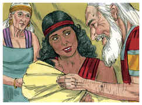

# Gênesis Capítulo 16

## 1
ORA Sarai, mulher de Abrão, não lhe dava filhos, e ele tinha uma serva egípcia, cujo nome era Agar.

## 2
E disse Sarai a Abrão: Eis que o Senhor me tem impedido de dar à luz; toma, pois, a minha serva; porventura terei filhos dela. E ouviu Abrão a voz de Sarai.

## 3
Assim tomou Sarai, mulher de Abrão, a Agar egípcia, sua serva, e deu-a por mulher a Abrão seu marido, ao fim de dez anos que Abrão habitara na terra de Canaã.

## 4
E ele possuiu a Agar, e ela concebeu; e vendo ela que concebera, foi sua senhora desprezada aos seus olhos.

## 5
Então disse Sarai a Abrão: Meu agravo seja sobre ti; minha serva pus eu em teu regaço; vendo ela agora que concebeu, sou menosprezada aos seus olhos; o Senhor julgue entre mim e ti.

## 6
E disse Abrão a Sarai: Eis que tua serva está na tua mão; faze-lhe o que bom é aos teus olhos. E afligiu-a Sarai, e ela fugiu de sua face.

## 7
E o anjo do Senhor a achou junto a uma fonte de água no deserto, junto à fonte no caminho de Sur.

## 8
E disse: Agar, serva de Sarai, donde vens, e para onde vais? E ela disse: Venho fugida da face de Sarai minha senhora.

## 9
Então lhe disse o anjo do Senhor: Torna-te para tua senhora, e humilha-te debaixo de suas mãos.

## 10
Disse-lhe mais o anjo do Senhor: Multiplicarei sobremaneira a tua descendência, que não será contada, por numerosa que será.

## 11
Disse-lhe também o anjo do Senhor: Eis que concebeste, e darás à luz um filho, e chamarás o seu nome Ismael; porquanto o Senhor ouviu a tua aflição.

## 12
E ele será homem feroz, e a sua mão será contra todos, e a mão de todos contra ele; e habitará diante da face de todos os seus irmãos.

## 13
E ela chamou o nome do Senhor, que com ela falava: Tu és Deus que me vê; porque disse: Não olhei eu também para aquele que me vê?

## 14
Por isso se chama aquele poço de Beer-Laai-Rói; eis que está entre Cades e Berede.

## 15
E Agar deu à luz um filho a Abrão; e Abrão chamou o nome do seu filho que Agar tivera, Ismael.

## 16
E era Abrão da idade de oitenta e seis anos, quando Agar deu à luz Ismael.

