# Gênesis Capítulo 31

## 1
ENTÃO ouvia as palavras dos filhos de Labão, que diziam: Jacó tem tomado tudo o que era de nosso pai, e do que era de nosso pai fez ele toda esta glória.

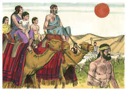

## 2
Viu também Jacó o rosto de Labão, e eis que não era para com ele como anteriormente.

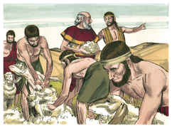

## 3
E disse o Senhor a Jacó: Torna-te à terra dos teus pais, e à tua parentela, e eu serei contigo.

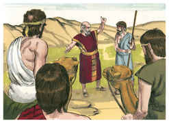

## 4
Então mandou Jacó chamar a Raquel e a Lia ao campo, para junto do seu rebanho,

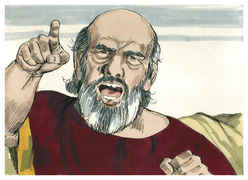

## 5
E disse-lhes: Vejo que o rosto de vosso pai não é para comigo como anteriormente; porém o Deus de meu pai tem estado comigo;

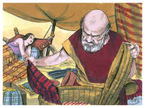

## 6
E vós mesmas sabeis que com todo o meu esforço tenho servido a vosso pai;

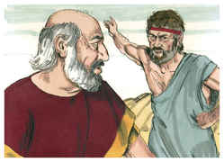

## 7
Mas vosso pai me enganou e mudou o salário dez vezes; porém Deus não lhe permitiu que me fizesse mal.

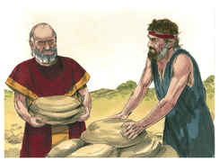

## 8
Quando ele dizia assim: Os salpicados serão o teu salário; então todos os rebanhos davam salpicados. E quando ele dizia assim: Os listrados serão o teu salário, então todos os rebanhos davam listrados.

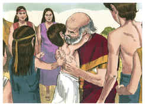

## 9
Assim Deus tirou o gado de vosso pai, e deu-o a mim.

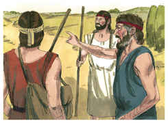

## 10
E sucedeu que, ao tempo em que o rebanho concebia, eu levantei os meus olhos e vi em sonhos, e eis que os bodes, que cobriam as ovelhas, eram listrados, salpicados e malhados.

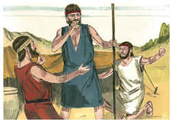

## 11
E disse-me o anjo de Deus em sonhos: Jacó! E eu disse: Eis-me aqui.

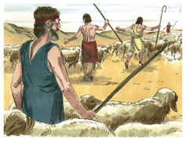

## 12
E disse ele: Levanta agora os teus olhos e vê todos os bodes que cobrem o rebanho, que são listrados, salpicados e malhados; porque tenho visto tudo o que Labão te fez.

## 13
Eu sou o Deus de Betel, onde tens ungido uma coluna, onde me fizeste um voto; levanta-te agora, sai-te desta terra e torna-te à terra da tua parentela.

## 14
Então responderam Raquel e Lia e disseram-lhe: Há ainda para nós parte ou herança na casa de nosso pai?

## 15
Não nos considera ele como estranhas? Pois vendeu-nos, e comeu de todo o nosso dinheiro.

## 16
Porque toda a riqueza, que Deus tirou de nosso pai, é nossa e de nossos filhos; agora, pois, faze tudo o que Deus te mandou.

## 17
Então se levantou Jacó, pondo os seus filhos e as suas mulheres sobre os camelos;

## 18
E levou todo o seu gado, e todos os seus bens, que havia adquirido, o gado que possuía, que alcançara em Padã-Arã, para ir a Isaque, seu pai, à terra de Canaã.

## 19
E havendo Labão ido a tosquiar as suas ovelhas, furtou Raquel os ídolos que seu pai tinha.

## 20
E Jacó logrou a Labão, o arameu, porque não lhe fez saber que fugia.

## 21
E fugiu ele com tudo o que tinha, e levantou-se e passou o rio; e se dirigiu para a montanha de Gileade.

## 22
E no terceiro dia foi anunciado a Labão que Jacó tinha fugido.

## 23
Então tomou consigo os seus irmãos, e atrás dele seguiu o seu caminho por sete dias; e alcançou-o na montanha de Gileade.

## 24
Veio, porém, Deus a Labão, o arameu, em sonhos, de noite, e disse-lhe: Guarda-te, que não fales com Jacó nem bem nem mal.

## 25
Alcançou, pois, Labão a Jacó, e armara Jacó a sua tenda naquela montanha; armou também Labão com os seus irmãos a sua, na montanha de Gileade.

## 26
Então disse Labão a Jacó: Que fizeste, que me lograste e levaste as minhas filhas como cativas pela espada?

## 27
Por que fugiste ocultamente, e lograste-me, e não me fizeste saber, para que eu te enviasse com alegria, e com cânticos, e com tamboril e com harpa?

## 28
Também não me permitiste beijar os meus filhos e as minhas filhas. Loucamente agiste, agora, fazendo assim.

## 29
Poder havia em minha mão para vos fazer mal, mas o Deus de vosso pai me falou ontem à noite, dizendo: Guarda-te, que não fales com Jacó nem bem nem mal.

## 30
E agora se querias ir embora, porquanto tinhas saudades de voltar à casa de teu pai, por que furtaste os meus deuses?

## 31
Então respondeu Jacó, e disse a Labão: Porque temia; pois que dizia comigo, se porventura não me arrebatarias as tuas filhas.

## 32
Com quem achares os teus deuses, esse não viva; reconhece diante de nossos irmãos o que é teu do que está comigo, e toma-o para ti. Pois Jacó não sabia que Raquel os tinha furtado.

## 33
Então entrou Labão na tenda de Jacó, e na tenda de Lia, e na tenda de ambas as servas, e não os achou; e saindo da tenda de Lia, entrou na tenda de Raquel.

## 34
Mas tinha tomado Raquel os ídolos e os tinha posto na albarda de um camelo, e assentara-se sobre eles; e apalpou Labão toda a tenda, e não os achou.

## 35
E ela disse a seu pai: Não se acenda a ira aos olhos de meu senhor, que não posso levantar-me diante da tua face; porquanto tenho o costume das mulheres. E ele procurou, mas não achou os ídolos.

## 36
Então irou-se Jacó e contendeu com Labão; e respondeu Jacó, e disse a Labão: Qual é a minha transgressão? Qual é o meu pecado, que tão furiosamente me tens perseguido?

## 37
Havendo apalpado todos os meus móveis, que achaste de todos os móveis de tua casa? Põe-no aqui diante dos meus irmãos e de teus irmãos; e que julguem entre nós ambos.

## 38
Estes vinte anos eu estive contigo; as tuas ovelhas e as tuas cabras nunca abortaram, e não comi os carneiros do teu rebanho.

## 39
Não te trouxe eu o despedaçado; eu o pagava; o furtado de dia e o furtado de noite da minha mão o requerias.

## 40
Estava eu assim: De dia me consumia o calor, e de noite a geada; e o meu sono fugiu dos meus olhos.

## 41
Tenho estado agora vinte anos na tua casa; catorze anos te servi por tuas duas filhas, e seis anos por teu rebanho; mas o meu salário tens mudado dez vezes.

## 42
Se o Deus de meu pai, o Deus de Abraão e o temor de Isaque não fora comigo, por certo me despedirias agora vazio. Deus atendeu à minha aflição, e ao trabalho das minhas mãos, e repreendeu-te ontem à noite.

## 43
Então respondeu Labão, e disse a Jacó: Estas filhas são minhas filhas, e estes filhos são meus filhos, e este rebanho é o meu rebanho, e tudo o que vês, é meu; e que farei hoje a estas minhas filhas, ou a seus filhos, que deram à luz?

## 44
Agora pois vem, e façamos aliança eu e tu, que seja por testemunho entre mim e ti.

## 45
Então tomou Jacó uma pedra, e erigiu-a por coluna.

## 46
E disse Jacó a seus irmãos: Ajuntai pedras. E tomaram pedras, e fizeram um montão, e comeram ali sobre aquele montão.

## 47
E chamou-o Labão Jegar-Saaduta; porém Jacó chamou-o Galeede.

## 48
Então disse Labão: Este montão seja hoje por testemunha entre mim e ti. Por isso se lhe chamou Galeede,

## 49
E Mispá, porquanto disse: Atente o Senhor entre mim e ti, quando nós estivermos apartados um do outro.

## 50
Se afligires as minhas filhas, e se tomares mulheres além das minhas filhas, ninguém está conosco; atenta que Deus é testemunha entre mim e ti.

## 51
Disse mais Labão a Jacó: Eis aqui este mesmo montão, e eis aqui essa coluna que levantei entre mim e ti.

## 52
Este montão seja testemunha, e esta coluna seja testemunha, que eu não passarei este montão a ti, e que tu não passarás este montão e esta coluna a mim, para mal.

## 53
O Deus de Abraão e o Deus de Naor, o Deus de seu pai, julgue entre nós. E jurou Jacó pelo temor de seu pai Isaque.

## 54
E ofereceu Jacó um sacrifício na montanha, e convidou seus irmãos, para comer pão; e comeram pão e passaram a noite na montanha.

## 55
E levantou-se Labão pela manhã de madrugada, e beijou seus filhos e suas filhas e abençoou-os e partiu; e voltou Labão ao seu lugar.

