# Gênesis Capítulo 40

## 1
E ACONTECEU, depois destas coisas, que o copeiro do rei do Egito, e o seu padeiro, ofenderam o seu senhor, o rei do Egito.

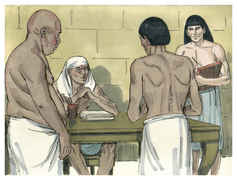

## 2
E indignou-se Faraó muito contra os seus dois oficiais, contra o copeiro-mor e contra o padeiro-mor.

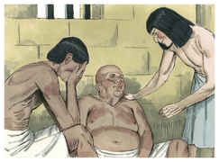

## 3
E entregou-os à prisão, na casa do capitão da guarda, na casa do cárcere, no lugar onde José estava preso.

## 4
E o capitão da guarda pô-los a cargo de José, para que os servisse; e estiveram muitos dias na prisão.

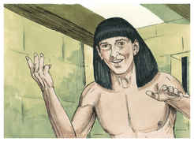

## 5
E ambos tiveram um sonho, cada um seu sonho, na mesma noite, cada um conforme a interpretação do seu sonho, o copeiro e o padeiro do rei do Egito, que estavam presos na casa do cárcere.

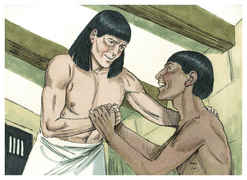

## 6
E veio José a eles pela manhã, e olhou para eles, e viu que estavam perturbados.

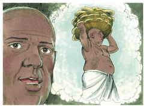

## 7
Então perguntou aos oficiais de Faraó, que com ele estavam no cárcere da casa de seu senhor, dizendo: Por que estão hoje tristes os vossos semblantes?

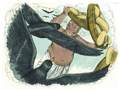

## 8
E eles lhe disseram: Tivemos um sonho, e ninguém há que o interprete. E José disse-lhes: Não são de Deus as interpretações? Contai-mo, peço-vos.

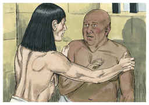

## 9
Então contou o copeiro-mor o seu sonho a José, e disse-lhe: Eis que em meu sonho havia uma vide diante da minha face.

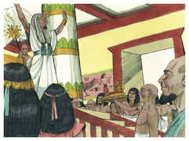

## 10
E na vide três sarmentos, e brotando ela, a sua flor saía, e os seus cachos amadureciam em uvas;

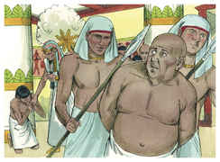

## 11
E o copo de Faraó estava na minha mão, e eu tomava as uvas, e as espremia no copo de Faraó, e dava o copo na mão de Faraó.

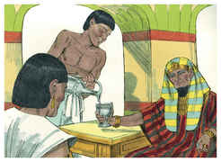

## 12
Então disse-lhe José: Esta é a sua interpretação: Os três sarmentos são três dias;

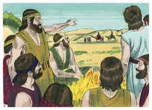

## 13
Dentro ainda de três dias Faraó levantará a tua cabeça, e te restaurará ao teu estado, e darás o copo de Faraó na sua mão, conforme o costume antigo, quando eras seu copeiro.

## 14
Porém lembra-te de mim, quando te for bem; e rogo-te que uses comigo de compaixão, e que faças menção de mim a Faraó, e faze-me sair desta casa;

## 15
Porque, de fato, fui roubado da terra dos hebreus; e tampouco aqui nada tenho feito para que me pusessem nesta cova.

## 16
Vendo então o padeiro-mor que tinha interpretado bem, disse a José: Eu também sonhei, e eis que três cestos brancos estavam sobre a minha cabeça;

## 17
E no cesto mais alto havia de todos os manjares de Faraó, obra de padeiro; e as aves o comiam do cesto, de sobre a minha cabeça.

## 18
Então respondeu José, e disse: Esta é a sua interpretação: Os três cestos são três dias;

## 19
Dentro ainda de três dias Faraó tirará a tua cabeça e te pendurará num pau, e as aves comerão a tua carne de sobre ti.

## 20
E aconteceu ao terceiro dia, o dia do nascimento de Faraó, que fez um banquete a todos os seus servos; e levantou a cabeça do copeiro-mor, e a cabeça do padeiro-mor, no meio dos seus servos.

## 21
E fez tornar o copeiro-mor ao seu ofício de copeiro, e este deu o copo na mão de Faraó,

## 22
Mas ao padeiro-mor enforcou, como José havia interpretado.

## 23
O copeiro-mor, porém, não se lembrou de José, antes se esqueceu dele.

