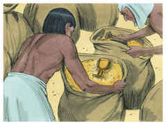

# Gênesis Capítulo 44

## 1
E DEU ordem ao que estava sobre a sua casa, dizendo: Enche de mantimento os sacos destes homens, quanto puderem levar, e põe o dinheiro de cada um na boca do seu saco.

## 2
E o meu copo, o copo de prata, porás na boca do saco do mais novo, com o dinheiro do seu trigo. E fez conforme a palavra que José tinha dito.

## 3
Vinda a luz da manhã, despediram-se estes homens, eles com os seus jumentos.

## 4
Saindo eles da cidade, e não se havendo ainda distanciado, disse José ao que estava sobre a sua casa: Levanta-te, e persegue aqueles homens; e, alcançando-os, lhes dirás: Por que pagastes mal por bem?

## 5
Não é este o copo em que bebe meu senhor e pelo qual bem adivinha? Procedestes mal no que fizestes.

## 6
E alcançou-os, e falou-lhes as mesmas palavras.

## 7
E eles disseram-lhe: Por que diz meu senhor tais palavras? Longe estejam teus servos de fazerem semelhante coisa.

## 8
Eis que o dinheiro, que temos achado nas bocas dos nossos sacos, te tornamos a trazer desde a terra de Canaã; como, pois, furtaríamos da casa do teu senhor prata ou ouro?

## 9
Aquele, com quem de teus servos for achado, morra; e ainda nós seremos escravos do meu senhor.

## 10
E ele disse: Ora seja também assim conforme as vossas palavras; aquele com quem se achar será meu escravo, porém vós sereis desculpados.

## 11
E eles apressaram-se e cada um pôs em terra o seu saco, e cada um abriu o seu saco.

## 12
E buscou, começando do maior, e acabando no mais novo; e achou-se o copo no saco de Benjamim.

## 13
Então rasgaram as suas vestes, e carregou cada um o seu jumento, e tornaram à cidade.

## 14
E veio Judá com os seus irmãos à casa de José, porque ele ainda estava ali; e prostraram-se diante dele em terra.

## 15
E disse-lhes José: Que é isto que fizestes? Não sabeis vós que um homem como eu pode, muito bem, adivinhar?

## 16
Então disse Judá: Que diremos a meu senhor? Que falaremos? E como nos justificaremos? Achou Deus a iniqüidade de teus servos; eis que somos escravos de meu senhor, tanto nós como aquele em cuja mão foi achado o copo.

## 17
Mas ele disse: Longe de mim que eu tal faça; o homem em cuja mão o copo foi achado, esse será meu servo; porém vós, subi em paz para vosso pai.

## 18
Então Judá se chegou a ele, e disse: Ai! senhor meu, deixa, peço-te, o teu servo dizer uma palavra aos ouvidos de meu senhor, e não se acenda a tua ira contra o teu servo; porque tu és como Faraó.

## 19
Meu senhor perguntou a seus servos, dizendo: Tendes vós pai, ou irmão?

## 20
E dissemos a meu senhor: Temos um velho pai, e um filho da sua velhice, o mais novo, cujo irmão é morto; e só ele ficou de sua mãe, e seu pai o ama.

## 21
Então tu disseste a teus servos: Trazei-mo a mim, e porei os meus olhos sobre ele.

## 22
E nós dissemos a meu senhor: Aquele moço não poderá deixar a seu pai; se deixar a seu pai, este morrerá.

## 23
Então tu disseste a teus servos: Se vosso irmão mais novo não descer convosco, nunca mais vereis a minha face.

## 24
E aconteceu que, subindo nós a teu servo meu pai, e contando-lhe as palavras de meu senhor,

## 25
Disse nosso pai: Voltai, comprai-nos um pouco de mantimento.

## 26
E nós dissemos: Não poderemos descer; mas, se nosso irmão menor for conosco, desceremos; pois não poderemos ver a face do homem se este nosso irmão menor não estiver conosco.

## 27
Então disse-nos teu servo, meu pai: Vós sabeis que minha mulher me deu dois filhos;

## 28
E um ausentou-se de mim, e eu disse: Certamente foi despedaçado, e não o tenho visto até agora;

## 29
Se agora também tirardes a este da minha face, e lhe acontecer algum desastre, fareis descer as minhas cãs com aflição à sepultura.

## 30
Agora, pois, indo eu a teu servo, meu pai, e o moço não indo conosco, como a sua alma está ligada com a alma dele,

## 31
Acontecerá que, vendo ele que o moço ali não está, morrerá; e teus servos farão descer as cãs de teu servo, nosso pai, com tristeza à sepultura.

## 32
Porque teu servo se deu por fiador por este moço para com meu pai, dizendo: Se eu o não tornar para ti, serei culpado para com meu pai por todos os dias.

## 33
Agora, pois, fique teu servo em lugar deste moço por escravo de meu senhor, e que suba o moço com os seus irmãos.

## 34
Porque, como subirei eu a meu pai, se o moço não for comigo? para que não veja eu o mal que sobrevirá a meu pai.

