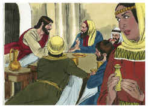
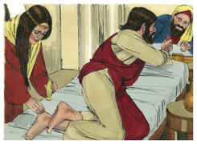
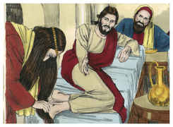

# Jó Capítulo 12

## 1
ENTÃO Jó respondeu, dizendo:

## 2
Na verdade, vós sois o povo, e convosco morrerá a sabedoria.

## 3
Também eu tenho entendimento como vós, e não vos sou inferior; e quem não sabe tais coisas como essas?

## 4
Eu sou motivo de riso para os meus amigos; eu, que invoco a Deus, e ele me responde; o justo e perfeito serve de zombaria.

## 5
Tocha desprezível é, na opinião do que está descansado, aquele que está pronto a vacilar com os pés.

## 6
As tendas dos assoladores têm descanso, e os que provocam a Deus estão seguros; nas suas mãos Deus lhes põe tudo.

## 7
Mas, pergunta agora às alimárias, e cada uma delas te ensinará; e às aves dos céus, e elas te farão saber;

## 8
Ou fala com a terra, e ela te ensinará; até os peixes do mar te contarão.

## 9
Quem não entende, por todas estas coisas, que a mão do Senhor fez isto?

## 10
Na sua mão está a alma de tudo quanto vive, e o espírito de toda a carne humana.

## 11
Porventura o ouvido não provará as palavras, como o paladar prova as comidas?

## 12
Com os idosos está a sabedoria, e na longevidade o entendimento.

## 13
Com ele está a sabedoria e a força; conselho e entendimento tem.

## 14
Eis que ele derruba, e ninguém há que edifique; prende um homem, e ninguém há que o solte.

## 15
Eis que ele retém as águas, e elas secam; e solta-as, e elas transtornam a terra.

## 16
Com ele está a força e a sabedoria; seu é o que erra e o que o faz errar.

## 17
Aos conselheiros leva despojados, e aos juízes faz desvairar.

## 18
Solta a autoridade dos reis, e ata o cinto aos seus lombos.

## 19
Aos sacerdotes leva despojados, aos poderosos transtorna.

## 20
Aos acreditados tira a fala, e tira o entendimento aos anciãos.

## 21
Derrama desprezo sobre os príncipes, e afrouxa o cinto dos fortes.

## 22
Das trevas descobre coisas profundas, e traz à luz a sombra da morte.

## 23
Multiplica as nações e as faz perecer; dispersa as nações, e de novo as reconduz.

## 24
Tira o entendimento aos chefes dos povos da terra, e os faz vaguear pelos desertos, sem caminho.

## 25
Nas trevas andam às apalpadelas, sem terem luz, e os faz desatinar como ébrios.

# João Capítulo 12

## 1
FOI, pois, Jesus seis dias antes da páscoa a Betânia, onde estava Lázaro, o que falecera, e a quem ressuscitara dentre os mortos.

## 2
Fizeram-lhe, pois, ali uma ceia, e Marta servia, e Lázaro era um dos que estavam à mesa com ele.

## 3
Então Maria, tomando um arrátel de ungüento de nardo puro, de muito preço, ungiu os pés de Jesus, e enxugou-lhe os pés com os seus cabelos; e encheu-se a casa do cheiro do ungüento.

## 4
Então, um dos seus discípulos, Judas Iscariotes, filho de Simão, o que havia de traí-lo, disse:

## 5
Por que não se vendeu este ungüento por trezentos dinheiros e não se deu aos pobres?

## 6
Ora, ele disse isto, não pelo cuidado que tivesse dos pobres, mas porque era ladrão e tinha a bolsa, e tirava o que ali se lançava.

## 7
Disse, pois, Jesus: Deixai-a; para o dia da minha sepultura guardou isto;

## 8
Porque os pobres sempre os tendes convosco, mas a mim nem sempre me tendes.

## 9
E muita gente dos judeus soube que ele estava ali; e foram, não só por causa de Jesus, mas também para ver a Lázaro, a quem ressuscitara dentre os mortos.

## 10
E os principais dos sacerdotes tomaram deliberação para matar também a Lázaro;

## 11
Porque muitos dos judeus, por causa dele, iam e criam em Jesus.

## 12
No dia seguinte, ouvindo uma grande multidão, que viera à festa, que Jesus vinha a Jerusalém,

## 13
Tomaram ramos de palmeiras, e saíram-lhe ao encontro, e clamavam: Hosana! Bendito o Rei de Israel que vem em nome do Senhor.

## 14
E achou Jesus um jumentinho, e assentou-se sobre ele, como está escrito:

## 15
Não temas, ó filha de Sião; eis que o teu Rei vem assentado sobre o filho de uma jumenta.

## 16
Os seus discípulos, porém, não entenderam isto no princípio; mas, quando Jesus foi glorificado, então se lembraram de que isto estava escrito dele, e que isto lhe fizeram.

## 17
A multidão, pois, que estava com ele quando Lázaro foi chamado da sepultura, testificava que ele o ressuscitara dentre os mortos.

## 18
Por isso a multidão lhe saiu ao encontro, porque tinham ouvido que ele fizera este sinal.

## 19
Disseram, pois, os fariseus entre si: Vedes que nada aproveitais? Eis que toda a gente vai após ele.

## 20
Ora, havia alguns gregos, entre os que tinham subido a adorar no dia da festa.

## 21
Estes, pois, dirigiram-se a Filipe, que era de Betsaida da Galiléia, e rogaram-lhe, dizendo: Senhor, queríamos ver a Jesus.

## 22
Filipe foi dizê-lo a André, e então André e Filipe o disseram a Jesus.

## 23
E Jesus lhes respondeu, dizendo: É chegada a hora em que o Filho do homem há de ser glorificado.

## 24
Na verdade, na verdade vos digo que, se o grão de trigo, caindo na terra, não morrer, fica ele só; mas se morrer, dá muito fruto.

## 25
Quem ama a sua vida perdê-la-á, e quem neste mundo odeia a sua vida, guardá-la-á para a vida eterna.

## 26
Se alguém me serve, siga-me, e onde eu estiver, ali estará também o meu servo. E, se alguém me servir, meu Pai o honrará.

## 27
Agora a minha alma está perturbada; e que direi eu? Pai, salva-me desta hora; mas para isto vim a esta hora.

## 28
Pai, glorifica o teu nome. Então veio uma voz do céu que dizia: Já o tenho glorificado, e outra vez o glorificarei.

## 29
Ora, a multidão que ali estava, e que a ouvira, dizia que havia sido um trovão. Outros diziam: Um anjo lhe falou.

## 30
Respondeu Jesus, e disse: Não veio esta voz por amor de mim, mas por amor de vós.

## 31
Agora é o juízo deste mundo; agora será expulso o príncipe deste mundo.

## 32
E eu, quando for levantado da terra, todos atrairei a mim.

## 33
E dizia isto, significando de que morte havia de morrer.

## 34
Respondeu-lhe a multidão: Nós temos ouvido da lei, que o Cristo permanece para sempre; e como dizes tu que convém que o Filho do homem seja levantado? Quem é esse Filho do homem?

## 35
Disse-lhes, pois, Jesus: A luz ainda está convosco por um pouco de tempo. Andai enquanto tendes luz, para que as trevas não vos apanhem; pois quem anda nas trevas não sabe para onde vai.

## 36
Enquanto tendes luz, crede na luz, para que sejais filhos da luz. Estas coisas disse Jesus e, retirando-se, escondeu-se deles.

## 37
E, ainda que tinha feito tantos sinais diante deles, não criam nele;

## 38
Para que se cumprisse a palavra do profeta Isaías, que diz: Senhor, quem creu na nossa pregação? E a quem foi revelado o braço do Senhor?

## 39
Por isso não podiam crer, então Isaías disse outra vez:

## 40
Cegou-lhes os olhos, e endureceu-lhes o coração, A fim de que não vejam com os olhos, e compreendam no coração, E se convertam, E eu os cure.

## 41
Isaías disse isto quando viu a sua glória e falou dele.

## 42
Apesar de tudo, até muitos dos principais creram nele; mas não o confessavam por causa dos fariseus, para não serem expulsos da sinagoga.

## 43
Porque amavam mais a glória dos homens do que a glória de Deus.

## 44
E Jesus clamou, e disse: Quem crê em mim, crê, não em mim, mas naquele que me enviou.

## 45
E quem me vê a mim, vê aquele que me enviou.

## 46
Eu sou a luz que vim ao mundo, para que todo aquele que crê em mim não permaneça nas trevas.

## 47
E se alguém ouvir as minhas palavras, e não crer, eu não o julgo; porque eu vim, não para julgar o mundo, mas para salvar o mundo.

## 48
Quem me rejeitar a mim, e não receber as minhas palavras, já tem quem o julgue; a palavra que tenho pregado, essa o há de julgar no último dia.

## 49
Porque eu não tenho falado de mim mesmo; mas o Pai, que me enviou, ele me deu mandamento sobre o que hei de dizer e sobre o que hei de falar.

## 50
E sei que o seu mandamento é a vida eterna. Portanto, o que eu falo, falo-o como o Pai mo tem dito.

