# Jó Capítulo 2

## 1
E, VINDO outro dia, em que os filhos de Deus vieram apresentar-se perante o Senhor, veio também Satanás entre eles, apresentar-se perante o Senhor.

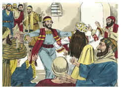

## 2
Então o Senhor disse a Satanás: Donde vens? E respondeu Satanás ao Senhor, e disse: De rodear a terra, e passear por ela.

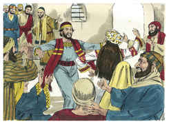

## 3
E disse o Senhor a Satanás: Observaste o meu servo Jó? Porque ninguém há na terra semelhante a ele, homem íntegro e reto, temente a Deus e que se desvia do mal, e que ainda retém a sua sinceridade, havendo-me tu incitado contra ele, para o consumir sem causa.

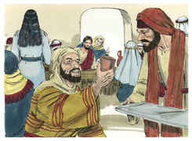

## 4
Então Satanás respondeu ao Senhor, e disse: Pele por pele, e tudo quanto o homem tem dará pela sua vida.

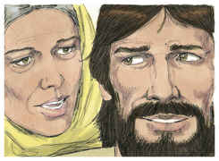

## 5
Porém estende a tua mão, e toca-lhe nos ossos, e na carne, e verás se não blasfema contra ti na tua face!

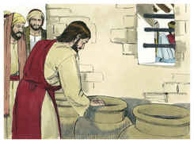

## 6
E disse o Senhor a Satanás: Eis que ele está na tua mão; porém guarda a sua vida.

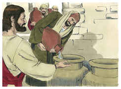

## 7
Então saiu Satanás da presença do Senhor, e feriu a Jó de úlceras malignas, desde a planta do pé até ao alto da cabeça.

## 8
E Jó tomou um caco para se raspar com ele; e estava assentado no meio da cinza.

## 9
Então sua mulher lhe disse: Ainda reténs a tua sinceridade? Amaldiçoa a Deus, e morre.

## 10
Porém ele lhe disse: Como fala qualquer doida, falas tu; receberemos o bem de Deus, e não receberíamos o mal? Em tudo isto não pecou Jó com os seus lábios.

## 11
Ouvindo, pois, três amigos de Jó todo este mal que tinha vindo sobre ele, vieram cada um do seu lugar: Elifaz o temanita, e Bildade o suíta, e Zofar o naamatita; e combinaram condoer-se dele, para o consolarem.

## 12
E, levantando de longe os seus olhos, não o conheceram; e levantaram a sua voz e choraram, e rasgaram cada um o seu manto, e sobre as suas cabeças lançaram pó ao ar.

## 13
E assentaram-se com ele na terra, sete dias e sete noites; e nenhum lhe dizia palavra alguma, porque viam que a dor era muito grande.

# João Capítulo 2

## 1
E, AO terceiro dia, fizeram-se umas bodas em Caná da Galiléia; e estava ali a mãe de Jesus.

## 2
E foi também convidado Jesus e os seus discípulos para as bodas.

## 3
E, faltando vinho, a mãe de Jesus lhe disse: Não têm vinho.

## 4
Disse-lhe Jesus: Mulher, que tenho eu contigo? Ainda não é chegada a minha hora.

## 5
Sua mãe disse aos serventes: Fazei tudo quanto ele vos disser.

## 6
E estavam ali postas seis talhas de pedra, para as purificações dos judeus, e em cada uma cabiam dois ou três almudes.

## 7
Disse-lhes Jesus: Enchei de água essas talhas. E encheram-nas até em cima.

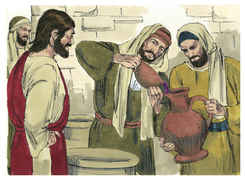

## 8
E disse-lhes: Tirai agora, e levai ao mestre-sala. E levaram.

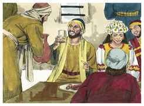

## 9
E, logo que o mestre-sala provou a água feita vinho (não sabendo de onde viera, se bem que o sabiam os serventes que tinham tirado a água), chamou o mestre-sala ao esposo,

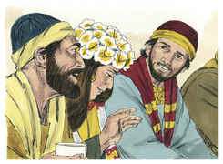

## 10
E disse-lhe: Todo o homem põe primeiro o vinho bom e, quando já têm bebido bem, então o inferior; mas tu guardaste até agora o bom vinho.

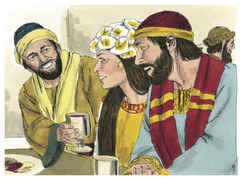

## 11
Jesus principiou assim os seus sinais em Caná da Galiléia, e manifestou a sua glória; e os seus discípulos creram nele.

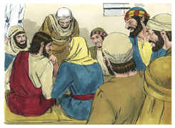

## 12
Depois disto desceu a Cafarnaum, ele, e sua mãe, e seus irmãos, e seus discípulos; e ficaram ali não muitos dias.

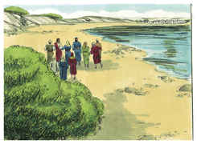

## 13
E estava próxima a páscoa dos judeus, e Jesus subiu a Jerusalém.

## 14
E achou no templo os que vendiam bois, e ovelhas, e pombos, e os cambiadores assentados.

## 15
E tendo feito um azorrague de cordéis, lançou todos fora do templo, também os bois e ovelhas; e espalhou o dinheiro dos cambiadores, e derribou as mesas;

## 16
E disse aos que vendiam pombos: Tirai daqui estes, e não façais da casa de meu Pai casa de venda.

## 17
E os seus discípulos lembraram-se do que está escrito: O zelo da tua casa me devorou.

## 18
Responderam, pois, os judeus, e disseram-lhe: Que sinal nos mostras para fazeres isto?

## 19
Jesus respondeu, e disse-lhes: Derribai este templo, e em três dias o levantarei.

## 20
Disseram, pois, os judeus: Em quarenta e seis anos foi edificado este templo, e tu o levantarás em três dias?

## 21
Mas ele falava do templo do seu corpo.

## 22
Quando, pois, ressuscitou dentre os mortos, os seus discípulos lembraram-se de que lhes dissera isto; e creram na Escritura, e na palavra que Jesus tinha dito.

## 23
E, estando ele em Jerusalém pela páscoa, durante a festa, muitos, vendo os sinais que fazia, creram no seu nome.

## 24
Mas o mesmo Jesus não confiava neles, porque a todos conhecia;

## 25
E não necessitava de que alguém testificasse do homem, porque ele bem sabia o que havia no homem.

