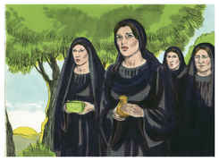
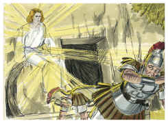

# Jó Capítulo 20

## 1
ENTÃO respondeu Zofar, o naamatita, e disse:

## 2
Visto que os meus pensamentos me fazem responder, eu me apresso.

## 3
Eu ouvi a repreensão, que me envergonha, mas o espírito do meu entendimento responderá por mim.

## 4
Porventura não sabes tu que desde a antiguidade, desde que o homem foi posto sobre a terra,

## 5
O júbilo dos ímpios é breve, e a alegria dos hipócritas momentânea?

## 6
Ainda que a sua altivez suba até ao céu, e a sua cabeça chegue até às nuvens.

## 7
Contudo, como o seu próprio esterco, perecerá para sempre; e os que o viam dirão: Onde está?

## 8
Como um sonho voará, e não será achado, e será afugentado como uma visão da noite.

## 9
O olho, que já o viu, jamais o verá, nem o seu lugar o verá mais.

## 10
Os seus filhos procurarão agradar aos pobres, e as suas mãos restituirão os seus bens.

## 11
Os seus ossos estão cheios do vigor da sua mocidade, mas este se deitará com ele no pó.

## 12
Ainda que o mal lhe seja doce na boca, e ele o esconda debaixo da sua língua,

## 13
E o guarde, e não o deixe, antes o retenha no seu paladar,

## 14
Contudo a sua comida se mudará nas suas entranhas; fel de áspides será interiormente.

## 15
Engoliu riquezas, porém vomitá-las-á; do seu ventre Deus as lançará.

## 16
Veneno de áspides sorverá; língua de víbora o matará.

## 17
Não verá as correntes, os rios e os ribeiros de mel e manteiga.

## 18
Restituirá o seu trabalho, e não o engolirá; conforme ao poder de sua mudança, e não saltará de gozo.

## 19
Porquanto oprimiu e desamparou os pobres, e roubou a casa que não edificou.

## 20
Porquanto não sentiu sossego no seu ventre; nada salvará das coisas por ele desejadas.

## 21
Nada lhe sobejará do que coma; por isso as suas riquezas não durarão.

## 22
Sendo plena a sua abastança, estará angustiado; toda a força da miséria virá sobre ele.

## 23
Mesmo estando ele a encher a sua barriga, Deus mandará sobre ele o ardor da sua ira, e a fará chover sobre ele quando for comer.

## 24
Ainda que fuja das armas de ferro, o arco de bronze o atravessará.

## 25
Desembainhará a espada que sairá do seu corpo, e resplandecendo virá do seu fel; e haverá sobre ele assombros.

## 26
Toda a escuridão se ocultará nos seus esconderijos; um fogo não assoprado o consumirá, irá mal com o que ficar na sua tenda.

## 27
Os céus manifestarão a sua iniqüidade; e a terra se levantará contra ele.

## 28
As riquezas de sua casa serão transportadas; no dia da sua ira todas se derramarão.

## 29
Esta, da parte de Deus, é a porção do homem ímpio; esta é a herança que Deus lhe decretou.

# João Capítulo 20

## 1
E NO primeiro dia da semana, Maria Madalena foi ao sepulcro de madrugada, sendo ainda escuro, e viu a pedra tirada do sepulcro.

## 2
Correu, pois, e foi a Simão Pedro, e ao outro discípulo, a quem Jesus amava, e disse-lhes: Levaram o Senhor do sepulcro, e não sabemos onde o puseram.

## 3
Então Pedro saiu com o outro discípulo, e foram ao sepulcro.

## 4
E os dois corriam juntos, mas o outro discípulo correu mais apressadamente do que Pedro, e chegou primeiro ao sepulcro.

## 5
E, abaixando-se, viu no chão os lençóis; todavia não entrou.

## 6
Chegou, pois, Simão Pedro, que o seguia, e entrou no sepulcro, e viu no chão os lençóis,

## 7
E que o lenço, que tinha estado sobre a sua cabeça, não estava com os lençóis, mas enrolado num lugar à parte.

## 8
Então entrou também o outro discípulo, que chegara primeiro ao sepulcro, e viu, e creu.

## 9
Porque ainda não sabiam a Escritura, que era necessário que ressuscitasse dentre os mortos.

## 10
Tornaram, pois, os discípulos para casa.

## 11
E Maria estava chorando fora, junto ao sepulcro. Estando ela, pois, chorando, abaixou-se para o sepulcro.

## 12
E viu dois anjos vestidos de branco, assentados onde jazera o corpo de Jesus, um à cabeceira e outro aos pés.

## 13
E disseram-lhe eles: Mulher, por que choras? Ela lhes disse: Porque levaram o meu Senhor, e não sei onde o puseram.

## 14
E, tendo dito isto, voltou-se para trás, e viu Jesus em pé, mas não sabia que era Jesus.

## 15
Disse-lhe Jesus: Mulher, por que choras? Quem buscas? Ela, cuidando que era o hortelão, disse-lhe: Senhor, se tu o levaste, dize-me onde o puseste, e eu o levarei.

## 16
Disse-lhe Jesus: Maria! Ela, voltando-se, disse-lhe: Raboni, que quer dizer: Mestre.

## 17
Disse-lhe Jesus: Não me detenhas, porque ainda não subi para meu Pai, mas vai para meus irmãos, e dize-lhes que eu subo para meu Pai e vosso Pai, meu Deus e vosso Deus.

## 18
Maria Madalena foi e anunciou aos discípulos que vira o Senhor, e que ele lhe dissera isto.

## 19
Chegada, pois, a tarde daquele dia, o primeiro da semana, e cerradas as portas onde os discípulos, com medo dos judeus, se tinham ajuntado, chegou Jesus, e pôs-se no meio, e disse-lhes: Paz seja convosco.

## 20
E, dizendo isto, mostrou-lhes as suas mãos e o lado. De sorte que os discípulos se alegraram, vendo o Senhor.

## 21
Disse-lhes, pois, Jesus outra vez: Paz seja convosco; assim como o Pai me enviou, também eu vos envio a vós.

## 22
E, havendo dito isto, assoprou sobre eles e disse-lhes: Recebei o Espírito Santo.

## 23
Àqueles a quem perdoardes os pecados lhes são perdoados; e àqueles a quem os retiverdes lhes são retidos.

## 24
Ora, Tomé, um dos doze, chamado Dídimo, não estava com eles quando veio Jesus.

## 25
Disseram-lhe, pois, os outros discípulos: Vimos o Senhor. Mas ele disse-lhes: Se eu não vir o sinal dos cravos em suas mãos, e não puser o meu dedo no lugar dos cravos, e não puser a minha mão no seu lado, de maneira nenhuma o crerei.

## 26
E oito dias depois estavam outra vez os seus discípulos dentro, e com eles Tomé. Chegou Jesus, estando as portas fechadas, e apresentou-se no meio, e disse: Paz seja convosco.

## 27
Depois disse a Tomé: Põe aqui o teu dedo, e vê as minhas mãos; e chega a tua mão, e põe-na no meu lado; e não sejas incrédulo, mas crente.

## 28
E Tomé respondeu, e disse-lhe: Senhor meu, e Deus meu!

## 29
Disse-lhe Jesus: Porque me viste, Tomé, creste; bem-aventurados os que não viram e creram.

## 30
Jesus, pois, operou também em presença de seus discípulos muitos outros sinais, que não estão escritos neste livro.

## 31
Estes, porém, foram escritos para que creiais que Jesus é o Cristo, o Filho de Deus, e para que, crendo, tenhais vida em seu nome.

