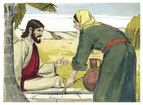
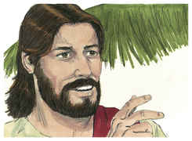
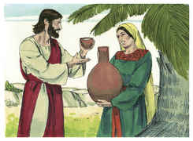
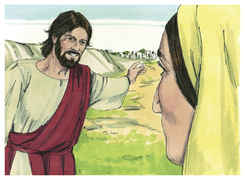
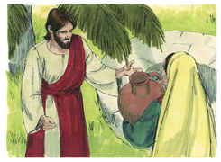
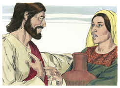

# Jó Capítulo 4

## 1
ENTÃO respondeu Elifaz o temanita, e disse:

## 2
Se intentarmos falar-te, enfadar-te-ás? Mas quem poderia conter as palavras?

## 3
Eis que ensinaste a muitos, e tens fortalecido as mãos fracas.

## 4
As tuas palavras firmaram os que tropeçavam e os joelhos desfalecentes tens fortalecido.

## 5
Mas agora, que se trata de ti, te enfadas; e tocando-te a ti, te perturbas.

## 6
Porventura não é o teu temor de Deus a tua confiança, e a tua esperança a integridade dos teus caminhos?

## 7
Lembra-te agora qual é o inocente que jamais pereceu? E onde foram os sinceros destruídos?

## 8
Segundo eu tenho visto, os que lavram iniqüidade, e semeiam mal, segam o mesmo.

## 9
Com o hálito de Deus perecem; e com o sopro da sua ira se consomem.

## 10
O rugido do leão, e a voz do leão feroz, e os dentes dos leõezinhos se quebram.

## 11
Perece o leão velho, porque não tem presa; e os filhos da leoa andam dispersos.

## 12
Uma coisa me foi trazida em segredo; e os meus ouvidos perceberam um sussurro dela.

## 13
Entre pensamentos vindos de visões da noite, quando cai sobre os homens o sono profundo,

## 14
Sobrevieram-me o espanto e o tremor, e todos os meus ossos estremeceram.

## 15
Então um espírito passou por diante de mim; fez-me arrepiar os cabelos da minha carne.

## 16
Parou ele, porém não conheci a sua feição; um vulto estava diante dos meus olhos; houve silêncio, e ouvi uma voz que dizia:

## 17
Seria porventura o homem mais justo do que Deus? Seria porventura o homem mais puro do que o seu Criador?

## 18
Eis que ele não confia nos seus servos e aos seus anjos atribui loucura;

## 19
Quanto menos àqueles que habitam em casas de lodo, cujo fundamento está no pó, e são esmagados como a traça!

## 20
Desde a manhã até à tarde são despedaçados; e eternamente perecem sem que disso se faça caso.

## 21
Porventura não passa com eles a sua excelência? Morrem, mas sem sabedoria.

# João Capítulo 4

## 1
E QUANDO o Senhor entendeu que os fariseus tinham ouvido que Jesus fazia e batizava mais discípulos do que João

## 2
(Ainda que Jesus mesmo não batizava, mas os seus discípulos),

## 3
Deixou a Judéia, e foi outra vez para a Galiléia.

## 4
E era-lhe necessário passar por Samaria.

## 5
Foi, pois, a uma cidade de Samaria, chamada Sicar, junto da herdade que Jacó tinha dado a seu filho José.

## 6
E estava ali a fonte de Jacó. Jesus, pois, cansado do caminho, assentou-se assim junto da fonte. Era isto quase à hora sexta.

## 7
Veio uma mulher de Samaria tirar água. Disse-lhe Jesus: Dá-me de beber.

## 8
Porque os seus discípulos tinham ido à cidade comprar comida.

## 9
Disse-lhe, pois, a mulher samaritana: Como, sendo tu judeu, me pedes de beber a mim, que sou mulher samaritana? (porque os judeus não se comunicam com os samaritanos).

## 10
Jesus respondeu, e disse-lhe: Se tu conheceras o dom de Deus, e quem é o que te diz: Dá-me de beber, tu lhe pedirias, e ele te daria água viva.

## 11
Disse-lhe a mulher: Senhor, tu não tens com que a tirar, e o poço é fundo; onde, pois, tens a água viva?

## 12
És tu maior do que o nosso pai Jacó, que nos deu o poço, bebendo ele próprio dele, e os seus filhos, e o seu gado?

## 13
Jesus respondeu, e disse-lhe: Qualquer que beber desta água tornará a ter sede;

## 14
Mas aquele que beber da água que eu lhe der nunca terá sede, porque a água que eu lhe der se fará nele uma fonte de água que salte para a vida eterna.

## 15
Disse-lhe a mulher: Senhor, dá-me dessa água, para que não mais tenha sede, e não venha aqui tirá-la.

## 16
Disse-lhe Jesus: Vai, chama o teu marido, e vem cá.

## 17
A mulher respondeu, e disse: Não tenho marido. Disse-lhe Jesus: Disseste bem: Não tenho marido;

## 18
Porque tiveste cinco maridos, e o que agora tens não é teu marido; isto disseste com verdade.

## 19
Disse-lhe a mulher: Senhor, vejo que és profeta.

## 20
Nossos pais adoraram neste monte, e vós dizeis que é em Jerusalém o lugar onde se deve adorar.

## 21
Disse-lhe Jesus: Mulher, crê-me que a hora vem, em que nem neste monte nem em Jerusalém adorareis o Pai.

## 22
Vós adorais o que não sabeis; nós adoramos o que sabemos porque a salvação vem dos judeus.

## 23
Mas a hora vem, e agora é, em que os verdadeiros adoradores adorarão o Pai em espírito e em verdade; porque o Pai procura a tais que assim o adorem.

## 24
Deus é Espírito, e importa que os que o adoram o adorem em espírito e em verdade.

## 25
A mulher disse-lhe: Eu sei que o Messias (que se chama o Cristo) vem; quando ele vier, nos anunciará tudo.

## 26
Jesus disse-lhe: Eu o sou, eu que falo contigo.

## 27
E nisto vieram os seus discípulos, e maravilharam-se de que estivesse falando com uma mulher; todavia nenhum lhe disse: Que perguntas? ou: Por que falas com ela?

## 28
Deixou, pois, a mulher o seu cântaro, e foi à cidade, e disse àqueles homens:

## 29
Vinde, vede um homem que me disse tudo quanto tenho feito. Porventura não é este o Cristo?

## 30
Saíram, pois, da cidade, e foram ter com ele.

## 31
E entretanto os seus discípulos lhe rogaram, dizendo: Rabi, come.

## 32
Ele, porém, lhes disse: Uma comida tenho para comer, que vós não conheceis.

## 33
Então os discípulos diziam uns aos outros: Trouxe-lhe, porventura, alguém algo de comer?

## 34
Jesus disse-lhes: A minha comida é fazer a vontade daquele que me enviou, e realizar a sua obra.

## 35
Não dizeis vós que ainda há quatro meses até que venha a ceifa? Eis que eu vos digo: Levantai os vossos olhos, e vede as terras, que já estão brancas para a ceifa.

## 36
E o que ceifa recebe galardão, e ajunta fruto para a vida eterna; para que, assim o que semeia como o que ceifa, ambos se regozijem.

## 37
Porque nisto é verdadeiro o ditado, que um é o que semeia, e outro o que ceifa.

## 38
Eu vos enviei a ceifar onde vós não trabalhastes; outros trabalharam, e vós entrastes no seu trabalho.

## 39
E muitos dos samaritanos daquela cidade creram nele, pela palavra da mulher, que testificou: Disse-me tudo quanto tenho feito.

## 40
Indo, pois, ter com ele os samaritanos, rogaram-lhe que ficasse com eles; e ficou ali dois dias.

## 41
E muitos mais creram nele, por causa da sua palavra.

## 42
E diziam à mulher: Já não é pelo teu dito que nós cremos; porque nós mesmos o temos ouvido, e sabemos que este é verdadeiramente o Cristo, o Salvador do mundo.

## 43
E dois dias depois partiu dali, e foi para a Galiléia.

## 44
Porque Jesus mesmo testificou que um profeta não tem honra na sua própria pátria.

## 45
Chegando, pois, à Galiléia, os galileus o receberam, vistas todas as coisas que fizera em Jerusalém, no dia da festa; porque também eles tinham ido à festa.

## 46
Segunda vez foi Jesus a Caná da Galiléia, onde da água fizera vinho. E havia ali um nobre, cujo filho estava enfermo em Cafarnaum.

## 47
Ouvindo este que Jesus vinha da Judéia para a Galiléia, foi ter com ele, e rogou-lhe que descesse, e curasse o seu filho, porque já estava à morte.

## 48
Então Jesus lhe disse: Se não virdes sinais e milagres, não crereis.

## 49
Disse-lhe o nobre: Senhor, desce, antes que meu filho morra.

## 50
Disse-lhe Jesus: Vai, o teu filho vive. E o homem creu na palavra que Jesus lhe disse, e partiu.

## 51
E descendo ele logo, saíram-lhe ao encontro os seus servos, e lhe anunciaram, dizendo: O teu filho vive.

## 52
Perguntou-lhes, pois, a que hora se achara melhor. E disseram-lhe: Ontem às sete horas a febre o deixou.

## 53
Entendeu, pois, o pai que era aquela hora a mesma em que Jesus lhe disse: O teu filho vive; e creu ele, e toda a sua casa.

## 54
Jesus fez este segundo milagre, quando ia da Judéia para a Galiléia.

