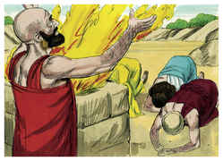

# Jó Capítulo 42

## 1
ENTÃO respondeu Jó ao Senhor, dizendo:

## 2
Bem sei eu que tudo podes, e que nenhum dos teus propósitos pode ser impedido.

## 3
Quem é este, que sem conhecimento encobre o conselho? Por isso relatei o que não entendia; coisas que para mim eram inescrutáveis, e que eu não entendia.

## 4
Escuta-me, pois, e eu falarei; eu te perguntarei, e tu me ensinarás.

## 5
Com o ouvir dos meus ouvidos ouvi, mas agora te vêem os meus olhos.

## 6
Por isso me abomino e me arrependo no pó e na cinza.

## 7
Sucedeu que, acabando o Senhor de falar a Jó aquelas palavras, o Senhor disse a Elifaz, o temanita: A minha ira se acendeu contra ti, e contra os teus dois amigos, porque não falastes de mim o que era reto, como o meu servo Jó.

## 8
Tomai, pois, sete bezerros e sete carneiros, e ide ao meu servo Jó, e oferecei holocaustos por vós, e o meu servo Jó orará por vós; porque deveras a ele aceitarei, para que eu não vos trate conforme a vossa loucura; porque vós não falastes de mim o que era reto como o meu servo Jó.

## 9
Então foram Elifaz, o temanita, e Bildade, o suíta, e Zofar, o naamatita, e fizeram como o Senhor lhes dissera; e o Senhor aceitou a face de Jó.

## 10
E o Senhor virou o cativeiro de Jó, quando orava pelos seus amigos; e o Senhor acrescentou, em dobro, a tudo quanto Jó antes possuía.

## 11
Então vieram a ele todos os seus irmãos, e todas as suas irmãs, e todos quantos dantes o conheceram, e comeram com ele pão em sua casa, e se condoeram dele, e o consolaram acerca de todo o mal que o Senhor lhe havia enviado; e cada um deles lhe deu uma peça de dinheiro, e um pendente de ouro.

## 12
E assim abençoou o Senhor o último estado de Jó, mais do que o primeiro; pois teve catorze mil ovelhas, e seis mil camelos, e mil juntas de bois, e mil jumentas.

## 13
Também teve sete filhos e três filhas.

## 14
E chamou o nome da primeira Jemima, e o nome da segunda Quezia, e o nome da terceira Quéren-Hapuque.

## 15
E em toda a terra não se acharam mulheres tão formosas como as filhas de Jó; e seu pai lhes deu herança entre seus irmãos.

## 16
E depois disto viveu Jó cento e quarenta anos; e viu a seus filhos, e aos filhos de seus filhos, até à quarta geração.

## 17
Então morreu Jó, velho e farto de dias.

