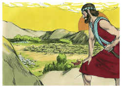
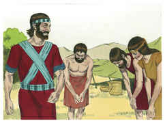

# Josué Capítulo 1

## 1
E SUCEDEU depois da morte de Moisés, servo do Senhor, que o Senhor falou a Josué, filho de Num, servo de Moisés, dizendo:

## 2
Moisés, meu servo, é morto; levanta-te, pois, agora, passa este Jordão, tu e todo este povo, à terra que eu dou aos filhos de Israel.

## 3
Todo o lugar que pisar a planta do vosso pé, vo-lo tenho dado, como eu disse a Moisés.

## 4
Desde o deserto e do Líbano, até ao grande rio, o rio Eufrates, toda a terra dos heteus, e até o grande mar para o poente do sol, será o vosso termo.

## 5
Ninguém te poderá resistir, todos os dias da tua vida; como fui com Moisés, assim serei contigo; não te deixarei nem te desampararei.

## 6
Esforça-te, e tem bom ânimo; porque tu farás a este povo herdar a terra que jurei a seus pais lhes daria.

## 7
Tão-somente esforça-te e tem mui bom ânimo, para teres o cuidado de fazer conforme a toda a lei que meu servo Moisés te ordenou; dela não te desvies, nem para a direita nem para a esquerda, para que prudentemente te conduzas por onde quer que andares.

## 8
Não se aparte da tua boca o livro desta lei; antes medita nele dia e noite, para que tenhas cuidado de fazer conforme a tudo quanto nele está escrito; porque então farás prosperar o teu caminho, e serás bem sucedido.

## 9
Não to mandei eu? Esforça-te, e tem bom ânimo; não temas, nem te espantes; porque o Senhor teu Deus é contigo, por onde quer que andares.

## 10
Então Josué deu ordem aos príncipes do povo, dizendo:

## 11
Passai pelo meio do arraial e ordenai ao povo, dizendo: Provede-vos de comida, porque dentro de três dias passareis este Jordão, para que entreis a possuir a terra que vos dá o Senhor vosso Deus, para a possuirdes.

## 12
E falou Josué aos rubenitas, e aos gaditas, e à meia tribo de Manassés, dizendo:

## 13
Lembrai-vos da palavra que vos mandou Moisés, o servo do Senhor, dizendo: O Senhor vosso Deus vos dá descanso, e vos dá esta terra.

## 14
Vossas mulheres, vossos meninos e vosso gado fiquem na terra que Moisés vos deu deste lado do Jordão; porém vós passareis armados na frente de vossos irmãos, todos os valentes e valorosos, e ajudá-los-eis;

## 15
Até que o Senhor dê descanso a vossos irmãos, como a vós, e eles também possuam a terra que o Senhor vosso Deus lhes dá; então tornareis à terra da vossa herança, e possuireis a que vos deu Moisés, o servo do Senhor, deste lado do Jordão, para o nascente do sol.

## 16
Então responderam a Josué, dizendo: Tudo quanto nos ordenaste faremos, e onde quer que nos enviares iremos.

## 17
Como em tudo ouvimos a Moisés, assim te ouviremos a ti, tão-somente que o Senhor teu Deus seja contigo, como foi com Moisés.

## 18
Todo o homem, que for rebelde às tuas ordens, e não ouvir as tuas palavras em tudo quanto lhe mandares, morrerá. Tão-somente esforça-te, e tem bom ânimo.

