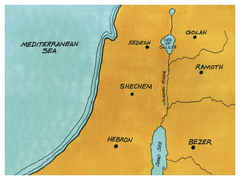

# Josué Capítulo 21

## 1
ENTÃO os cabeças dos pais dos levitas se achegaram a Eleazar, o sacerdote, e a Josué, filho de Num, e aos cabeças dos pais das tribos dos filhos de Israel;

## 2
E falaram-lhes em Siló, na terra de Canaã, dizendo: O Senhor ordenou, pelo ministério de Moisés, que se nos dessem cidades para habitar, e os seus arrabaldes para os nossos animais.

## 3
Por isso os filhos de Israel deram aos levitas da sua herança, conforme a ordem do Senhor, as seguintes cidades e os seus arrabaldes.

## 4
E saiu a sorte para as famílias dos coatitas; e aos filhos de Arão, o sacerdote, que eram dos levitas, tiveram por sorte da tribo de Judá, e da tribo de Simeão, e da tribo de Benjamim, treze cidades;

## 5
E aos outros filhos de Coate couberam por sorte, das famílias da tribo de Efraim, e da tribo de Dã, e da meia tribo de Manassés, dez cidades;

## 6
E aos filhos de Gérson couberam por sorte, das famílias da tribo de Issacar, e da tribo de Aser, e da tribo de Naftali, e da meia tribo de Manassés, em Basã, treze cidades;

## 7
Aos filhos de Merari, segundo as suas famílias, da tribo de Rúben, e da tribo de Gade, e da tribo de Zebulom, doze cidades;

## 8
E deram os filhos de Israel aos levitas estas cidades e os seus arrabaldes por sorte, como o Senhor ordenara pelo ministério de Moisés.

## 9
Deram mais, da tribo dos filhos de Judá e da tribo dos filhos de Simeão, estas cidades, que por nome foram mencionadas,

## 10
Para que fossem dos filhos de Arão, das famílias dos coatitas dos filhos de Levi; porquanto a primeira sorte foi sua.

## 11
Assim lhes deram a cidade de Arba, do pai de Anaque (esta é Hebrom), no monte de Judá, e os seus arrabaldes ao redor.

## 12
Porém o campo da cidade, e as suas aldeias, deram a Calebe, filho de Jefoné, por sua possessão.

## 13
Assim aos filhos de Arão, o sacerdote, deram Hebrom, cidade do refúgio do homicida, e os seus arrabaldes, Libna e os seus arrabaldes;

## 14
Jatir e os seus arrabaldes, e Estemoa e os seus arrabaldes;

## 15
E Holom e os seus arrabaldes, e Debir e os seus arrabaldes;

## 16
E Aim e os seus arrabaldes, e Jutá e os seus arrabaldes, e Bete-Semes e os seus arrabaldes; nove cidades destas duas tribos.

## 17
E da tribo de Benjamim, Gibeão e os seus arrabaldes, Geba e os seus arrabaldes;

## 18
Anatote e os seus arrabaldes, e Almom e os seus arrabaldes; quatro cidades.

## 19
Todas as cidades dos sacerdotes, filhos de Arão, foram treze cidades e os seus arrabaldes.

## 20
E as famílias dos filhos de Coate, levitas, que ficaram dos filhos de Coate, tiveram as cidades da sua sorte, da tribo de Efraim.

## 21
E deram-lhes Siquém, cidade de refúgio do homicida, e os seus arrabaldes, no monte de Efraim, e Gezer e os seus arrabaldes;

## 22
E Quibzaim e os seus arrabaldes, e Bete-Horom e os seus arrabaldes; quatro cidades.

## 23
E da tribo de Dã, Elteque e os seus arrabaldes, Gibetom e os seus arrabaldes;

## 24
Aijalom e os seus arrabaldes, Gate-Rimom e os seus arrabaldes; quatro cidades.

## 25
E da meia tribo de Manassés, Taanaque e os seus arrabaldes, e Gate-Rimom e os seus arrabaldes; duas cidades.

## 26
As cidades para as famílias dos demais filhos de Coate, foram dez e os seus arrabaldes.

## 27
E aos filhos de Gérson, das famílias dos levitas, deram da meia tribo de Manassés, Golã, cidade de refúgio do homicida, em Basã, e os seus arrabaldes, e Beesterá e os seus arrabaldes; duas cidades.

## 28
E da tribo de Issacar, Quisiom e os seus arrabaldes, Daberate e os seus arrabaldes,

## 29
Jarmute e os seus arrabaldes, En-Ganim e os seus arrabaldes; quatro cidades.

## 30
E da tribo de Aser, Misal e os seus arrabaldes, Abdom e os seus arrabaldes,

## 31
Helcate e os seus arrabaldes, e Reobe e os seus arrabaldes;

## 32
E da tribo de Naftali, Quedes, cidade de refúgio do homicida, na Galiléia, e os seus arrabaldes, e Hamote-Dor e os seus arrabaldes, e Cartã e os seus arrabaldes; três cidades.

## 33
Todas as cidades dos gersonitas, segundo as suas famílias, foram treze cidades e os seus arrabaldes.

## 34
E às famílias dos filhos de Merari, aos demais levitas, foram dadas, da tribo de Zebulom, Jocneão e os seus arrabaldes, Cartã e os seus arrabaldes,

## 35
Dimna e os seus arrabaldes, Naalal e os seus arrabaldes; quatro cidades.

## 36
E da tribo de Rúben, Bezer e seus arrabaldes, e Jaza e os seus arrabaldes,

## 37
Quedemote e os seus arrabaldes, e Mefaate e os seus arrabaldes; quatro cidades.

## 38
E da tribo de Gade, Ramote, cidade de refúgio do homicida, em Gileade, e os seus arrabaldes, e Maanaim e os seus arrabaldes,

## 39
Hesbom e os seus arrabaldes, Jazer e os seus arrabaldes; ao todo, quatro cidades.

## 40
Todas estas cidades foram dos filhos de Merari, segundo as suas famílias, que ainda restavam das famílias dos levitas; e foi a sua sorte doze cidades.

## 41
Todas as cidades dos levitas, no meio da herança dos filhos de Israel, foram quarenta e oito cidades e os seus arrabaldes.

## 42
Estavam estas cidades, cada uma com os seus arrabaldes em redor delas; assim estavam todas estas cidades.

## 43
Desta maneira deu o Senhor a Israel toda a terra que jurara dar a seus pais; e a possuíram e habitaram nela.

## 44
E o Senhor lhes deu repouso de todos os lados, conforme a tudo quanto jurara a seus pais; e nenhum de todos os seus inimigos pôde resisti-los; todos os seus inimigos o Senhor entregou-lhes nas mãos.

## 45
Palavra alguma falhou de todas as boas coisas que o Senhor falou à casa de Israel; tudo se cumpriu.

