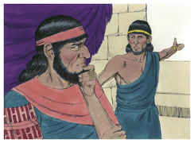
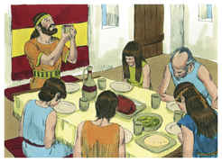
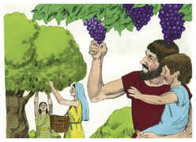
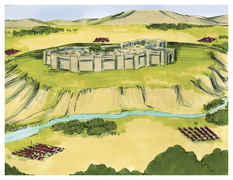

# Josué Capítulo 5

## 1
E SUCEDEU que, ouvindo todos os reis dos amorreus, que habitavam deste lado do Jordão, ao ocidente, e todos os reis dos cananeus, que estavam ao pé do mar, que o Senhor tinha secado as águas do Jordão, de diante dos filhos de Israel, até que passassem, desfaleceu-se-lhes o coração, e não houve mais ânimo neles, por causa dos filhos de Israel.

## 2
Naquele tempo disse o Senhor a Josué: Faze facas de pedra, e torna a circuncidar segunda vez aos filhos de Israel.

## 3
Então Josué fez para si facas de pedra, e circuncidou aos filhos de Israel no monte dos prepúcios.

## 4
E foi esta a causa por que Josué os circuncidou: todo o povo que tinha saído do Egito, os homens, todos os homens de guerra, já haviam morrido no deserto, pelo caminho, depois que saíram do Egito.

## 5
Porque todos os do povo que saíram estavam circuncidados, mas a nenhum dos que nasceram no deserto, pelo caminho, depois de terem saído do Egito, haviam circuncidado.

## 6
Porque quarenta anos andaram os filhos de Israel pelo deserto, até se acabar toda a nação, os homens de guerra, que saíram do Egito, e não obedeceram à voz do Senhor; aos quais o Senhor tinha jurado que lhes não havia de deixar ver a terra que o Senhor jurara a seus pais dar-nos; terra que mana leite e mel.

## 7
Porém em seu lugar pôs a seus filhos; a estes Josué circuncidou, porquanto estavam incircuncisos, porque os não circuncidaram no caminho.

## 8
E aconteceu que, acabando de circuncidar a toda a nação, ficaram no seu lugar no arraial, até que sararam.

## 9
Disse mais o Senhor a Josué: Hoje retirei de sobre vós o opróbrio do Egito; por isso o nome daquele lugar se chamou Gilgal, até ao dia de hoje.

## 10
Estando, pois, os filhos de Israel acampados em Gilgal, celebraram a páscoa no dia catorze do mês, à tarde, nas campinas de Jericó.

## 11
E, ao outro dia depois da páscoa, nesse mesmo dia, comeram, do fruto da terra, pães ázimos e espigas tostadas.

## 12
E cessou o maná no dia seguinte, depois que comeram do fruto da terra, e os filhos de Israel não tiveram mais maná; porém, no mesmo ano comeram dos frutos da terra de Canaã.

## 13
E sucedeu que, estando Josué perto de Jericó, levantou os seus olhos e olhou; e eis que se pôs em pé diante dele um homem que tinha na mão uma espada nua; e chegou-se Josué a ele, e disse-lhe: És tu dos nossos, ou dos nossos inimigos?

## 14
E disse ele: Não, mas venho agora como príncipe do exército do Senhor. Então Josué se prostrou com o seu rosto em terra e o adorou, e disse-lhe: Que diz meu senhor ao seu servo?

## 15
Então disse o príncipe do exército do Senhor a Josué: Descalça os sapatos de teus pés, porque o lugar em que estás é santo. E fez Josué assim.

