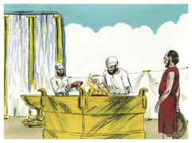
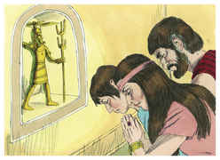

# Juízes Capítulo 2

## 1
E SUBIU o anjo do Senhor de Gilgal a Boquim, e disse: Do Egito vos fiz subir, e vos trouxe à terra que a vossos pais tinha jurado e disse: Nunca invalidarei a minha aliança convosco.

## 2
E, quanto a vós, não fareis acordo com os moradores desta terra, antes derrubareis os seus altares; mas vós não obedecestes à minha voz. Por que fizestes isso?

## 3
Assim também eu disse: Não os expulsarei de diante de vós; antes estarão como espinhos nas vossas ilhargas, e os seus deuses vos serão por laço.

## 4
E sucedeu que, falando o anjo do Senhor estas palavras a todos os filhos de Israel, o povo levantou a sua voz e chorou.

## 5
Por isso chamaram àquele lugar, Boquim; e sacrificaram ali ao Senhor.

## 6
E havendo Josué despedido o povo foram-se os filhos de Israel, cada um à sua herança, para possuírem a terra.

## 7
E serviu o povo ao Senhor todos os dias de Josué, e todos os dias dos anciãos que ainda sobreviveram depois de Josué, e viram toda aquela grande obra do Senhor, que fizera a Israel.

## 8
Faleceu, porém, Josué, filho de Num, servo do Senhor, com a idade de cento e dez anos;

## 9
E sepultaram-no no termo da sua herança, em Timnate-Heres, no monte de Efraim, para o norte do monte de Gaás.

## 10
E foi também congregada toda aquela geração a seus pais, e outra geração após ela se levantou, que não conhecia ao Senhor, nem tampouco a obra que ele fizera a Israel.

## 11
Então fizeram os filhos de Israel o que era mau aos olhos do Senhor; e serviram aos baalins.

## 12
E deixaram ao Senhor Deus de seus pais, que os tirara da terra do Egito, e foram-se após outros deuses, dentre os deuses dos povos, que havia ao redor deles, e adoraram a eles; e provocaram o Senhor à ira.

## 13
Porquanto deixaram ao Senhor, e serviram a Baal e a Astarote.

## 14
Por isso a ira do Senhor se acendeu contra Israel, e os entregou na mão dos espoliadores que os despojaram; e os entregou na mão dos seus inimigos ao redor; e não puderam mais resistir diante dos seus inimigos.

## 15
Por onde quer que saíam, a mão do Senhor era contra eles para mal, como o Senhor tinha falado, e como o Senhor lhes tinha jurado; e estavam em grande aflição.

## 16
E levantou o Senhor juízes, que os livraram da mão dos que os despojaram.

## 17
Porém tampouco ouviram aos juízes, antes prostituíram-se após outros deuses, e adoraram a eles; depressa se desviaram do caminho, por onde andaram seus pais, obedecendo os mandamentos do Senhor; mas eles assim não fizeram.

## 18
E, quando o Senhor lhes levantava juízes, o Senhor era com o juiz, e os livrava da mão dos seus inimigos, todos os dias daquele juiz; porquanto o Senhor se compadecia deles pelo seu gemido, por causa dos que os oprimiam e afligiam.

## 19
Porém sucedia que, falecendo o juiz, reincidiam e se corrompiam mais do que seus pais, andando após outros deuses, servindo-os, e adorando-os; nada deixavam das suas obras, nem do seu obstinado caminho.

## 20
Por isso a ira do Senhor se acendeu contra Israel, e disse: Porquanto este povo transgrediu a minha aliança, que tinha ordenado a seus pais, e não deram ouvidos à minha voz,

## 21
Tampouco desapossarei mais de diante deles a nenhuma das nações, que Josué deixou, quando morreu;

## 22
Para por elas provar a Israel, se há de guardar, ou não, o caminho do Senhor, como seus pais o guardaram, para nele andar.

## 23
Assim o Senhor deixou ficar aquelas nações, e não as desterrou logo, nem as entregou na mão de Josué.

