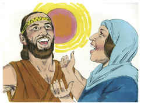

# Juízes Capítulo 5

## 1
E CANTOU Débora e Baraque, filho de Abinoão, naquele mesmo dia, dizendo:

## 2
Louvai ao Senhor pela vingança de Israel, quando o povo se ofereceu voluntariamente.

## 3
Ouvi, reis; dai ouvidos, príncipes; eu, eu cantarei ao Senhor; salmodiarei ao Senhor Deus de Israel.

## 4
Ó Senhor, saindo tu de Seir, caminhando tu desde o campo de Edom, a terra estremeceu; até os céus gotejaram; até as nuvens gotejaram águas.

## 5
Os montes se derreteram diante do Senhor, e até Sinai diante do Senhor Deus de Israel.

## 6
Nos dias de Sangar, filho de Anate, nos dias de Jael cessaram os caminhos; e os que andavam por veredas iam por caminhos torcidos.

## 7
Cessaram as aldeias em Israel, cessaram; até que eu, Débora, me levantei, por mãe em Israel me levantei.

## 8
E se escolhia deuses novos, logo a guerra estava às portas; via-se por isso escudo ou lança entre quarenta mil em Israel?

## 9
Meu coração é para os legisladores de Israel, que voluntariamente se ofereceram entre o povo; bendizei ao Senhor.

## 10
Vós os que cavalgais sobre jumentas brancas, que vos assentais em juízo, que andais pelo caminho, falai disto.

## 11
Donde se ouve o estrondo dos flecheiros, entre os lugares onde se tiram águas, ali falai das justiças do Senhor, das justiças que fez às suas aldeias em Israel; então o povo do Senhor descia às portas.

## 12
Desperta, desperta, Débora, desperta, desperta, entoa um cântico; levanta-te, Baraque, e leva presos os teus cativos, tu, filho de Abinoão.

## 13
Então fez dominar sobre os nobres entre o povo, aos que restaram; fez-me o Senhor dominar sobre os poderosos.

## 14
De Efraim saiu a sua raiz contra Amaleque; e depois de ti vinha Benjamim dentre os teus povos; de Maquir desceram os legisladores, e de Zebulom os que levaram a cana do escriba.

## 15
Também os principais de Issacar foram com Débora; e como Issacar, assim também Baraque, foi enviado a pé para o vale; nas divisões de Rúben foram grandes as resoluções do coração.

## 16
Por que ficaste tu entre os currais para ouvires os balidos dos rebanhos? Nas divisões de Rúben tiveram grandes esquadrinhações do coração.

## 17
Gileade ficou além do Jordão, e Dã por que se deteve nos navios? Aser se assentou na beira dos mares, e ficou junto às suas baías.

## 18
Zebulom é um povo que expôs a sua vida à morte, como também Naftali, nas alturas do campo.

## 19
Vieram reis, pelejaram; então pelejaram os reis de Canaã em Taanaque, junto às águas de Megido; não tomaram despojo de prata.

## 20
Desde os céus pelejaram; até as estrelas desde os lugares dos seus cursos pelejaram contra Sísera.

## 21
O ribeiro de Quisom os arrastou, aquele antigo ribeiro, o ribeiro de Quisom. Pisaste, ó minha alma, à força.

## 22
Então os cascos dos cavalos se despedaçaram; pelo galopar, o galopar dos seus valentes.

## 23
Amaldiçoai a Meroz, diz o anjo do Senhor, acremente amaldiçoai aos seus moradores; porquanto não vieram ao socorro do Senhor, ao socorro do Senhor com os valorosos.

## 24
Bendita seja entre as mulheres, Jael, mulher de Héber, o queneu; bendita seja entre as mulheres nas tendas.

## 25
Água pediu ele, leite lhe deu ela; em prato de nobres lhe ofereceu manteiga.

## 26
À estaca estendeu a sua mão esquerda, e ao martelo dos trabalhadores a sua direita; e matou a Sísera, e rachou-lhe a cabeça, quando lhe pregou e atravessou as fontes.

## 27
Entre os seus pés se encurvou, caiu, ficou estirado; entre os seus pés se encurvou, caiu; onde se encurvou, ali ficou abatido.

## 28
A mãe de Sísera olhava pela janela, e exclamava pela grade: Por que tarda em vir o seu carro? Por que se demoram os ruídos dos seus carros?

## 29
As mais sábias das suas damas responderam; e até ela respondia a si mesma:

## 30
Porventura não achariam e repartiriam despojos? Uma ou duas moças a cada homem? Para Sísera despojos de estofos coloridos, despojos de estofos coloridos bordados; de estofos coloridos bordados de ambos os lados como despojo para os pescoços.

## 31
Assim, ó Senhor, pereçam todos os teus inimigos! Porém os que te amam sejam como o sol quando sai na sua força. (5:32)E sossegou a terra quarenta anos.

