# Lucas Capítulo 1

## 1
TENDO, pois, muitos empreendido pôr em ordem a narração dos fatos que entre nós se cumpriram,

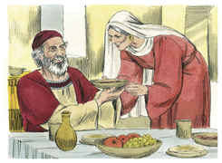

## 2
Segundo nos transmitiram os mesmos que os presenciaram desde o princípio, e foram ministros da palavra,

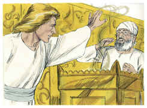

## 3
Pareceu-me também a mim conveniente descrevê-los a ti, ó excelente Teófilo, por sua ordem, havendo-me já informado minuciosamente de tudo desde o princípio;

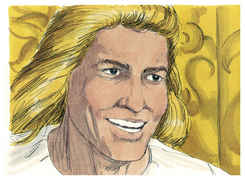

## 4
Para que conheças a certeza das coisas de que já estás informado.

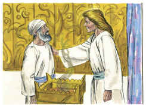

## 5
Existiu, no tempo de Herodes, rei da Judéia, um sacerdote chamado Zacarias, da ordem de Abias, e cuja mulher era das filhas de Arão; e o seu nome era Isabel.

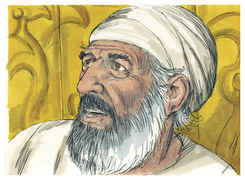

## 6
E eram ambos justos perante Deus, andando sem repreensão em todos os mandamentos e preceitos do Senhor.

## 7
E não tinham filhos, porque Isabel era estéril, e ambos eram avançados em idade.

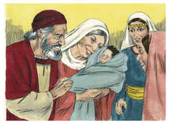

## 8
E aconteceu que, exercendo ele o sacerdócio diante de Deus, na ordem da sua turma,

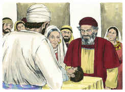

## 9
Segundo o costume sacerdotal, coube-lhe em sorte entrar no templo do Senhor para oferecer o incenso.

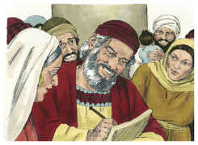

## 10
E toda a multidão do povo estava fora, orando, à hora do incenso.

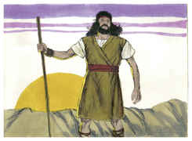

## 11
E um anjo do Senhor lhe apareceu, posto em pé, à direita do altar do incenso.

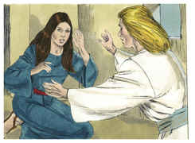

## 12
E Zacarias, vendo-o, turbou-se, e caiu temor sobre ele.

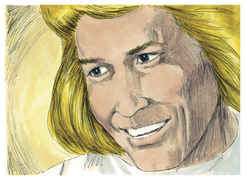

## 13
Mas o anjo lhe disse: Zacarias, não temas, porque a tua oração foi ouvida, e Isabel, tua mulher, dará à luz um filho, e lhe porás o nome de João.

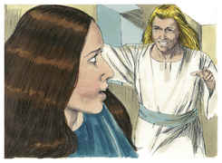

## 14
E terás prazer e alegria, e muitos se alegrarão no seu nascimento,

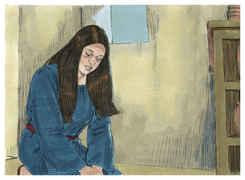

## 15
Porque será grande diante do Senhor, e não beberá vinho, nem bebida forte, e será cheio do Espírito Santo, já desde o ventre de sua mãe.

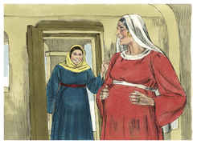

## 16
E converterá muitos dos filhos de Israel ao Senhor seu Deus,

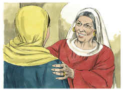

## 17
E irá adiante dele no espírito e virtude de Elias, para converter os corações dos pais aos filhos, e os rebeldes à prudência dos justos, com o fim de preparar ao Senhor um povo bem disposto.

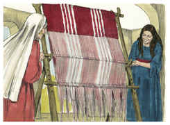

## 18
Disse então Zacarias ao anjo: Como saberei isto? pois eu já sou velho, e minha mulher avançada em idade.

## 19
E, respondendo o anjo, disse-lhe: Eu sou Gabriel, que assisto diante de Deus, e fui enviado a falar-te e dar-te estas alegres novas.

## 20
E eis que ficarás mudo, e não poderás falar até ao dia em que estas coisas aconteçam; porquanto não creste nas minhas palavras, que a seu tempo se hão de cumprir.

## 21
E o povo estava esperando a Zacarias, e maravilhava-se de que tanto se demorasse no templo.

## 22
E, saindo ele, não lhes podia falar; e entenderam que tinha tido uma visão no templo. E falava por acenos, e ficou mudo.

## 23
E sucedeu que, terminados os dias de seu ministério, voltou para sua casa.

## 24
E, depois daqueles dias, Isabel, sua mulher, concebeu, e por cinco meses se ocultou, dizendo:

## 25
Assim me fez o Senhor, nos dias em que atentou em mim, para destruir o meu opróbrio entre os homens.

## 26
E, no sexto mês, foi o anjo Gabriel enviado por Deus a uma cidade da Galiléia, chamada Nazaré,

## 27
A uma virgem desposada com um homem, cujo nome era José, da casa de Davi; e o nome da virgem era Maria.

## 28
E, entrando o anjo aonde ela estava, disse: Salve, agraciada; o Senhor é contigo; bendita és tu entre as mulheres.

## 29
E, vendo-o ela, turbou-se muito com aquelas palavras, e considerava que saudação seria esta.

## 30
Disse-lhe, então, o anjo: Maria, não temas, porque achaste graça diante de Deus.

## 31
E eis que em teu ventre conceberás e darás à luz um filho, e pôr-lhe-ás o nome de Jesus.

## 32
Este será grande, e será chamado filho do Altíssimo; e o Senhor Deus lhe dará o trono de Davi, seu pai;

## 33
E reinará eternamente na casa de Jacó, e o seu reino não terá fim.

## 34
E disse Maria ao anjo: Como se fará isto, visto que não conheço homem algum?

## 35
E, respondendo o anjo, disse-lhe: Descerá sobre ti o Espírito Santo, e a virtude do Altíssimo te cobrirá com a sua sombra; por isso também o Santo, que de ti há de nascer, será chamado Filho de Deus.

## 36
E eis que também Isabel, tua prima, concebeu um filho em sua velhice; e é este o sexto mês para aquela que era chamada estéril;

## 37
Porque para Deus nada é impossível.

## 38
Disse então Maria: Eis aqui a serva do Senhor; cumpra-se em mim segundo a tua palavra. E o anjo ausentou-se dela.

## 39
E, naqueles dias, levantando-se Maria, foi apressada às montanhas, a uma cidade de Judá,

## 40
E entrou em casa de Zacarias, e saudou a Isabel.

## 41
E aconteceu que, ao ouvir Isabel a saudação de Maria, a criancinha saltou no seu ventre; e Isabel foi cheia do Espírito Santo.

## 42
E exclamou com grande voz, e disse: Bendita és tu entre as mulheres, e bendito o fruto do teu ventre.

## 43
E de onde me provém isto a mim, que venha visitar-me a mãe do meu Senhor?

## 44
Pois eis que, ao chegar aos meus ouvidos a voz da tua saudação, a criancinha saltou de alegria no meu ventre.

## 45
Bem-aventurada a que creu, pois hão de cumprir-se as coisas que da parte do Senhor lhe foram ditas.

## 46
Disse então Maria: A minha alma engrandece ao Senhor,

## 47
E o meu espírito se alegra em Deus meu Salvador;

## 48
Porque atentou na baixeza de sua serva; Pois eis que desde agora todas as gerações me chamarão bem-aventurada,

## 49
Porque me fez grandes coisas o Poderoso; E santo é seu nome.

## 50
E a sua misericórdia é de geração em geração Sobre os que o temem.

## 51
Com o seu braço agiu valorosamente; Dissipou os soberbos no pensamento de seus corações.

## 52
Depôs dos tronos os poderosos, E elevou os humildes.

## 53
Encheu de bens os famintos, E despediu vazios os ricos.

## 54
Auxiliou a Israel seu servo, Recordando-se da sua misericórdia;

## 55
Como falou a nossos pais, Para com Abraão e a sua posteridade, para sempre.

## 56
E Maria ficou com ela quase três meses, e depois voltou para sua casa.

## 57
E completou-se para Isabel o tempo de dar à luz, e teve um filho.

## 58
E os seus vizinhos e parentes ouviram que tinha Deus usado para com ela de grande misericórdia, e alegraram-se com ela.

## 59
E aconteceu que, ao oitavo dia, vieram circuncidar o menino, e lhe chamavam Zacarias, o nome de seu pai.

## 60
E, respondendo sua mãe, disse: Não, porém será chamado João.

## 61
E disseram-lhe: Ninguém há na tua parentela que se chame por este nome.

## 62
E perguntaram por acenos ao pai como queria que lhe chamassem.

## 63
E, pedindo ele uma tabuinha de escrever, escreveu, dizendo: O seu nome é João. E todos se maravilharam.

## 64
E logo a boca se lhe abriu, e a língua se lhe soltou; e falava, louvando a Deus.

## 65
E veio temor sobre todos os seus vizinhos, e em todas as montanhas da Judéia foram divulgadas todas estas coisas.

## 66
E todos os que as ouviam as conservavam em seus corações, dizendo: Quem será, pois, este menino? E a mão do Senhor estava com ele.

## 67
E Zacarias, seu pai, foi cheio do Espírito Santo, e profetizou, dizendo:

## 68
Bendito o Senhor Deus de Israel, Porque visitou e remiu o seu povo,

## 69
E nos levantou uma salvação poderosa Na casa de Davi seu servo.

## 70
Como falou pela boca dos seus santos profetas, desde o princípio do mundo;

## 71
Para nos livrar dos nossos inimigos e da mão de todos os que nos odeiam;

## 72
Para manifestar misericórdia a nossos pais, E lembrar-se da sua santa aliança,

## 73
E do juramento que jurou a Abraão nosso pai,

## 74
De conceder-nos que, Libertados da mão de nossos inimigos, o serviríamos sem temor,

## 75
Em santidade e justiça perante ele, todos os dias da nossa vida.

## 76
E tu, ó menino, serás chamado profeta do Altíssimo, Porque hás de ir ante a face do Senhor, a preparar os seus caminhos;

## 77
Para dar ao seu povo conhecimento da salvação, Na remissão dos seus pecados;

## 78
Pelas entranhas da misericórdia do nosso Deus, Com que o oriente do alto nos visitou;

## 79
Para iluminar aos que estão assentados em trevas e na sombra da morte; A fim de dirigir os nossos pés pelo caminho da paz.

## 80
E o menino crescia, e se robustecia em espírito. E esteve nos desertos até ao dia em que havia de mostrar-se a Israel.

